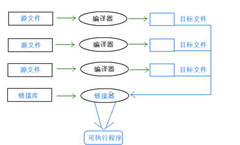
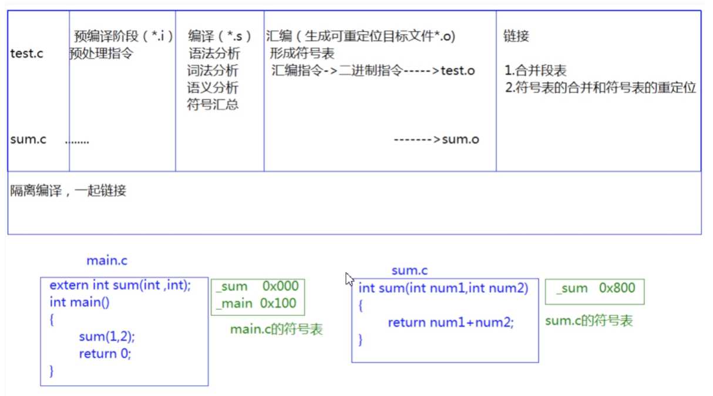
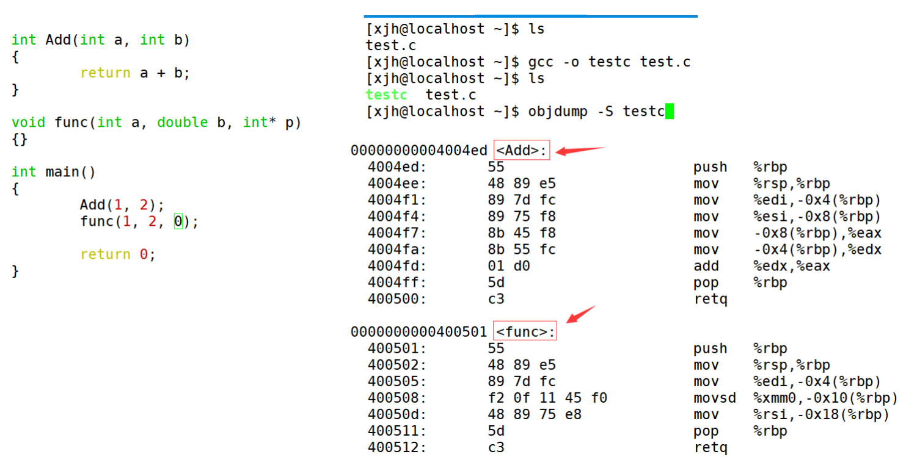
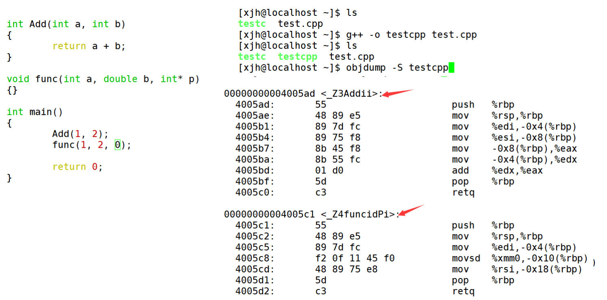
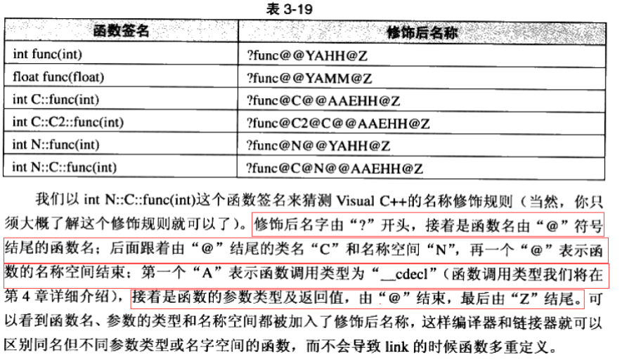

## 1. 什么是C++ 

​    C语言是结构化和模块化的语言，适合处理较小规模的程序。对于复杂的问题，规模较大的 
程序，需要高度的抽象和建模时，C语言则不合适。为了解决软件危机， 20世纪80年代， 计算机
界提出了OOP(object oriented programming：面向对象)思想，支持面向对象的程序设计语言 
应运而生。
   1982年，Bjarne Stroustrup博士在C语言的基础上引入并扩充了面向对象的概念，发明了一 
种新的程序语言。为了表达该语言与C语言的渊源关系，命名为C++。因此：C++是基于C语言而 
产生的，它既可以进行C语言的过程化程序设计，又可以进行以抽象数据类型为特点的基于对象的 
程序设计，还可以进行面向对象的程序设计。

## 2. C++的发展史 

​    1979年，贝尔实验室的本贾尼等人试图分析unix内核的时候，试图将内核模块化，于是在C 
语言的基础上进行扩展，增加了类的机制，完成了一个可以运行的预处理程序，称之为C  with 
classes。

语言的发展就像是练功打怪升级一样，也是逐步递进，由浅入深的过程。我们先来看下C++的历 
史版本。

|      阶段      | 内容                                                         |
| :------------: | :----------------------------------------------------------- |
| C with classes | 类及派生类、公有和私有成员、类的构造和析构、友元、内联函数、赋值运算符重载等 |
|     C++1.0     | 添加虚函数概念，函数和运算符重载，引用、常量等               |
|     C++2.0     | 更加完善支持面向对象，新增保护成员、多重继承、对象的初始化、抽象类、静态成员以及const成员函数 |
|     C++3.0     | 进一步完善，引入模板，解决多重继承产生的二义性问题和相应构造和析构的处理 |
|     C++98      | C++标准第一个版本，绝大多数编译器都支持，得到了国际标准化组织(ISO)和美国标准化协会认可，以模板方式重写C++标准库，引入了STL(标准模板库) |
|     C++03      | C++标准第二个版本，语言特性无大改变，主要：修订错误、减少多异性 |
|     C++05      | C++标准委员会发布了一份计数报告(Technical Report，TR1)，正式更名C++0x，即：计划在本世纪第一个10年的某个时间发布 |
|     C++11      | 增加了许多特性，使得C++更像一种新语言，比如：正则表达式、基于范围for循环、auto关键字、新容器、列表初始化、标准线程库等 |
|     C++14      | 对C++11的扩展，主要是修复C++11中漏洞以及改进，比如：泛型的lambda表达式，auto的返回值类型推导，二进制字面常量等 |
|     C++17      | 在C++11上做了一些小幅改进，增加了19个新特性，比如：static_assert()的文本信息可选，Fold表达式用于可变的模板，if和switch语句中的初始化器等 |
|     C++20      | 自C++11以来最大的发行版，引入了许多新的特性，比如：模块(Modules)、协程(Coroutines)、范围(Ranges)、概念(Constraints)等重大特性，还有对已有特性的更新：比如Lambda支持模板、范围for支持初始化等 |
|     C++23      |                                                              |
|     C++26      |                                                              |
|                |                                                              |

## 3. C++的重要性 

### 3.1 语言的使用广泛度

在30多年的发展中，C/C++几乎一直稳居前5。

TIOBE 编程语言社区排行榜是编程语言流行趋势的一个指标，每月更新，这份排行榜排名基于互联网上有经验的程序员、 课程和第三方厂商的数量。排名使用著名的搜索引擎（诸如 Google、MSN、Yahoo!、Wikipedia、YouTube 以及 Baidu 等）进行计算。 
注意：排名不能说明那个语言好，那个不好，每门编程语言都有适应自己的应用场景。

### 3.2 在工业领域

1. **操作系统以及大型系统软件开发** 
所有操作系统几乎都是C/C++写的，许多大型软件背后几乎都是C++写的，比如：
Photoshop、Office、JVM(Java虚拟机)等，究其原因还是性能高，可以直接操控硬件。 
2. **服务器端开发**
后台开发：主要侧重于业务逻辑的处理，即对于前端请求后端给出对应的响应，现在主流采 
用java，但内卷化比较严重，大厂可能会有C++后台开发，主要做一些基础组件，中间件、 
缓存、分布式存储等。服务器端开发比后台开发跟广泛，包含后台开发，一般对实时性要求 
比较高的，比如游戏服务器、流媒体服务器、网络通讯等都采用C++开发的。
3. **游戏开发** 
PC平台几乎所有的游戏都是C++写的，比如：魔兽世界、传奇、CS、跑跑卡丁车等，市面上
相当多的游戏引擎都是基于C++开发的，比如：Cocos2d、虚幻4、DirectX等。三维游戏领 
域计算量非常庞大，底层的数学全都是矩阵变换，想要画面精美、内容丰富、游戏实时性 
搞，这些高难度需求无疑只能选C++语言。比较知名厂商：腾讯、网易、完美世界、巨人网 
络等。

4. **嵌入式和物联网领域** 
嵌入式：就是把具有计算能力的主控板嵌入到机器装置或者电子装置的内部，能够控制这些
装置。比如：智能手环、摄像头、扫地机器人、智能音响等。 
谈到嵌入式开发，大家最能想到的就是单片机开发(即在8位、16位或者32位单片机产品或者 
裸机上进行的开发)，嵌入式开发除了单片机开发以外，还包含在soc片上、系统层面、驱动 
层面以及应用、中间件层面的开发。 
常见的岗位有：嵌入式开发工程师、驱动开发工程师、系统开发工程师、Linux开发工程 
师、固件开发工程师等。 
知名的一些厂商，比如：以华为、vivo、oppo、小米为代表的手机厂；以紫光展锐、乐鑫为 
代表的芯片厂；以大疆、海康威视、大华、CVTE等具有自己终端业务厂商；以及海尔、海 
信、格力等传统家电行业。 
随着5G的普及，物联网(即万物互联，)也成为了一种新兴势力，比如：阿里lot、腾讯lot、京 
东、百度、美团等都有硬件相关的事业部。
5. **数字图像处理** 
数字图像处理中涉及到大量数学矩阵方面的运算，对CPU算力要求比较高，主要的图像处理
算法库和开源库等都是C/C++写的，比如：OpenCV、OpenGL等，大名鼎鼎的Photoshop 
就是C++写的。
6. **人工智能** 
一提到人工智能，大家首先想到的就是python，认为学习人工智能就要学习python，这个
是误区，python中库比较丰富，使用python可以快速搭建神经网络、填入参数导入数据就 
可以开始训练模型了。但人工智能背后深度学习算法等核心还是用C++写的。
7. **分布式应用** 
近年来移动互联网的兴起，各应用数据量业务量不断攀升；后端架构要不断提高性能和并发
能力才能应对大信息时代的来临。在分布式领域，好些分布式框架、文件系统、中间组件等 
都是C++开发的。对分布式计算影响极大的Hadoop生态的几个重量级组件：HDFS、 
zookeeper、HBase等，也都是基于Google用C++实现的GFS、Chubby、BigTable。包括分 
布式计算框架MapReduce也是Google先用C++实现了一套，之后才有开源的java版本。
除了上述领域外，在：科学计算、浏览器、流媒体开发、网络软件等都是C++比较适合的场景， 
作为一名老牌语言的常青树，C++一直霸占编程语言前5名，肯定有其存在的价值。

除了上述领域外，在：科学计算、浏览器、流媒体开发、网络软件等都是C++比较适合的场景， 
作为一名老牌语言的常青树，C++一直霸占编程语言前5名，肯定有其存在的价值。

## C++关键字(C++98) 

C++总计63个关键字，C语言32个关键字

|   |   |   |   |   |   |
|:---|:---|:---|:---|:---|:---|
|asm|do|if|return|try|continue|
|auto|double|inline|short|typedef|for|
|bool|dynamic_cast|int|signed|typeid|public|
|break|else|long|sizeof|typename|throw|
|case|enum|mutable|static| union| wchar_t|
|catch|explicit|namespace|static_cast|unsigned|default|
|char|export|new|struct|using|friend|
|class|extern|operator|switch|virtual|register|
|const|false|private|template|void|true|
|const_cast|float|protected|this|volatile|while|
|delete|goto|reinterpret_cast|

 

### C++支持函数重载的原理--名字修饰(name Mangling) 

为什么C++支持函数重载，而C语言不支持函数重载呢？ 

在C/C++中，一个程序要运行起来，需要经历以下几个阶段：预处理、编译、汇编、链接。

1. 实际项目通常是由多个头文件和多个源文件构成，而通过C语言阶段学习的编译链接，我们可以知道，【当前a.cpp中调用了b.cpp中定义的Add函数时】，编译后链接前，a.o的目标 文件中没有Add的函数地址，因为Add是在b.cpp中定义的，所以Add的地址在b.o中。那么怎么办呢？
2. 所以链接阶段就是专门处理这种问题，链接器看到a.o调用Add，但是没有Add的地址，就会到b.o的符号表中找Add的地址，然后链接到一起。(老师要带同学们回顾一下)
3. 那么链接时，面对Add函数，链接接器会使用哪个名字去找呢？这里每个编译器都有自己的函数名修饰规则。
4. 由于Windows下vs的修饰规则过于复杂，而Linux下g++的修饰规则简单易懂，下面我们使用了g++演示了这个修饰后的名字。
5. 通过下面我们可以看出gcc的函数修饰后名字不变。而g++的函数修饰后变成【_Z+函数长度
+函数名+类型首字母】。

- 采用C语言编译器编译后结果

结论：在linux下，采用gcc编译完成后，函数名字的修饰没有发生改变。 

- 采用C++编译器编译后结果

结论：在linux下，采用g++编译完成后，函数名字的修饰发生改变，编译器将函数参数类型信息添加到修改后的名字中。

- Windows下名字修饰规则

对比Linux会发现，windows下vs编译器对函数名字修饰规则相对复杂难懂，但道理都是类似的，我们就不做细致的研究了。 
【C/C++函数调用约定和名字修饰规则-对vs下函数名修饰规则讲解】

[C/C++ 函数调用约定-CSDN博客](https://blog.csdn.net/lioncolumn/article/details/10376891)

> 函数调用约定
>
>  常见的函数调用约定[5]：cdecl,stdcall,fastcall,thiscall,naked call
>
>  MFC调用约定(VS6:Project Settings->C/C++ <Category:Code Generation> Calling convention:)
>
>  
>
> 1, __cdecl（C调用约定.The C default calling convention）C/C++ 缺省调用方式
>
>  1)压栈顺序:函数参数从右到左
>
>  2)参数栈维护:由调用函数把参数弹出栈, 传送参数的内存栈由调用函数来维护
>
>  （正因为如此，实现可变参数vararg的函数(如printf)只能使用该调用约定）
>
>  3)函数修饰名约定:VC将函数编译后会在函数名前面加上下划线前缀
>
>  4)每一个调用它的函数都包含清空堆栈的代码，所以产生的可执行文件大小会比调用_stdcall函数的大
>
>  
>
> 2, __stdcall (Pascal方式清理C方式压栈，通常用于Win32 Api中)
>
>  1)压栈顺序:函数参数从右到左的压栈顺序
>
>  2)参数栈维护:被调用函数把参数弹出栈(在退出时清空堆栈)
>
> 　3)函数修饰名约定:VC将函数编译后会在函数名前面加上下划线前缀，在函数名后加上"@"和参数的字节数
>
>   ex. VC: int f(void *p) (编译后)-> _f@4(在外部汇编语言里可以用这个名字引用这个函数)
>
>  
>
> 3, __fastcall (快速调用约定,通过寄存器来传送参数)
>
>  1)压栈顺序:用ECX和EDX传送前两个双字（DWORD）或更小的参数，剩下的参数仍旧自右向左压栈传送
>
>  2)参数栈维护:被调用函数在返回前清理传送参数的内存栈
>
>  3)函数修饰名约定:VC将函数编译后会在函数名前面加上"@"前缀，在函数名后加上"@"和参数的字节数
>
>  
>
> 4, thiscall (本身调用,仅用于“C++”成员函数)
>
>  1)压栈顺序:this指针存放于CX/ECX寄存器中，参数从右到左的压栈顺序
>
>  2)thiscall不是关键词，因此不能被程序员指定
>
>  
>
> 5, naked call (裸调)
>
>  1)当采用1-4的调用约定时，如果必要的话，进入函数时编译器会产生代码来
>
>   保存ESI，EDI，EBX，EBP寄存器, 退出函数时则产生代码恢复这些寄存器的内容
>
>   (这些代码称作 prolog and epilog code,一般，ebp,esp的保存是必须的)
>
>  2)naked call不产生这样的代码。naked call不是类型修饰符，故必须和_declspec共同使用
>
>  
>
> ・关键字 __stdcall、__cdecl和__fastcall(1-3)可以直接加在要输出的函数前。
>
>  它们对应的命令行参数分别为/Gz、/Gd和/Gr。缺省状态为/Gd，即__cdecl
>
> ・要完全模仿PASCAL调用约定首先必须使用__stdcall调用约定，函数名修饰约定可通过其它方法模仿
>
> ・WINAPI宏，Windows.h支持该宏，它可以将出函数翻译成适当的调用约定，
>
>  在WIN32中，它被定义为__stdcall。使用WINAPI宏可以创建自己的APIs
>
>  
>
> 引用:
>
>  很多API函数就是象这样声明的:
>  int WINAPI MessageBoxA(HWND,LPCSTR,LPSTR,UINT);
>  而WINAPI实际上就是__stdcall.
>  大多数API都采用__stdcall调用规范,这是因为几乎所有的语言都支持__stdcall调用.
>
>  相比之下,__cdecl只有在C语言中才能用. 但__cdecl调用有一个特点,就是能够实现可变参数的函数调用, 
>
>  比如printf,这用__stdcall调用是不可能的.
>  __fastcall这种调用规范比较少见,但是在Borland C++ Builder中比较多的采用了这种调用方式.
>  如果有共享代码的需要,比如写DLL,推荐的方法是用__stdcall调用,因为这样适用范围最广.
>
>  如果是C++语言写的代码供Delphi这样的语言调用就必须声明为__stdcall,
>
>  因为Pascal不支持cdecl调用(或许Delphi的最新版本能够支持也说不定,这个不太清楚).
>
>  在其他一些地方,比如写COM组件,几乎都用的是stdcall调用.
>
>  在VC或Delphi或C++Builder里面都可以从项目设置中更改默认的函数调用规范,
>
>  当然也可在函数声明时加入__stdcall,__cdecl,__fastcall关键字来明确的指示本函数用哪种调用约定.
>  __declspec一般都是用来声明DLL中的导出函数.这个关键字也有一些其他的用法,不过非常罕见.
>
>  __declspec主要是用于说明DLL的引出函数的,在某些情况下用__declspec(dllexport)在DLL中声明引出函数,
>
>  比用传统的DEF文件方便.在普通程序中也可用__declspec(dllimport)说明函数是位于另一个DLL中的导出函数.
>
>  以下是在dev-c++里建立自已的dll时的dll.h里面的代码,这里面有一个:_declspec(dllexport)
>
>   \#ifndef _DLL_H_
>   \#define _DLL_H_//防重复定义
>
>   \#if BUILDING_DLL
>   \# define DLLIMPORT __declspec (dllexport)
>   \#else
>   \# define DLLIMPORT __declspec (dllimport)
>   \#endif
>   DLLIMPORT void HelloWorld (void);
>   \#endif
>  上面代码里面的_delcspce(dllexport)被定义为宏,这样可以提高程序的可读性.
>
>  这个的作用是将函数定义为导出函数,也就是说这个函数要被包含这个函数的程序之外的程序调用.
>
>  本语句中就是:void Helloword(void):
>
>  摘自msdn:在 32 位编译器版本中，可以使用 __declspec(dllexport) 关键字从 DLL 导出数据、
>
>  函数、类或类成员函数。__declspec(dllexport) 将导出指令添加到对象文件
>
>  若要导出函数，__declspec(dllexport) 关键字必须出现在调用约定关键字的左边（如果指定了关键字）
>
>  例如：
>
>  __declspec(dllexport) void __cdecl Function1(void);
>
>  若要导出类中的所有公共数据成员和成员函数，关键字必须出现在类名的左边，如下所示：
>
>  class __declspec(dllexport) CExampleExport : public CObject
>   { ... class definition ... };
>
>  生成 DLL 时，通常创建一个包含正在导出的函数原型和/或类的头文件，并将 __declspec(dllexport)
>
>  添加到头文件中的声明。若要提高代码的可读性，请为 __declspec(dllexport) 定义一个宏并对正在导出的
>
>  每个符号使用该宏：#define DllExport __declspec( dllexport )
>
>  __declspec(dllexport) 将函数名存储在 DLL 的导出表中。如果希望优化表的大小
>
> 附录>
>
>  1, 修饰名(Decoration name)
>
> 　　“C”或者“C++”函数在内部（编译和链接）通过修饰名识别。修饰名是编译器在编译函数定义或者原
>
> 　　型时生成的字符串。有些情况下使用函数的修饰名是必要的，如在[模块定义文件](http://baike.baidu.com/view/2779203.htm)里头指定输出“C++”
>
> 　　重载函数、构造函数、析构函数，又如在汇编代码里调用“C””或“C++”函数等。
>
> 　　修饰名由函数名、类名、调用约定、返回类型、参数等共同决定。
>
> 　　2、名字修饰约定随调用约定和编译种类(C或C++)的不同而变化。
>
> 　　函数名修饰约定随编译种类和调用约定的不同而不同，下面分别说明。
>
> 　　a、C编译时函数名修饰约定规则：
>
> 　　__stdcall调用约定在输出函数名前加上一个下划线前缀，后面加上一个“@”符号和其参数的字节数，
>
> 　　格式为_functionname@number。
>
> 　　__cdecl调用约定仅在输出函数名前加上一个下划线前缀，格式为_functionname。
>
> 　　__fastcall调用约定在输出函数名前加上一个“@”符号，后面也是一个“@”符号和其参数的字节数，
>
> 　　格式为@functionname@number。
>
> 　　它们均不改变输出函数名中的字符大小写，这和PASCAL调用约定不同，
>
>   PASCAL约定输出的函数名无任何修饰且全部大写。
>
> 　　b、C++编译时函数名修饰约定规则：
>
> 　　__stdcall调用约定：
>
> 　　1、以“?”标识函数名的开始，后跟函数名；
>
> 　　2、函数名后面以“@@YG”标识参数表的开始，后跟参数表；
>
> 　　3、参数表以代号表示：
>
> 　　X--void ，
>
> 　　D--char，
>
> 　　E--unsigned char，
>
> 　　F--short，
>
> 　　H--int，
>
> 　　I--unsigned int，
>
> 　　J--long，
>
> 　　K--unsigned long，
>
> 　　M--float，
>
> 　　N--double，
>
> 　　_N--bool，
>
> 　　....
>
> 　　PA--表示指针，后面的代号表明指针类型，如果相同类型的指针连续出现，以“0”代替，一个“0”代
>
> 　　表一次重复；
>
> 　　4、参数表的第一项为该函数的返回值类型，其后依次为参数的数据类型,指针标识在其所指数据类型前
>
> 　　；
>
> 　　5、参数表后以“@Z”标识整个名字的结束，如果该函数无参数，则以“Z”标识结束。
>
> 　　其格式为“?functionname@@YG*****@Z”或“?functionname@@YG*XZ”，例如
>
> 　　int Test1（char *var1,unsigned long）-----“?Test1@@YGHPADK@Z”
>
> 　　void Test2（） -----“?Test2@@YGXXZ”
>
> 　　__cdecl调用约定：
>
> 　　规则同上面的_stdcall调用约定，只是参数表的开始标识由上面的“@@YG”变为“@@YA”。
>
> 　　__fastcall调用约定：
>
> 　　规则同上面的_stdcall调用约定，只是参数表的开始标识由上面的“@@YG”变为“@@YI”。
>
> 　　VC++对函数的省缺声明是"__cedcl",将只能被C/C++调用

6. 通过这里就理解了C语言没办法支持重载，因为同名函数没办法区分。而C++是通过函数修
饰规则来区分，只要参数不同，修饰出来的名字就不一样，就支持了重载。
7. 如果两个函数函数名和参数是一样的，返回值不同是不构成重载的，因为调用时编译器没办
法区分。

## 构造函数
1. 构造函数
2. 拷贝构造函数
3. 赋值运算符重载
4. 析构函数
5. 取地址运算符重载
6. const取地址运算符重载

- 所有构造函数都不能被其他成员函数复用(委托构造除外).
  看着很像复用的情况:string::operator=()在成员函数内自己定义自己,构建临时对象,然后swap();
- 成员函数也不能自己调用析构函数,因为肚子里的蛋不能杀的了鸡.