[toc]

## 字符串原始字面值

语法:
R"16字符以内相同注释(保持原始输出的值)16字符以内相同注释"

```
int main() {

    std::cout<<R"必须相同的注释(
    <html>
    <head>
    <title>
    主题
    </title>
    </head>
    </html> 
    )必须相同的注释"<<"\n";
    return 0;
}
```

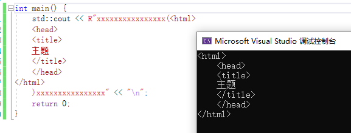


## 超长整型long long

- long long也是C语言关键字,但long long是在C++11标准中正式加入

- C++11要求long long至少占8字节,不同平台标准不一样,可能8字节,也可能16,32字节.

- 表示形式

  ```
  long int n1 = 100L;
  long long n2 = 100LL;
  unsigned long long n3 = 100ULL;
  ```

- 等价类型

  ```
  int main() {
      long long n1;
      long long int n2;
      signed long long n3;
      signed long long int n4;
      std::cout<<typeid(n1).name()<<"\n";
      std::cout<<typeid(n2).name()<<"\n";
      std::cout<<typeid(n3).name()<<"\n";
      std::cout<<typeid(n4).name()<<"\n";
      return 0;
  }
  ```

  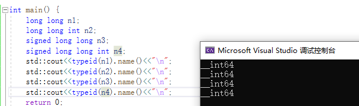

- 取值范围

  C++11提供了三个宏

  LLONG_MAX:signed long long int 的最大值

  LLONG_MIN:signed long long int 的最小值

  ULONG_MAX:unsiged long long int 的最大值(也等于2*LLONG_MAX)

  (无符号的最小值为0)

  计算方式:无符号,`2^比特位数==2^(字节数*8);`,8字节为`2^(8*8)== 2^64`;有符号,`2^(64-1)`;

- C++11定义的5种标准有符号整型

  - signed char, 1字节
  - short int, 2字节
  - int, 4字节
  - long int, 32位下4字节,64位下8字节
  - long long int, 最小占8字节.

  无符号5种在前面加上unsigned.


## static_assert

C语言中<cassert>是运行时断言,C++中static_assert是编译时断言.

语法:static_assert(常量表达式,"自定义代码提示");

static_assert的常量表达式必须要在编译期间能计算出来


## noexcept

### C++98异常抛出方法:

`void func() throw(int ,double){}` 表示只能抛出int,double类型的异常

`void func() throw(){}` 表示不抛出任何异常

`void func(){}`表示抛出异常没有类型限制

### C++11中如果不需要抛出异常:

`void func() noexcept{}` 表示不抛出任何异常,就算内部抛出,noexcept也会自动终止异常抛出,或者报错

### noexcept还可以带参数

`void func() noexcept(常量表达式,返回值为bool类型) {}`

如果表达式为true,和noexcept一样,不抛异常.

如果表达式为false,则会抛异常

一般在模板里使用.


## to_string

C++11提供了数值类型与字符串转换函数重载函数,头文件 `<string>`

[to_string - C++ Reference (cplusplus.com)](https://legacy.cplusplus.com/reference/string/to_string/)

数值转字符串

```
string to_string (int val);
string to_string (long val);
string to_string (long long val);
string to_string (unsigned val);
string to_string (unsigned long val);
string to_string (unsigned long long val);
string to_string (float val);
string to_string (double val);
string to_string (long double val);
```

字符串转数值

[标准库标头  - cppreference.com](https://zh.cppreference.com/w/cpp/header/string)

```
int       stoi ( const std::string& str, std::size_t* pos = nullptr, int base = 10 );
long      stol ( const std::string& str, std::size_t* pos = nullptr, int base = 10 );
long long stoll( const std::string& str, std::size_t* pos = nullptr, int base = 10 );

unsigned long      stoul ( const std::string& str, std::size_t* pos = nullptr, int base = 10 );
unsigned long long stoull( const std::string& str, std::size_t* pos = nullptr, int base = 10 );

float       stof ( const std::string& str, std::size_t* pos = nullptr );
double      stod ( const std::string& str, std::size_t* pos = nullptr );
long double stold( const std::string& str, std::size_t* pos = nullptr );
```

参数:

str是需要转成数值的字符串

pos:如果 pos 不是空指针,那么指针 ptr 会接收 str.c_str() 中首个未转换字符的地址,将计算该字符的下标它存储到 `*pos`;缺省是nullptr

base:进制数,base的值就代表所转换的进制数;缺省是10;如果 `base` 是 0,那么自动检测数值进制;如果前缀是 `0,`那么底是八进制,如果前缀是 `0x` 或 `0X`,那么底是十六进制,否则底是十进制.

演示

```
#include<string>

int main() {
    std::string str = "123a123a";
    size_t n= 0;
    int a = std::stoi(str,&n, 10);
    std::cout<<a<<", char:"<<n << "\n";

    return 0;
}
```


## decltype 

decltype == declare type

### 语法: 

- decltype(表达式) 变量名;

- decltype((表达式)) 引用;

```
struct A {
    int _a;
};

int main() {
    A a;
    decltype(a._a) t = 1;
    decltype((a._a)) tref= t;
    return 0;
}
```

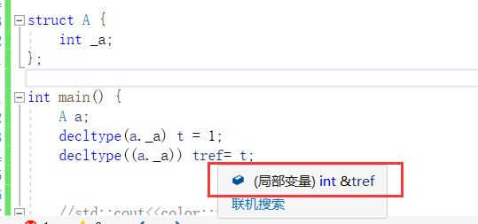

### 功能:

- 简化类模板编写

  举例: const对象与非const对象的类模板处理

  ```
  template<typename T>
  struct Container {
      void Traversal(T& t) {
          for (_it = t.begin(); _it != t.end(); _it++) {
              std::cout<< *_it << " ";
          }
      }
      //typename T::iterator _it;
      decltype(T().begin()) _it;  //也可以这样
  };
  
  int main() {
      std::list<int> lt{ 1,2,3,4,5,6 };
      Container<std::list<int>> con;
      //Container<const std::list<int>> con;
      con.Traversal(lt);
      return 0;
  }
  ```

  当传入非const对象时, 遍历list使用两种方式定义成员变量类型都满足需求

  `typename T::iterator _it;`

  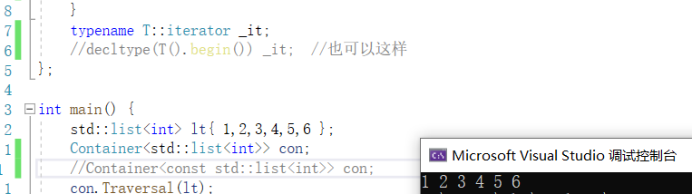

  `decltype(T().begin()) _it;`

  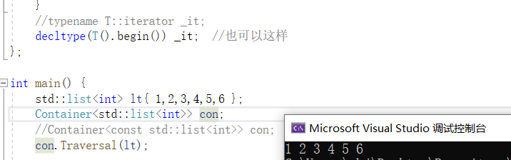

  但如果传入的是const对象.此时`typename T::iterator _it;`这样的定义方式就无法满足,

  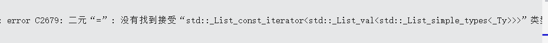

  而`decltype(T().begin()) _it;`都能满足两种方式:

  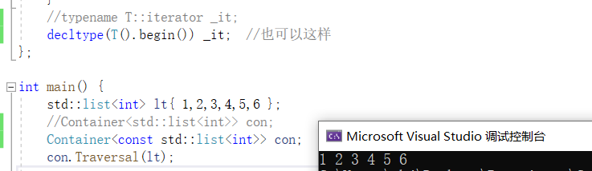

  因为类型是推导出来的,由编译器在编译期间自动识别,更加灵活.

  因此,decltype在模板编程中,能起到很好地简化实现的作用.


## 强类型枚举 enum class/struct

先看C++11之前,C++98的枚举(C风格)

```
#include<iostream>

enum { yellow, orange };
enum color { red,yellow, blue };

int main() {
    std::cout<<color::yellow<<"\n";
    return 0;
}
```

运行结果:

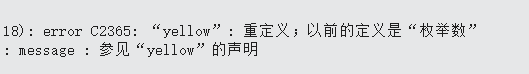

C风格枚举是全局可见.显然不符合面向对象封装特性.(此处全局指域内可见,如果在全局域,则全局可见;在类域则仅类域可见,在函数体内,则函数体内可见)

多个枚举有相同的属性时,会发生重定义行为,有着明先缺陷.

之后,在C++11中引入了enum class

### 举例

```
#include<iostream>

enum struct color { red,yellow, blue };

int main() {
    printf("%d",color::yellow);
    return 0;
}
```


### 特点

- 强作用域

  使用时必须指明作用域,`color::yellow;`

- 转换限制

  Description:强类型枚举成员的值不可以与整型发生隐式类型转化

  Example1:不能隐式类型转换

  

  Example2:可以显式相近类型转换

  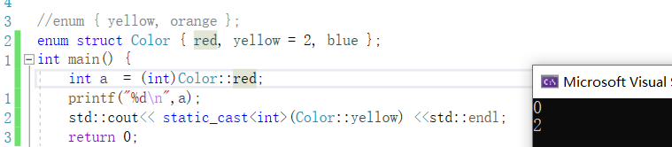

- 可以指定底层类型

  语法:

  enum class/struct 类型名 : 底层类型 { 成员 };

  `enum struct Color : char { blue, red, yellow };`

  //不能指定wchar_t,宽字节类型

  //C++11后普通枚举也支持指定底层类型


## 匿名联合体作为类成员

木叶村要进行第99次人口普查，人员的登记方式如下：
    - 学生只需要登记所在学校的编号
        - 本村学生以外的人员需要登记其身份证号码
        - 本村外来人员需要登记户口所在地+联系方式

```
// 外来人口信息
struct Foreigner
{
    Foreigner(string s, string ph) : addr(s), phone(ph) {}
    string addr;
    string phone;
};

// 登记人口信息
class Person
{
public:
    enum class Category : char {Student, Local, Foreign};
    Person(int num) : number(num), type(Category::Student) {}
    Person(string id) : idNum(id), type(Category::Local) {}
    Person(string addr, string phone) : foreign(addr, phone), type(Category::Foreign) {}
    ~Person() {}

    void print()
    {
        cout << "Person category: " << (int)type << endl;
        switch (type)
        {
        case Category::Student:
            cout << "Student school number: " << number << endl;
            break;
        case Category::Local:
            cout << "Local people ID number: " << idNum << endl;
            break;
        case Category::Foreign:
            cout << "Foreigner address: " << foreign.addr
                << ", phone: " << foreign.phone << endl;
            break;
        default:
            break;
        }
    }

private:
    Category type;
    union
    {
        int number;
        string idNum;
        Foreigner foreign;
    };
};

int main()
{
    Person p1(9527);
    Person p2("1101122022X");
    Person p3("砂隐村村北", "1301810001");
    p1.print();
    p2.print();
    p3.print();
    return 0;
}
```

输出结果:

```
Person category: 0
Student school number: 9527
Person category: 1
Local people ID number: 1101122022X
Person category: 2
Foreigner address: 砂隐村村北, phone: 1301810001
```

根据需求我们将木叶村的人口分为了三类并通过枚举记录了下来，在Person类中添加了一个匿名的非受限联合体用来存储人口信息，仔细分析之后就会发现这种处理方式的优势非常明显：尽可能地节省了内存空间。

1. Person类可以直接访问匿名非受限联合体内部的数据成员。
2. 不使用匿名非受限联合体申请的内存空间等于 number、 idNum 、 foreign 三者内存之和。
3. 使用匿名非受限联合体之后number、 idNum 、 foreign 三者共用同一块内存。


## chrono库

C++11中提供了日期和时间相关的库chrono，通过chrono库可以很方便地处理日期和时间，为程序的开发提供了便利。chrono库主要包含三种类型的类：`时间间隔duration`、`时钟clocks`、`时间点time point`。 

### 时间间隔duration

1. 常用类成员

`duration表示一段时间间隔`，用来记录时间长度，可以表示几秒、几分钟、几个小时的时间间隔。duration的原型如下：

```
// 定义于头文件 <chrono>
template< 
	class Rep, //单位类型 == 单位次数(多少个单位) == 多少个周期数
	class Period = std::ratio<1>  //单位  Period:周期,默认周期为1s
> class duration;
```

模板参数:

- `Rep`：Representation(表示),这是一个数值类型，用于**表示**时钟数（周期）的类型（默认为整形）。若 `Rep` 是浮点数，则 `duration` 能使用小数描述时钟周期的数目。

- `Period`：表示时钟的周期，它的原型如下：

  ```
  // 定义于头文件 <ratio>
  template<
      std::intmax_t Num,
      std::intmax_t Denom = 1
  > class ratio;
  ```

  **位于命名空间std**

  `ratio`(比率;比例)类表示`每个时钟周期的单位`,如秒、毫秒、微秒，其中第一个模板参数`Num(Numerator)代表分子`，`Denom(denominator)代表分母`，该分母值默认为1，因此，`ratio代表的是一个分子除以分母的数值`，比如：ratio<2>代表一个时钟周期是2秒，ratio<60>代表一分钟，ratio<60\*60>代表一个小时，ratio<60\*60\*24>代表一天。而ratio<1,1000>代表的是1/1000秒，也就是1毫秒，ratio<1,1000000>代表一微秒，ratio<1,1000000000>代表一纳秒。
  
  [std::ratio - cppreference.com](https://zh.cppreference.com/w/cpp/numeric/ratio/ratio)
  
  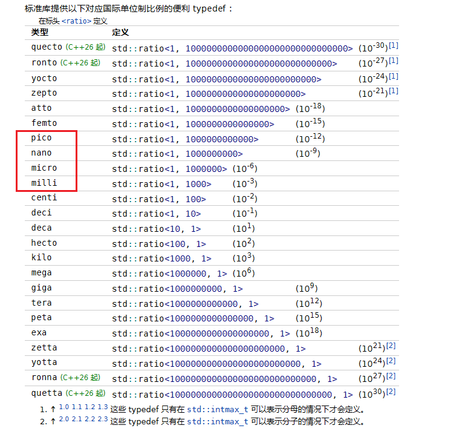
#### 常用的duration

  >为了方便使用，在标准库中定义了一些常用的时间间隔，比如：时、分、秒、毫秒、微秒、纳秒，它们都位于chrono命名空间下，定义如下：
  >
  >| 类型                                | 定义                                             |
  >| ----------------------------------- | ------------------------------------------------ |
  >| 纳秒：**std::chrono::nanoseconds**  | using nanoseconds  = duration<long long, nano>;  |
  >| 微秒：**std::chrono::microseconds** | using microseconds = duration<long long, micro>; |
  >| 毫秒：**std::chrono::milliseconds** | using milliseconds = duration<long long, milli>; |
  >| 秒  ：**std::chrono::seconds**      | using seconds      = duration<long long>;        |
  >| 分钟：**std::chrono::minutes**      | using minutes      = duration<int, ratio<60>>;   |
  >| 小时：**std::chrono::hours**        | using hours        = duration<int, ratio<3600>>; |

  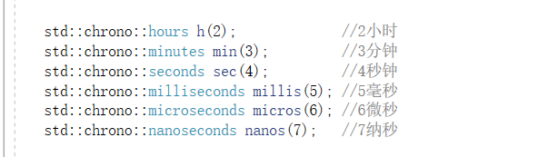

2. duration类的构造函数原型如下：

```
// 1. 拷贝构造函数
duration( const duration& ) = default;  //浅拷贝
// 2. 通过指定时钟周期的类型和次数来构造对象(以缺省单位秒直接构造)j
template< class Rep2 >
constexpr explicit duration( const Rep2& r ); //std::chrono::duration<int> sec(1);//1秒
// 3. 通过指定时钟周期类型，和时钟周期长度来构造对象
template< class Rep2, class Period2 >
constexpr duration( const duration<Rep2,Period2>& d );//改变单位
```

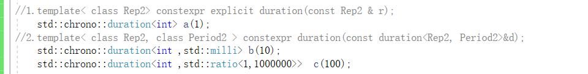

3. 为了更加方便的进行duration对象之间的操作，类内部进行了操作符重载：

```
duration& operator= (const duration& rhs) = default;
constexpr duration operator+() const;
constexpr duration operator-() const;
duration& operator++();
duration  operator++(int);
duration& operator--();
duration  operator--(int);
duration& operator+= (const duration& rhs);
duration& operator-= (const duration& rhs);
duration& operator*= (const rep& r);
duration& operator/= (const rep& r);
duration& operator%= (const rep& r);
duration& operator%= (const duration& rhs);
```

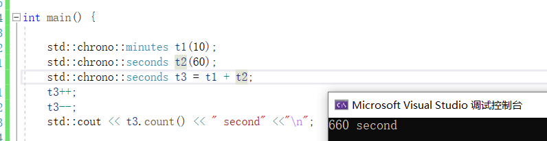

> 注意事项：duration的加减运算有一定的规则，当两个duration时钟周期不相同的时候，会先统一成一种时钟，然后再进行算术运算，统一的规则如下：假设有ratio<x1,y1> 和 ratio<x2,y2>两个时钟周期，首先需要求出x1，x2的最大公约数X，然后求出y1，y2的最小公倍数Y，统一之后的时钟周期ratio为ratio<X,Y>。

exam:

```
    std::chrono::duration<double, std::ratio<9, 7>> d1(3); //单位为9/7秒
    std::chrono::duration<double, std::ratio<6, 5>> d2(1); //单位为6/5秒
    /*
    9和6的最大公约数是3;
    7和5的最小公倍数是35;
    */
    // d1 和 d2 统一之后的时钟周期
    std::chrono::duration<double, std::ratio<3, 35>> d4 = d1 - d2; 
    auto d3 = d1 - d2;
    std::cout<<d3.count()<<"\n";
```

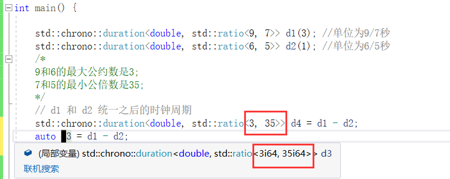

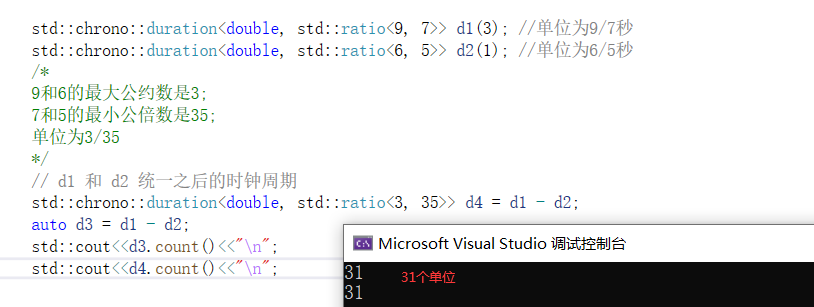

4. duration类还提供了获取时间间隔的**时钟周期数**的方法count()，函数原型如下：

```
constexpr rep count() const; //计算有多少个单位
```

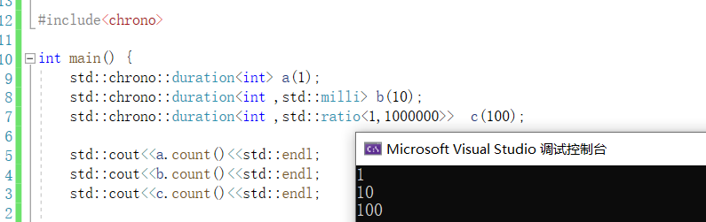


### 时间点time_point

注:这个类需要有一个时钟才可以使用,一般搭配system_clock、steady_clock使用,这两个类中缺省已将time_point等初始化好,方便用户使用.

用法展示在system_clock、steady_clock小节描述中.以下内容仅补充定义

```
// 定义于头文件 <chrono>
template<
    class Clock,
    class Duration = typename Clock::duration  //缺省使用时钟内置的duration,一般不需要手动写
> class time_point;
```

它被实现成如同存储一个 Duration 类型的自 Clock 的纪元起始开始的时间间隔的值，通过这个类最终可以得到时间中的某一个时间点。

- Clock：此时间点在此时钟上计量
- Duration：用于计量从纪元起时间的 std::chrono::duration 类型

```
// 1. 构造一个以新纪元(epoch，即：1970.1.1)作为值的对象，需要和时钟类一起使用，不能单独使用该无参构造函数
time_point();
// 2. 构造一个对象，表示一个时间点，其中d的持续时间从epoch开始，需要和时钟类一起使用，不能单独使用该构造函数
explicit time_point( const duration& d );
// 3. 拷贝构造函数，构造与t相同时间点的对象，使用的时候需要指定模板参数
template< class Duration2 >
time_point( const time_point<Clock,Duration2>& t );
```

operator重载和duration类似


在这个类中除了构造函数还提供了另外一个time_since_epoch()函数，**用来获得1970年1月1日到time_point对象中记录的时间经过的时间间隔**（duration），函数原型如下：

`duration time_since_epoch() const;`

**实际应用中将单位转换成秒后就是常说的时间戳**.

[在线时间戳转换工具(Unix timestamp) - 在线工具 (tools.fun)](https://tools.fun/timestamp.html)


### 时钟system_clock & steady_clock

#### system_clock


    struct system_clock { // wraps GetSystemTimePreciseAsFileTime/GetSystemTimeAsFileTime
        using rep                       = long long;
        using period                    = ratio<1, 10'000'000>; // 100 nanoseconds
        using duration                  = chrono::duration<rep, period>;
        using time_point                = chrono::time_point<system_clock>;
        static constexpr bool is_steady = false; //不是单调时钟
    
    /*	3个静态函数	*/
    	// get current time  
    	// 返回当前计算机系统时间的时间点。
        _NODISCARD static time_point now() noexcept 
        { 
            return time_point(duration(_Xtime_get_ticks()));
        }
    
    	// convert to __time64_t  
    	// 将 time_point 时间点类型转换为 std::time_t 类型
        _NODISCARD static __time64_t to_time_t(const time_point& _Time) noexcept 
        { 
            return duration_cast<seconds>(_Time.time_since_epoch()).count();
        }
        
    	// convert from __time64_t 
    	// 将 std::time_t 类型转换为 time_point 时间点类型
        _NODISCARD static time_point from_time_t(__time64_t _Tm) noexcept 
        { 
            return time_point{seconds{_Tm}};
        }
    };
system_clock中的time_point类型通过系统时钟做了初始化chrono::time_point<system_clock>，里面记录了新纪元时间点

system_clock还提供了3个静态函数:

```

static std::chrono::time_point<std::chrono::system_clock> now() noexcept;

// 将 time_point 时间点类型转换为 std::time_t 类型
static std::time_t to_time_t( const time_point& t ) noexcept;

// 将 std::time_t 类型转换为 time_point 时间点类型
static std::chrono::system_clock::time_point from_time_t( std::time_t t ) noexcept;
```


##### 代码举例

1. 计算一段时间

```
int main(){
//新纪元起始时间点:
    std::chrono::system_clock::time_point epoch;//系统时间的时间点(缺省为新纪元)  
    std::cout<<epoch.time_since_epoch().count()<<"\n"; //

//一日时间段
    std::chrono::duration<long long> day(std::chrono::hours(24)); 
    //std::chrono::hours day(24); //相同

//新纪元后的一天的时间点:
    std::chrono::system_clock::time_point epoch1 = epoch+day;
    //std::chrono::system_clock::time_point epoch1(epoch+day); //相同
    std::cout<<epoch1.time_since_epoch().count()<<"\n";

    return 0;
}
```

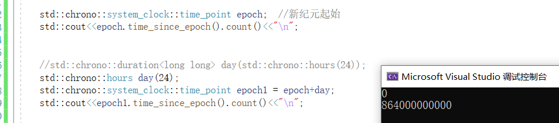

证明获取到的是新纪元起始一天之后的时间：

将周期单位从100纳秒换成s，即：

864000000000 （100ns） = 864000000000 00（1ns） * 10^(-9) = 86400 （s）

再将时间戳转换,得证


新纪元的时间戳是0,得证


2. 获取当前计算机系统时间

```
int main(){
    std::chrono::system_clock::time_point now_time =  std::chrono::system_clock::now();
   //法一:
    time_t time = std::chrono::system_clock::to_time_t(now_time);
    std::cout<<ctime(&time)<<"\n";
    
   //法二:获取后还需要单位转换+时间戳工具
    std::cout<<now_time.time_since_epoch().count()<<"\n"; 
}
```

运行结果:

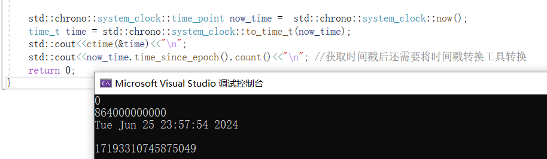


#### steady_clock(秒表)

别名:

`using high_resolution_clock = steady_clock;`

> 如果我们通过时钟不是为了获取当前的系统时间，而是进行程序耗时的时长，此时使用syetem_clock就不合适了，因为这个时间可以跟随系统的设置发生变化。在C++11中提供的时钟类steady_clock相当于秒表，只要启动就会进行时间的累加，并且不能被修改，非常适合于进行耗时的统计。


定义:

类 `std::chrono::steady_clock` 表示单调时钟。此时钟的时间点无法随物理时间向前推进而减少。此时钟与壁钟时间无关（例如，它能是上次重启开始的时间），且最适于度量间隔。

```
struct steady_clock { // wraps QueryPerformanceCounter 包装查询性能计数器-- VS
    using rep                       = long long;
    using period                    = nano;
    using duration                  = nanoseconds; //单位是1ns,精度比system高了100倍
    using time_point                = chrono::time_point<steady_clock>; //
    static constexpr bool is_steady = true; //稳定时钟标志，始终为 true
    
/* 1个静态方法 */
    // get current time 
    // 获取一个稳定增加的时间点
    _NODISCARD static time_point now() noexcept 
    { 
		//VS版实现,需要可以查VS中的定义
    }
};
```

这个类只提供了一个now方法,就用于统计时长.

##### 例程:

```
int main() {

    // 获取开始时间点
    std::chrono::steady_clock::time_point start = std::chrono::steady_clock::now();

    // 执行业务流程
    std::cout << "print 1000 stars ...." << "\n";
    for (int i = 0; i < 1000; ++i)
    {
        std::cout << "*";
    }
    std::cout << "\n";

    // 获取结束时间点
    std::chrono::steady_clock::time_point end = std::chrono::steady_clock::now();

    // 计算差值
    //std::chrono::duration<long long,std::nano> dt = end - start; //相同
    //std::chrono::nanoseconds dt = end - start; //相同
    auto dt = end - start;  //相同
    std::cout << "总共耗时: " << dt.count() << "纳秒" << "\n";
}
```

结果:

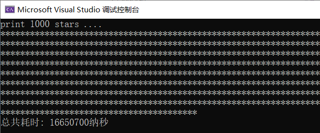

### 转换函数

#### 1.duration_cast

duration_cast是chrono库提供的一个模板函数,这个函数不属于duration类,属于chrono命名空间.

通过这个函数可以对duration类对象内部的时钟周期Period，和周期次数的类型Rep进行修改，该函数原型如下：

```
template <class ToDuration, class Rep, class Period>
  constexpr ToDuration duration_cast (const duration<Rep,Period>& dtn);
```

参数:

ToDuration:为转换目的对象的类型.

````
std::chrono::hours h = std::chrono::duration_cast<std::chrono::hours>(std::chrono::minutes(60));
````

Rep和Period都是duration模板参数,已经存在,不需要提供.

##### Description:

这个函数用于duration对象不能隐式转换的时候,即提供给用户用于强制转换.

duration_cast提供给用户使用,即数据安全交由程序员负责,底层不再负责.

##### duration支持隐式转换的规则

1. 如果是对时钟周期进行转换：原时钟周期必须能够整除目的时钟周期（比如：小时到分钟）。

2. 如果是对时钟周期次数的类型进行转换：低等类型默认可以向高等类型进行转换（比如：int 转 double）

   (1和2点反过来都会损失精度,是不安全的,因此默认不支持.)

3. 如果时钟周期和时钟周期次数类型都变了，只看第二点（也就是只看时间周期次数类型）。

4. 以上条件都不满足，那么就需要使用 duration_cast 进行显示转换。


Exam:

1. 周期: 分钟 -> 小时

```
int main() {
    //分钟 -> 小时
    std::chrono::hours h = std::chrono::minutes(60);
    return 0;
}
```

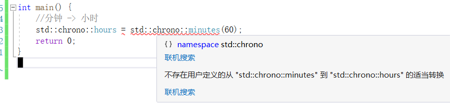

默认不支持小周期向大周期转换.需要使用duration_cast.

正确格式:

```
    std::chrono::hours h= std::chrono::duration_cast<std::chrono::hours>(std::chrono::minutes(60));
```


2. 类型 浮点 -> 整型

   报错:

   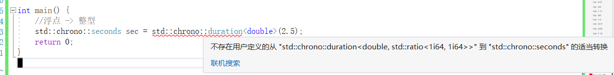

   正确:牺牲精度完成转换

   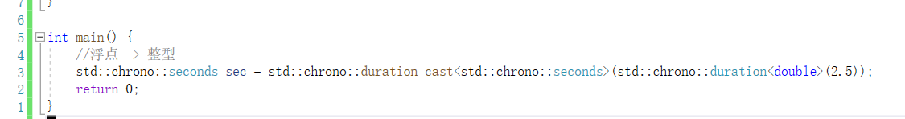

3. 类型+周期

   - 类型不满足,周期大小满足

   ```
       std::chrono::duration<double,std::ratio<1,1000>> t1(2.2);
       std::chrono::duration<int,std::ratio<1,100>> t2 = t1; 
   ```

   

   根据规则2,只看类型,类型不满足,因此需要转换.

   - 类型满足,周期大小不满足

         std::chrono::duration<int,std::ratio<1,100>> t3(1);
         std::chrono::duration<double,std::ratio<1,1000>> t2 = t3;

     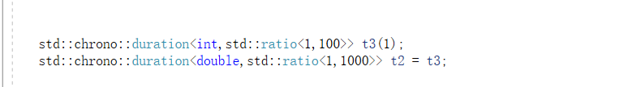

     没有警告,说明可以隐式转换,即只看类型.

#### 2. time_point_cast

time_point_cast 和 duration_cast类似.也是chrono库提供的一个模板函数,属于chrono命名空间,不属于time_point类.

转换规则也和duration_cast一样.

```
template <class ToDuration, class Clock, class Duration>
time_point<Clock, ToDuration> time_point_cast(const time_point<Clock, Duration> &t);

```


Exam:

```
    std::chrono::time_point<std::chrono::system_clock,std::chrono::milliseconds> millis; 
    std::chrono::time_point<std::chrono::system_clock,std::chrono::seconds> s = millis; 
```


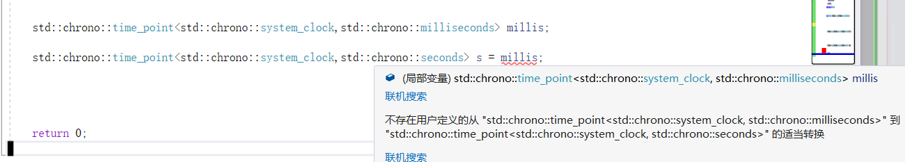

修改:

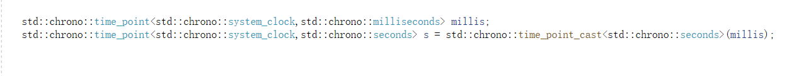

反之可以支持隐式转换

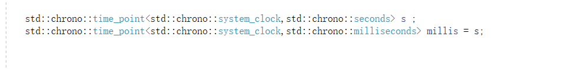


## 线程

### this_thread

在C++11中不仅添加了线程类，还添加了一个关于线程的命名空间std::this_thread，在这个命名空间中提供了四个公共的成员函数，通过这些成员函数就可以对当前线程进行相关的操作了。

头文件<thread>

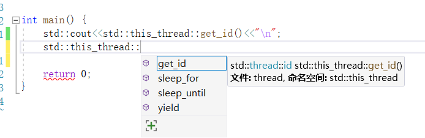

#### get_id()

函数原型

`thread::id get_id() noexcept;`

get_id可以获取线程的id,在主线程中获取到的是主线程id,在子线程中获取到的是子线程id.


>  注:在VS中,线程id被封装了一层,是一个结构体.
>
> 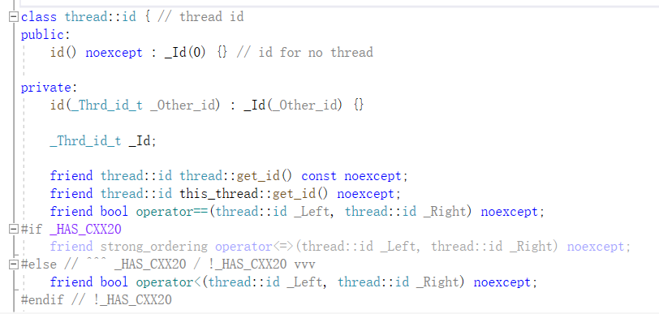


#### sleep_for

命名空间this_thread中提供了一个休眠函数sleep_for()，调用这个函数的线程会马上从运行态变成阻塞态并在这种状态下休眠一定的时长，因为阻塞态的线程已经让出了CPU资源，代码也不会被执行，所以线程休眠过程中对CPU来说没有任何负担。程序休眠完成之后，会从阻塞态重新变成就绪态，就绪态的线程需要再次争抢CPU时间片，抢到之后才会变成运行态，这时候程序才会继续向下运行。

这个函数是函数原型如下，参数需要指定一个休眠时长，是一个时间段：

```
template <class Rep, class Period>
  void sleep_for (const chrono::duration<Rep,Period>& rel_time);
```

示例

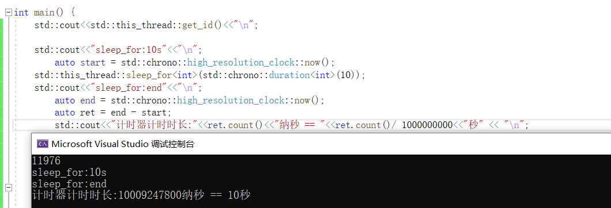
