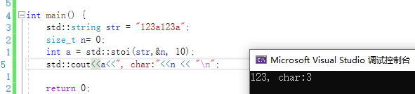
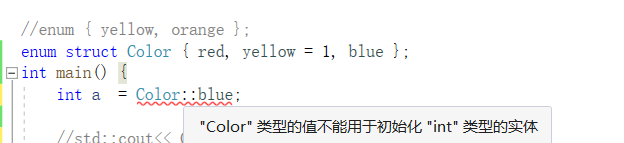

[TOC]

## 字符串原始字面值

语法:
R"16字符以内相同注释(保持原始输出的值)16字符以内相同注释"

```
int main() {

    std::cout<<R"必须相同的注释(
    <html>
    <head>
    <title>
    主题
    </title>
    </head>
    </html> 
    )必须相同的注释"<<"\n";
    return 0;
}
```


## 缺省值

### C++98:

- 函数参数的缺省值
- 整型类的静态类成员的缺省值
- 类模板参数的缺省值

### C++11:

- 非静态成员函数的缺省值

- 模板函数的缺省值

  该特性使 调用模板函数时可以**不写模板参数**,不写模板参数就能够**自动推导模板参数类型**. 当无法推导出类型时,才会使用缺省值(没有缺省值就会报错).


## 超长整型long long

- long long也是C语言关键字,但long long是在C++11标准中正式加入

- C++11要求long long至少占8字节,不同平台标准不一样,可能8字节,也可能16,32字节.

- 表示形式

  ```
  long int n1 = 100L;
  long long n2 = 100LL;
  unsigned long long n3 = 100ULL;
  ```

- 等价类型

  ```
  int main() {
      long long n1;
      long long int n2;
      signed long long n3;
      signed long long int n4;
      std::cout<<typeid(n1).name()<<"\n";
      std::cout<<typeid(n2).name()<<"\n";
      std::cout<<typeid(n3).name()<<"\n";
      std::cout<<typeid(n4).name()<<"\n";
      return 0;
  }
  ```

  

- 取值范围

  C++11提供了三个宏

  LLONG_MAX:signed long long int 的最大值

  LLONG_MIN:signed long long int 的最小值

  ULONG_MAX:unsiged long long int 的最大值(也等于2*LLONG_MAX)

  (无符号的最小值为0)

  计算方式:无符号,`2^比特位数==2^(字节数*8);`,8字节为`2^(8*8)== 2^64`;有符号,`2^(64-1)`;

- C++11定义的5种标准有符号整型

  - signed char, 1字节
  - short int, 2字节
  - int, 4字节
  - long int, 32位下4字节,64位下8字节
  - long long int, 最小占8字节.

  无符号5种在前面加上unsigned.


## static_assert

[【C++ 关键字 static_assert 相关问题】C++ 关于静态断言的编译问题 ，深入了解静态断言_-CSDN博客](https://blog.csdn.net/qq_21438461/article/details/132299143)

C语言中<cassert>是运行时断言,C++中static_assert是编译时断言.

- 语法:

  static_assert(常量表达式,"自定义代码提示");

- 注:

  static_assert的常量表达式必须要在编译期间能计算出来

- 优点:

  编译时断言能够比运行时断言更快的发现问题,在编译期间就能发现问题去解决.

  运行时断言,至少需要耗费一些资源,大型项目中开销更大,会更难发现问题.

- 例程

```
int main(){
  static_assert(sizeof(int*) == 4,R"(该操作系统是32位)");
  return 0;
}
```


32位系统与64位系统各数据类型对比：

|      数据类型      |      说明      | 32位字节数 | 64位字节数 |               取值范围               |
| :----------------: | :------------: | :--------: | :--------: | :----------------------------------: |
|        bool        |     布尔型     |     1      |     1      |             true，false              |
|        char        |     字符型     |     1      |     1      |               -128~127               |
|   unsigned char    |  无符号字符型  |     1      |     1      |                0~255                 |
|       short        |     短整型     |     2      |     2      |             -32768~32767             |
|   unsigned short   |  无符号短整型  |     2      |     2      |               0~65535                |
|        int         |      整型      |     4      |     4      |        -2147483648~2147483647        |
|    unsigned int    |   无符号整型   |     4      |     4      |             0~4294967295             |
|        long        |     长整型     |    `4`     |    `8`     |                  –                   |
|   unsigned long    |  无符号长整型  |    `4`     |    `8`     |                  –                   |
| unsigned long long | 无符号超长整型 |   至少8    |   至少8    |        8字节取值范围: 0 ~ 264        |
|       float        |  单精度浮点数  |     4      |     4      | 范围-2128 ~ 2128 精度为6~7位有效数字 |
|       double       |  双精度浮点数  |     8      |     8      |   范围-21024 ~ 21024 精度为15~16位   |
|    long double     | 扩展精度浮点数 |     8      |     8      |   范围-21024 ~ 21024 精度为15~16位   |
|         *          |  地址（指针）  |    `4`     |    `8`     |                  –                   |


## noexcept(※)

### C++98异常抛出方法:

`void func() throw(int ,double){}` 表示只能抛出int,double类型的异常

`void func() throw(){}` 表示不抛出任何异常

`void func(){}`表示抛出异常没有类型限制

### C++11 noexcept:

`void func() noexcept{}` 表示不抛出任何异常,就算内部抛出,noexcept也会自动终止异常抛出,或者报错

### noexcept参数

`void func() noexcept(常量表达式,返回值为bool类型) {}`

如果表达式为true,和noexcept一样,不抛异常.

如果表达式为false,则会抛异常

一般在模板里使用.


### C++98的异常特性

C++98中提供了一整套基本的异常处理机制，包括以下关键元素：

1. **`try`，`catch`，`throw` 关键字**：
   - `try` 块用于包围可能抛出异常的代码。
   - `catch` 块用于捕获和处理异常。
   - `throw` 关键字用于抛出异常。

2. **标准异常类**：
   - `std::exception` 是所有标准库异常的基类。
   - 其他标准异常类包括 `std::runtime_error`、`std::logic_error`、`std::bad_alloc` 等。

3. **异常规范**：
   - 异常规范 (`throw` 说明符) 用于声明函数可以抛出的异常类型。
   - 例如：`void func() throw(int, std::runtime_error);`
   - 不过，这种规范在实际应用中很少使用，C++11中引入了`noexcept`作为替代，并且异常规范在C++17中被完全移除。

### C++11的异常特性

C++11在C++98的基础上引入了一些新特性和改进，使异常处理更加灵活和高效：

1. **`noexcept` 关键字**：
   - 用于标记函数不会抛出异常。
   - `noexcept` 关键字可用于函数声明和表达式，以便编译器进行优化。
   - 例如：`void safeFunction() noexcept;`

2. **嵌套异常和重新抛出**：
   - C++11 引入了 `std::nested_exception` 类和 `std::rethrow_if_nested` 函数，用于捕获和重新抛出嵌套异常，特别是在多线程环境中有用。
   - 例如：
     ```cpp
     #include <iostream>
     #include <exception>
     
     void innerFunction() {
         throw std::runtime_error("Inner exception");
     }
     
     void outerFunction() {
         try {
             innerFunction();
         } catch (...) {
             std::throw_with_nested(std::runtime_error("Outer exception"));
         }
     }
     
     int main() {
         try {
             outerFunction();
         } catch (const std::exception& e) {
             std::cout << "Caught exception: " << e.what() << std::endl;
             try {
                 std::rethrow_if_nested(e);
             } catch (const std::exception& nested) {
                 std::cout << "Caught nested exception: " << nested.what() << std::endl;
             }
         }
         return 0;
     }
     ```

3. **智能指针和异常安全性**：
   
- C++11引入了智能指针（如`std::unique_ptr`和`std::shared_ptr`），这些工具可以显著提高异常安全性，避免资源泄漏。
  
4. **`std::current_exception` 和 `std::rethrow_exception`**：
   - 用于捕获当前异常对象并在以后重新抛出。
   - 例如：
     ```cpp
     #include <iostream>
     #include <exception>
     
     std::exception_ptr globalExceptionPtr;
     
     void mightThrow() {
         try {
             throw std::runtime_error("An error occurred");
         } catch (...) {
             globalExceptionPtr = std::current_exception();
         }
     }
     
     int main() {
         mightThrow();
         try {
             if (globalExceptionPtr) {
                 std::rethrow_exception(globalExceptionPtr);
             }
         } catch (const std::exception& e) {
             std::cout << "Caught exception: " << e.what() << std::endl;
         }
         return 0;
     }
     ```

### 总结

- **C++98**：提供了基本的异常处理机制，包括 `try`，`catch`，`throw` 关键字和标准异常类，但其异常规范（`throw` 说明符）在实际应用中较为有限。
- **C++11**：在C++98基础上进行了显著改进，引入了`noexcept`关键字、嵌套异常处理、新的标准库函数和类（如`std::current_exception`和`std::rethrow_exception`），以及智能指针以提高异常安全性。


## 字符串与数值类型转换 to_string/stoi

C++11提供了数值类型与字符串转换函数重载函数`to_string`,头文件 `<string>`

[to_string - C++ Reference (cplusplus.com)](https://legacy.cplusplus.com/reference/string/to_string/)

数值转字符串

```
string to_string (int val);
string to_string (long val);
string to_string (long long val);
string to_string (unsigned val);
string to_string (unsigned long val);
string to_string (unsigned long long val);
string to_string (float val);
string to_string (double val);
string to_string (long double val);
```

字符串转数值

[标准库标头  - cppreference.com](https://zh.cppreference.com/w/cpp/header/string)

```
int       stoi ( const std::string& str, std::size_t* pos = nullptr, int base = 10 );
long      stol ( const std::string& str, std::size_t* pos = nullptr, int base = 10 );
long long stoll( const std::string& str, std::size_t* pos = nullptr, int base = 10 );

unsigned long      stoul ( const std::string& str, std::size_t* pos = nullptr, int base = 10 );
unsigned long long stoull( const std::string& str, std::size_t* pos = nullptr, int base = 10 );

float       stof ( const std::string& str, std::size_t* pos = nullptr );
double      stod ( const std::string& str, std::size_t* pos = nullptr );
long double stold( const std::string& str, std::size_t* pos = nullptr );
```

参数:

- str是需要转成数值的字符串
- pos:如果 pos 不是空指针,那么指针 ptr 会接收 str.c_str() 中首个未转换字符的地址,将计算该字符的下标它存储到 `*pos`;缺省是nullptr
- base:进制数,base的值就代表所转换的进制数;缺省是10;如果 `base` 是 0,那么自动检测数值进制;如果前缀是 `0,`那么底是八进制,如果前缀是 `0x` 或 `0X`,那么底是十六进制,否则底是十进制.

返回值

- 对应 str 内容的整数值。

异常

- 无法进行转换时会抛出 std::invalid_argument。(只有首字母为空或数值时不抛异常)
- 转换值会落在结果类型的范围外，或底层函数（即 std::strtol 或 std::strtoll）将 errno 设置为 ERANGE 时会抛出 std::out_of_range。

使用

- 从首字母开始寻找空格和数值,空格会跳过;遇到数值后,开始找第一个非数值或直到结束,输出结果.
- 当从头开始到结束都没有遇到数值类型,或遇到的第一个字符为非数值的(空格会跳过),则抛异常.

演示

```
#include<string>

int main() {
    std::string str = "123a123a";
    std::string str1 = "a123a123a"; 	//异常
    std::string str2 = "   123a123a"; //正常
    std::string str2 = "   "; 				//异常
    size_t n= 0;
    int a = std::stoi(str,&n, 10);
    std::cout<<a<<", char:"<<n << "\n";

    return 0;
}
```




## decltype 

decltype == declare type

### 语法: 

- decltype(表达式/函数) 变量名;

  推导类型与表达式结果/函数返回值类型一致

- decltype((表达式)) 引用;

  表达式是一个左值，或者被括号( )包围，使用 decltype推导出的是表达式类型的引用（如果有const、volatile限定符不能忽略）。

```
struct A {
    int _a;
};

int main() {
    A a;
    decltype(a._a) t = 1;
    decltype((a._a)) tref= t;
    return 0;
}
```


### 功能:

- 简化类模板编写

  举例: const对象与非const对象的类模板处理

  ```
  template<typename T>
  struct Container {
      void Traversal(T& t) {
          for (_it = t.begin(); _it != t.end(); _it++) {
              std::cout<< *_it << " ";
          }
      }
      //typename T::iterator _it;
      decltype(T().begin()) _it;  //也可以这样
  };
  
  int main() {
      std::list<int> lt{ 1,2,3,4,5,6 };
      Container<std::list<int>> con;
      //Container<const std::list<int>> con;
      con.Traversal(lt);
      return 0;
  }
  ```

  当传入非const对象时, 遍历list使用两种方式定义成员变量类型都满足需求

  `typename T::iterator _it;`

  

  `decltype(T().begin()) _it;`

  

  但如果传入的是const对象.此时`typename T::iterator _it;`这样的定义方式就无法满足,

  

  而`decltype(T().begin()) _it;`都能满足两种方式:

  

  因为类型是推导出来的,由编译器在编译期间自动识别,更加灵活.

  因此,decltype在模板编程中,能起到很好地简化实现的作用.


## auto

### auto规则补充:

- 当变量不是指针或者引用类型时，推导的结果中不会保留const、volatile关键字
- 当变量是指针或者引用类型时，推导的结果中会保留const、volatile关键字

### 

### 返回值类型后置

在模板编程中,返回类型可能依赖于模板参数的类型,而前置返回值类型在模板参数确定前就需要明确.

为了实现返回值类型能够自动推导,就需要返回值类型在参数类型确定后再确定,因此引入了返回值类型后置:

返回值类型后置语法使得我们能够在声明返回类型时访问参数类型.

> 另一方面,如函数指针的无法成为前置函数返回值类型,使用后置返回值类型能够实现返回值类型拓展.
>
> 《现代C++语言核心特性解析》
>
> 实际上,某些情况下通过decltype(T()) 也可以实现返回值类型推导,但是可读性比较差,不是所有类都可以,不够普适

样例1:

```
auto foo()->int {
    return 2;
}

int main() {
    std::cout<<foo()<<"\n";
    return 0;
}
```


样例2:

```
template<class T = int, class U = int>
auto Add(T t, U u)->decltype(t + u) {
    return t + u;
}


int main() {
    std::cout << Add(1, 1.1) << "\n";
    return 0;
}
```


## 强类型枚举 enum class/struct

先看C++11之前,C++98的枚举(C风格)

```
#include<iostream>

enum { yellow, orange };
enum color { red,yellow, blue };

int main() {
    std::cout<<color::yellow<<"\n";
    return 0;
}
```

运行结果:


C风格枚举是全局可见.显然不符合面向对象封装特性.(此处全局指域内可见,如果在全局域,则全局可见;在类域则仅类域可见,在函数体内,则函数体内可见)

多个枚举有相同的属性时,会发生重定义行为,有着明先缺陷.

之后,在C++11中引入了enum class

### 举例

```
#include<iostream>

enum struct color { red,yellow, blue };

int main() {
    printf("%d",color::yellow);
    return 0;
}
```


### 特点

- 强作用域

  使用时必须指明作用域,`color::yellow;`

- 转换限制

  Description:强类型枚举成员的值不可以与整型发生隐式类型转化

  Example1:不能隐式类型转换

  

  Example2:可以显式相近类型转换

  

- 可以指定底层类型

  语法:

  enum class/struct 类型名 : 底层类型 { 成员 };

  `enum struct Color : char { blue, red, yellow };`

  //不能指定wchar_t,宽字节类型

  //C++11后普通枚举也支持指定底层类型

### 用法:

1. 直接使用(C风格)

2. 用于比较时,以==对象==方式.

   ```
   enum class Color{RED,YELLOW,BLUE};
   Color color; //以对象方式定义枚举
   if(color==Color::RED){
   	//
   }
   else if(color == Color::BLUE){
   	//
   }
   else //...
   ```

   

   


## POD类型

[pod（数据结构）_百度百科 (baidu.com)](https://baike.baidu.com/item/pod/13976179?fr=ge_ala)

>  plain old data 的缩写（POD）一个普通的古老的数据结构(POD)是一种[数据结构](https://baike.baidu.com/item/数据结构/1450?fromModule=lemma_inlink)。
>
> 它仅作为被动的收藏的字段值,不使用[封包](https://baike.baidu.com/item/封包/0?fromModule=lemma_inlink)或者otherobject-oriented特征。(A plain old data structure(POD) is a data structurethat is represented only as passive collections of field values, without using encapsulationor otherobject-orientedfeatures.)
>
> 在C++中，我们把传统的C风格的struct叫做POD（Plain Old Data）对象。一般来说，POD对象应该满足如下特性。
>
> 对于POD类型T的对象，不管这个对象是否拥有类型T的有效值，如果将该对象的底层[字节](https://baike.baidu.com/item/字节/0?fromModule=lemma_inlink)序列复制到一个[字符](https://baike.baidu.com/item/字符/0?fromModule=lemma_inlink)[数组](https://baike.baidu.com/item/数组/0?fromModule=lemma_inlink)（或者无符号字符数组）中，再将其复制回对象，那么该对象的值与原始值一样。
>
> 对于任意的POD类型T，如果两个T[指针](https://baike.baidu.com/item/指针/0?fromModule=lemma_inlink)分别指向两个不同的对象obj1和obj2，如果用memcpy[库函数](https://baike.baidu.com/item/库函数/0?fromModule=lemma_inlink)把obj1的值复制到obj2，那么obj2将拥有与obj1相同的值。
>
> 简言之，针对POD对象，其二进制内容是可以随便复制的，在任何地方，只要其二进制内容在，就能还原出正确无误的POD对象。对于任何POD对象，都可以使用memset( )函数或者其他类似的内存初始化函数。

在C++11中将 POD划分为两个基本概念的合集，即∶平凡的（trivial） 和标准布局的（standard layout ） 。


Old ：说明是老的数据类型,即C风格类型,体现与C的兼容性

POD类型的特性是 成员内存连续,只允许存在普通的成员函数(静态+非静态).

POD类型等于     平凡类型(trivial) + 标准布局类型(standard layout).

[普通、标准布局、POD 和文本类型 | Microsoft Learn](https://learn.microsoft.com/zh-cn/cpp/cpp/trivial-standard-layout-and-pod-types?view=msvc-160)

### "平凡"类型 trivial

平凡类型就是只允许普通的成员函数存在(静态+非静态)的结构体.

#### 具体条件:

1. **拥有平凡的默认构造函数（trivial constructor）和析构函数（trivial destructor）**

   平凡的默认构造函数就是说构造函数**"什么都不干"**。

   代码中体现为:只有**由编译器自动生成的默认构造**以及**`=default`关键字声明的构造函数**,才算平凡函数

   `=default`就是让构造函数平凡化.

2. **拥有平凡的拷贝构造函数（trivial copy constructor）和移动构造函数（trivial move constructor）。**

3. **拥有平凡的拷贝赋值运算符（trivial assignment operator）和移动赋值运算符（trivial move operator）。**

   以上平凡函数都可以显式使用`=default`让其平凡化.

4. **不包含虚函数以及虚基类。**

满足以上所有要求,才算是平凡类型.平凡类型能够完美兼容C语言.

#### 注意:

- 自定义的构造函数就算是空函数体也不是平凡类型.
- 必须要有默认生成的一系列函数,使用`=delete`禁止生成默认函数后不是平凡类型

#### Example:

exam1:不是平凡类型


exam2:是平凡类型


### "标准布局"类型 standard layout

标准布局实际就是成员内存连续的布局.只有内存连续才能满足向纯C类型兼容

#### 具体条件:

1. 所有**非静态成员有相同的访问权限**（public，private，protected三种权限只存其一）。

   exam1:是标准布局

   

   exam2:不是标准布局

   

2. 在类或者结构体继承体系中

   - **没有虚函数和虚拟基类**：类或结构体不能包含虚函数或虚基类。(虚表会破坏内存连续)
   - **没有非标准布局基类**：类或结构体不能继承自非标准布局类型。
   - **所有非静态数据成员具有相同的访问控制**：所有非静态数据成员必须具有相同的访问级别（public, protected, private）。

   - **只有一个最基类**：如果类有基类，则只能有一个最基类。(看编译器实现,有时多个基类也可以)
   - **不能与基类同时存在非静态成员**: 当基类有非静态成员时,自己不能存在非静态成员.当自己存在非静态成员时,基类不能有.
   - **不能存在非静态的基类成员**：VS2019不允许存在,gcc7允许存在,--->最好不存在
   - **类类型的所有非静态成员均为标准布局,所有非静态数据成员均符合标准布局类型**


**静态数据成员的访问控制**：

- 静态数据成员的访问控制不影响标准布局类型的规则，因为它们不属于任何特定对象实例，只存在一份，并且不占用对象实例的内存空间。

**静态成员不影响内存布局**：

- 静态成员变量在内存中只有一份，属于整个类，而非具体的对象实例。由于标准布局类型的规则主要是为了确保对象的内存布局一致和可预测，所以静态成员的存在不会破坏这一点。

**静态成员函数**：

- 静态成员函数同样不影响对象的内存布局，因为它们也不属于任何特定对象实例，可以通过类名直接访问。


