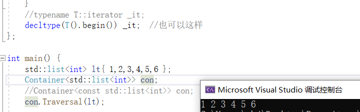

[toc]

## 字符串原始字面值

语法:
R"16字符以内相同注释(保持原始输出的值)16字符以内相同注释"

```
int main() {

    std::cout<<R"必须相同的注释(
    <html>
    <head>
    <title>
    主题
    </title>
    </head>
    </html> 
    )必须相同的注释"<<"\n";
    return 0;
}
```


## 超长整型long long

- long long也是C语言关键字,但long long是在C++11标准中正式加入

- C++11要求long long至少占8字节,不同平台标准不一样,可能8字节,也可能16,32字节.

- 表示形式

  ```
  long int n1 = 100L;
  long long n2 = 100LL;
  unsigned long long n3 = 100ULL;
  ```

- 等价类型

  ```
  int main() {
      long long n1;
      long long int n2;
      signed long long n3;
      signed long long int n4;
      std::cout<<typeid(n1).name()<<"\n";
      std::cout<<typeid(n2).name()<<"\n";
      std::cout<<typeid(n3).name()<<"\n";
      std::cout<<typeid(n4).name()<<"\n";
      return 0;
  }
  ```

  

- 取值范围

  C++11提供了三个宏

  LLONG_MAX:signed long long int 的最大值

  LLONG_MIN:signed long long int 的最小值

  ULONG_MAX:unsiged long long int 的最大值(也等于2*LLONG_MAX)

  (无符号的最小值为0)

  计算方式:无符号,`2^比特位数==2^(字节数*8);`,8字节为`2^(8*8)== 2^64`;有符号,`2^(64-1)`;

- C++11定义的5种标准有符号整型

  - signed char, 1字节
  - short int, 2字节
  - int, 4字节
  - long int, 32位下4字节,64位下8字节
  - long long int, 最小占8字节.

  无符号5种在前面加上unsigned.


## static_assert

C语言中<cassert>是运行时断言,C++中static_assert是编译时断言.

语法:static_assert(常量表达式,"自定义代码提示");

static_assert的常量表达式必须要在编译期间能计算出来


## noexcept

### C++98异常抛出方法:

`void func() throw(int ,double){}` 表示只能抛出int,double类型的异常

`void func() throw(){}` 表示不抛出任何异常

`void func(){}`表示抛出异常没有类型限制

### C++11中如果不需要抛出异常:

`void func() noexcept{}` 表示不抛出任何异常,就算内部抛出,noexcept也会自动终止异常抛出,或者报错

### noexcept还可以带参数

`void func() noexcept(常量表达式,返回值为bool类型) {}`

如果表达式为true,和noexcept一样,不抛异常.

如果表达式为false,则会抛异常

一般在模板里使用.


## to_string

C++11提供了数值类型与字符串转换函数重载函数,头文件 `<string>`

[to_string - C++ Reference (cplusplus.com)](https://legacy.cplusplus.com/reference/string/to_string/)

数值转字符串

```
string to_string (int val);
string to_string (long val);
string to_string (long long val);
string to_string (unsigned val);
string to_string (unsigned long val);
string to_string (unsigned long long val);
string to_string (float val);
string to_string (double val);
string to_string (long double val);
```

字符串转数值

[标准库标头  - cppreference.com](https://zh.cppreference.com/w/cpp/header/string)

```
int       stoi ( const std::string& str, std::size_t* pos = nullptr, int base = 10 );
long      stol ( const std::string& str, std::size_t* pos = nullptr, int base = 10 );
long long stoll( const std::string& str, std::size_t* pos = nullptr, int base = 10 );

unsigned long      stoul ( const std::string& str, std::size_t* pos = nullptr, int base = 10 );
unsigned long long stoull( const std::string& str, std::size_t* pos = nullptr, int base = 10 );

float       stof ( const std::string& str, std::size_t* pos = nullptr );
double      stod ( const std::string& str, std::size_t* pos = nullptr );
long double stold( const std::string& str, std::size_t* pos = nullptr );
```

参数:

str是需要转成数值的字符串

pos:如果 pos 不是空指针,那么指针 ptr 会接收 str.c_str() 中首个未转换字符的地址,将计算该字符的下标它存储到 `*pos`;缺省是nullptr

base:进制数,base的值就代表所转换的进制数;缺省是10;如果 `base` 是 0,那么自动检测数值进制;如果前缀是 `0,`那么底是八进制,如果前缀是 `0x` 或 `0X`,那么底是十六进制,否则底是十进制.

演示

```
#include<string>

int main() {
    std::string str = "123a123a";
    size_t n= 0;
    int a = std::stoi(str,&n, 10);
    std::cout<<a<<", char:"<<n << "\n";

    return 0;
}
```


## decltype 

decltype == declare type

### 语法: 

- decltype(表达式) 变量名;

- decltype((表达式)) 引用;

```
struct A {
    int _a;
};

int main() {
    A a;
    decltype(a._a) t = 1;
    decltype((a._a)) tref= t;
    return 0;
}
```


### 功能:

- 简化类模板编写

  举例: const对象与非const对象的类模板处理

  ```
  template<typename T>
  struct Container {
      void Traversal(T& t) {
          for (_it = t.begin(); _it != t.end(); _it++) {
              std::cout<< *_it << " ";
          }
      }
      //typename T::iterator _it;
      decltype(T().begin()) _it;  //也可以这样
  };
  
  int main() {
      std::list<int> lt{ 1,2,3,4,5,6 };
      Container<std::list<int>> con;
      //Container<const std::list<int>> con;
      con.Traversal(lt);
      return 0;
  }
  ```

  当传入非const对象时, 遍历list使用两种方式定义成员变量类型都满足需求

  `typename T::iterator _it;`

  

  `decltype(T().begin()) _it;`

  

  但如果传入的是const对象.此时`typename T::iterator _it;`这样的定义方式就无法满足,

  

  而`decltype(T().begin()) _it;`都能满足两种方式:

  

  因为类型是推导出来的,由编译器在编译期间自动识别,更加灵活.

  因此,decltype在模板编程中,能起到很好地简化实现的作用.


## 强类型枚举 enum class/struct

先看C++11之前,C++98的枚举(C风格)

```
#include<iostream>

enum { yellow, orange };
enum color { red,yellow, blue };

int main() {
    std::cout<<color::yellow<<"\n";
    return 0;
}
```

运行结果:


C风格枚举是全局可见.显然不符合面向对象封装特性.(此处全局指域内可见,如果在全局域,则全局可见;在类域则仅类域可见,在函数体内,则函数体内可见)

多个枚举有相同的属性时,会发生重定义行为,有着明先缺陷.

之后,在C++11中引入了enum class

### 举例

```
#include<iostream>

enum struct color { red,yellow, blue };

int main() {
    printf("%d",color::yellow);
    return 0;
}
```


### 特点

- 强作用域

  使用时必须指明作用域,`color::yellow;`

- 转换限制

  Description:强类型枚举成员的值不可以与整型发生隐式类型转化

  Example1:不能隐式类型转换

  

  

- 可以指定底层类型

  语法:

  enum class/struct 类型名 : 底层类型 { 成员 };

  `enum struct Color : char { blue, red, yellow };`

  //不能指定wchar_t,宽字节类型
