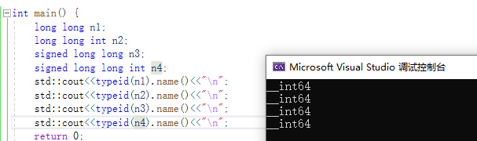

[toc]

## 字符串原始字面值

语法:
R"16字符以内相同注释(保持原始输出的值)16字符以内相同注释"

```
int main() {

    std::cout<<R"必须相同的注释(
    <html>
    <head>
    <title>
    主题
    </title>
    </head>
    </html> 
    )必须相同的注释"<<"\n";
    return 0;
}
```


## 超长整型long long

- long long也是C语言关键字,但long long是在C++11标准中正式加入

- C++11要求long long至少占8字节,不同平台标准不一样,可能8字节,也可能16,32字节.

- 表示形式

  ```
  long int n1 = 100L;
  long long n2 = 100LL;
  unsigned long long n3 = 100ULL;
  ```

- 等价类型

  ```
  int main() {
      long long n1;
      long long int n2;
      signed long long n3;
      signed long long int n4;
      std::cout<<typeid(n1).name()<<"\n";
      std::cout<<typeid(n2).name()<<"\n";
      std::cout<<typeid(n3).name()<<"\n";
      std::cout<<typeid(n4).name()<<"\n";
      return 0;
  }
  ```

  

- 取值范围

  C++11提供了三个宏

  LLONG_MAX:signed long long int 的最大值

  LLONG_MIN:signed long long int 的最小值

  ULONG_MAX:unsiged long long int 的最大值(也等于2*LLONG_MAX)

  (无符号的最小值为0)

  计算方式:无符号,`2^比特位数==2^(字节数*8);`,8字节为`2^(8*8)== 2^64`;有符号,`2^(64-1)`;

- C++11定义的5种标准有符号整型

  - signed char, 1字节
  - short int, 2字节
  - int, 4字节
  - long int, 32位下4字节,64位下8字节
  - long long int, 最小占8字节.

  无符号5种在前面加上unsigned.


## static_assert

C语言中<cassert>是运行时断言,C++中static_assert是编译时断言.

语法:static_assert(常量表达式,"自定义代码提示");

static_assert的常量表达式必须要在编译期间能计算出来


## noexcept

### C++98异常抛出方法:

`void func() throw(int ,double){}` 表示只能抛出int,double类型的异常

`void func() throw(){}` 表示不抛出任何异常

`void func(){}`表示抛出异常没有类型限制

### C++11中如果不需要抛出异常:

`void func() noexcept{}` 表示不抛出任何异常,就算内部抛出,noexcept也会自动终止异常抛出,或者报错

### noexcept还可以带参数

`void func() noexcept(常量表达式,返回值为bool类型) {}`

如果表达式为true,和noexcept一样,不抛异常.

如果表达式为false,则会抛异常

一般在模板里使用.
