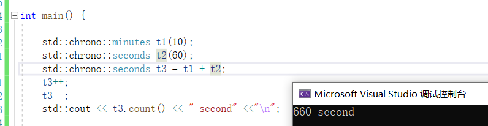
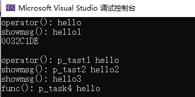

[TOC]


## \<chrono\>

C++11中提供了日期和时间相关的库chrono。

chrono库主要包含三种类型的类：`时间间隔duration`、`时钟clocks`、`时间点time point`。 

### 时间间隔duration

1. 常用类成员

`duration表示一段时间间隔`，用来记录时间长度，可以表示几秒、几分钟、几个小时的时间间隔。duration的原型如下：

```
// 定义于头文件 <chrono>
template< 
	class Rep, //单位类型 == 单位次数(多少个单位) == 多少个周期数
	class Period = std::ratio<1>  //单位  Period:周期,默认周期为1s
> class duration;
```

模板参数:

- `Rep`：Representation(表示),这是一个数值类型，用于**表示**时钟数（周期）的类型（默认为整形）。若 `Rep` 是浮点数，则 `duration` 能使用小数描述时钟周期的数目。

- `Period`：表示时钟的周期，它的原型如下：

  ```
  // 定义于头文件 <ratio>
  template<
      std::intmax_t Num,
      std::intmax_t Denom = 1
  > class ratio;
  ```

  **位于命名空间std**

  `ratio`(比率;比例)类表示`每个时钟周期的单位`,如秒、毫秒、微秒，其中第一个模板参数`Num(Numerator)代表分子`，`Denom(denominator)代表分母`，该分母值默认为1，因此，`ratio代表的是一个分子除以分母的数值`，比如：ratio<2>代表一个时钟周期是2秒，ratio<60>代表一分钟，ratio<60\*60>代表一个小时，ratio<60\*60\*24>代表一天。而ratio<1,1000>代表的是1/1000秒，也就是1毫秒，ratio<1,1000000>代表一微秒，ratio<1,1000000000>代表一纳秒。

  [std::ratio - cppreference.com](https://zh.cppreference.com/w/cpp/numeric/ratio/ratio)

  

#### 常用的duration

  >为了方便使用，在标准库中定义了一些常用的时间间隔，比如：时、分、秒、毫秒、微秒、纳秒，它们都位于chrono命名空间下，定义如下：
  >
  >| 类型                                | 定义                                             |
  >| ----------------------------------- | ------------------------------------------------ |
  >| 纳秒：**std::chrono::nanoseconds**  | using nanoseconds  = duration<long long, nano>;  |
  >| 微秒：**std::chrono::microseconds** | using microseconds = duration<long long, micro>; |
  >| 毫秒：**std::chrono::milliseconds** | using milliseconds = duration<long long, milli>; |
  >| 秒  ：**std::chrono::seconds**      | using seconds      = duration<long long>;        |
  >| 分钟：**std::chrono::minutes**      | using minutes      = duration<int, ratio<60>>;   |
  >| 小时：**std::chrono::hours**        | using hours        = duration<int, ratio<3600>>; |

  

2. duration类的构造函数原型如下：

```
// 1. 拷贝构造函数
duration( const duration& ) = default;  //浅拷贝
// 2. 通过指定时钟周期的类型和次数来构造对象(以缺省单位秒直接构造)j
template< class Rep2 >
constexpr explicit duration( const Rep2& r ); //std::chrono::duration<int> sec(1);//1秒
// 3. 通过指定时钟周期类型，和时钟周期长度来构造对象
template< class Rep2, class Period2 >
constexpr duration( const duration<Rep2,Period2>& d );//改变单位
```


3. 为了更加方便的进行duration对象之间的操作，类内部进行了操作符重载：

```
duration& operator= (const duration& rhs) = default;
constexpr duration operator+() const;
constexpr duration operator-() const;
duration& operator++();
duration  operator++(int);
duration& operator--();
duration  operator--(int);
duration& operator+= (const duration& rhs);
duration& operator-= (const duration& rhs);
duration& operator*= (const rep& r);
duration& operator/= (const rep& r);
duration& operator%= (const rep& r);
duration& operator%= (const duration& rhs);
```



> 注意事项：duration的加减运算有一定的规则，当两个duration时钟周期不相同的时候，会先统一成一种时钟，然后再进行算术运算，统一的规则如下：假设有ratio<x1,y1> 和 ratio<x2,y2>两个时钟周期，首先需要求出x1，x2的最大公约数X，然后求出y1，y2的最小公倍数Y，统一之后的时钟周期ratio为ratio<X,Y>。

exam:

```
    std::chrono::duration<double, std::ratio<9, 7>> d1(3); //单位为9/7秒
    std::chrono::duration<double, std::ratio<6, 5>> d2(1); //单位为6/5秒
    /*
    9和6的最大公约数是3;
    7和5的最小公倍数是35;
    */
    // d1 和 d2 统一之后的时钟周期
    std::chrono::duration<double, std::ratio<3, 35>> d4 = d1 - d2; 
    auto d3 = d1 - d2;
    std::cout<<d3.count()<<"\n";
```


4. duration类还提供了获取时间间隔的**时钟周期数**的方法count()，函数原型如下：

```
constexpr rep count() const; //计算有多少个单位
```


### 时间点time_point

注:这个类需要有一个时钟才可以使用,一般搭配system_clock、steady_clock使用,这两个类中缺省已将time_point等初始化好,方便用户使用.

用法展示在system_clock、steady_clock小节描述中.以下内容仅补充定义

```
// 定义于头文件 <chrono>
template<
    class Clock,
    class Duration = typename Clock::duration  //缺省使用时钟内置的duration,一般不需要手动写
> class time_point;
```

它被实现成如同存储一个 Duration 类型的自 Clock 的纪元起始开始的时间间隔的值，通过这个类最终可以得到时间中的某一个时间点。

- Clock：此时间点在此时钟上计量
- Duration：用于计量从纪元起时间的 std::chrono::duration 类型

```
// 1. 构造一个以新纪元(epoch，即：1970.1.1)作为值的对象，需要和时钟类一起使用，不能单独使用该无参构造函数
time_point();
// 2. 构造一个对象，表示一个时间点，其中d的持续时间从epoch开始，需要和时钟类一起使用，不能单独使用该构造函数
explicit time_point( const duration& d );
// 3. 拷贝构造函数，构造与t相同时间点的对象，使用的时候需要指定模板参数
template< class Duration2 >
time_point( const time_point<Clock,Duration2>& t );
```

operator重载和duration类似


在这个类中除了构造函数还提供了另外一个time_since_epoch()函数，**用来获得1970年1月1日到time_point对象中记录的时间经过的时间间隔**（duration），函数原型如下：

`duration time_since_epoch() const;`

**实际应用中将单位转换成秒后就是常说的时间戳**.

[在线时间戳转换工具(Unix timestamp) - 在线工具 (tools.fun)](https://tools.fun/timestamp.html)


### 时钟system_clock & steady_clock

#### system_clock


    struct system_clock { // wraps GetSystemTimePreciseAsFileTime/GetSystemTimeAsFileTime
        using rep                       = long long;
        using period                    = ratio<1, 10'000'000>; // 100 nanoseconds
        using duration                  = chrono::duration<rep, period>;
        using time_point                = chrono::time_point<system_clock>;
        static constexpr bool is_steady = false; //不是单调时钟
    
    /*	3个静态函数	*/
    	// get current time  
    	// 返回当前计算机系统时间的时间点。
        _NODISCARD static time_point now() noexcept 
        { 
            return time_point(duration(_Xtime_get_ticks()));
        }
    
    	// convert to __time64_t  
    	// 将 time_point 时间点类型转换为 std::time_t 类型
        _NODISCARD static __time64_t to_time_t(const time_point& _Time) noexcept 
        { 
            return duration_cast<seconds>(_Time.time_since_epoch()).count();
        }
        
    	// convert from __time64_t 
    	// 将 std::time_t 类型转换为 time_point 时间点类型
        _NODISCARD static time_point from_time_t(__time64_t _Tm) noexcept 
        { 
            return time_point{seconds{_Tm}};
        }
    };

system_clock中的time_point类型通过系统时钟做了初始化chrono::time_point<system_clock>，里面记录了新纪元时间点

system_clock还提供了3个静态函数:

```
static std::chrono::time_point<std::chrono::system_clock> now() noexcept;

// 将 time_point 时间点类型转换为 std::time_t 类型
static std::time_t to_time_t( const time_point& t ) noexcept;

// 将 std::time_t 类型转换为 time_point 时间点类型
static std::chrono::system_clock::time_point from_time_t( std::time_t t ) noexcept;
```


##### 代码举例

1. 计算一段时间

```
int main(){
//新纪元起始时间点:
    std::chrono::system_clock::time_point epoch;//系统时间的时间点(缺省为新纪元)  
    std::cout<<epoch.time_since_epoch().count()<<"\n"; //

//一日时间段
    std::chrono::duration<long long> day(std::chrono::hours(24)); 
    //std::chrono::hours day(24); //相同

//新纪元后的一天的时间点:
    std::chrono::system_clock::time_point epoch1 = epoch+day;
    //std::chrono::system_clock::time_point epoch1(epoch+day); //相同
    std::cout<<epoch1.time_since_epoch().count()<<"\n";

    return 0;
}
```


证明获取到的是新纪元起始一天之后的时间：

将周期单位从100纳秒换成s，即：

864000000000 （100ns） = 864000000000 00（1ns） * 10^(-9) = 86400 （s）

再将时间戳转换,得证


新纪元的时间戳是0,得证


2. 获取当前计算机系统时间

```
int main(){
    std::chrono::system_clock::time_point now_time =  std::chrono::system_clock::now();
   //法一:
    time_t time = std::chrono::system_clock::to_time_t(now_time);
    std::cout<<ctime(&time)<<"\n";
    
   //法二:获取后还需要单位转换+时间戳工具
    std::cout<<now_time.time_since_epoch().count()<<"\n"; 
}
```

运行结果:


#### steady_clock(秒表)

别名:

`using high_resolution_clock = steady_clock;`

> 如果我们通过时钟不是为了获取当前的系统时间，而是进行程序耗时的时长，此时使用syetem_clock就不合适了，因为这个时间可以跟随系统的设置发生变化。在C++11中提供的时钟类steady_clock相当于秒表，只要启动就会进行时间的累加，并且不能被修改，非常适合于进行耗时的统计。


定义:

类 `std::chrono::steady_clock` 表示单调时钟。此时钟的时间点无法随物理时间向前推进而减少。此时钟与壁钟时间无关（例如，它能是上次重启开始的时间），且最适于度量间隔。

```
struct steady_clock { // wraps QueryPerformanceCounter 包装查询性能计数器-- VS
    using rep                       = long long;
    using period                    = nano;
    using duration                  = nanoseconds; //单位是1ns,精度比system高了100倍
    using time_point                = chrono::time_point<steady_clock>; //
    static constexpr bool is_steady = true; //稳定时钟标志，始终为 true
    
/* 1个静态方法 */
    // get current time 
    // 获取一个稳定增加的时间点
    _NODISCARD static time_point now() noexcept 
    { 
		//VS版实现,需要可以查VS中的定义
    }
};
```

这个类只提供了一个now方法,就用于统计时长.

##### 例程:

```
int main() {

    // 获取开始时间点
    std::chrono::steady_clock::time_point start = std::chrono::steady_clock::now();

    // 执行业务流程
    std::cout << "print 1000 stars ...." << "\n";
    for (int i = 0; i < 1000; ++i)
    {
        std::cout << "*";
    }
    std::cout << "\n";

    // 获取结束时间点
    std::chrono::steady_clock::time_point end = std::chrono::steady_clock::now();

    // 计算差值
    //std::chrono::duration<long long,std::nano> dt = end - start; //相同
    //std::chrono::nanoseconds dt = end - start; //相同
    auto dt = end - start;  //相同
    std::cout << "总共耗时: " << dt.count() << "纳秒" << "\n";
}
```

结果:


### 转换函数

#### 1.duration_cast

duration_cast是chrono库提供的一个模板函数,这个函数不属于duration类,属于chrono命名空间.

通过这个函数可以对duration类对象内部的时钟周期Period，和周期次数的类型Rep进行修改，该函数原型如下：

```
template <class ToDuration, class Rep, class Period>
  constexpr ToDuration duration_cast (const duration<Rep,Period>& dtn);
```

参数:

ToDuration:为转换目的对象的类型.

````
std::chrono::hours h = std::chrono::duration_cast<std::chrono::hours>(std::chrono::minutes(60));
````

Rep和Period都是duration模板参数,已经存在,不需要提供.

##### 描述:

这个函数用于duration对象不能隐式转换的时候,即提供给用户用于强制转换.

duration_cast提供给用户使用,即数据安全交由程序员负责,底层不再负责.

##### duration支持隐式转换的规则

1. 如果是对时钟周期进行转换：原时钟周期必须能够整除目的时钟周期（比如：小时到分钟）。

2. 如果是对时钟周期次数的类型进行转换：低等类型默认可以向高等类型进行转换（比如：int 转 double）

   (1和2点反过来都会损失精度,是不安全的,因此默认不支持.)

3. 如果时钟周期和时钟周期次数类型都变了，只看第二点（也就是只看时间周期次数类型）。

4. 以上条件都不满足，那么就需要使用 duration_cast 进行显示转换。


Exam:

1. 周期: 分钟 -> 小时

```
int main() {
    //分钟 -> 小时
    std::chrono::hours h = std::chrono::minutes(60);
    return 0;
}
```


默认不支持小周期向大周期转换.需要使用duration_cast.

正确格式:

```
    std::chrono::hours h= std::chrono::duration_cast<std::chrono::hours>(std::chrono::minutes(60));
```


2. 类型 浮点 -> 整型

   报错:

   

   正确:牺牲精度完成转换

   

3. 类型+周期

   - 类型不满足,周期大小满足

   ```
       std::chrono::duration<double,std::ratio<1,1000>> t1(2.2);
       std::chrono::duration<int,std::ratio<1,100>> t2 = t1; 
   ```

   

   根据规则2,只看类型,类型不满足,因此需要转换.

   - 类型满足,周期大小不满足

         std::chrono::duration<int,std::ratio<1,100>> t3(1);
         std::chrono::duration<double,std::ratio<1,1000>> t2 = t3;

     

     没有警告,说明可以隐式转换,即只看类型.

#### 2. time_point_cast

time_point_cast 和 duration_cast类似.也是chrono库提供的一个模板函数,属于chrono命名空间,不属于time_point类.

转换规则也和duration_cast一样.

```
template <class ToDuration, class Clock, class Duration>
time_point<Clock, ToDuration> time_point_cast(const time_point<Clock, Duration> &t);

```


Exam:

```
    std::chrono::time_point<std::chrono::system_clock,std::chrono::milliseconds> millis; 
    std::chrono::time_point<std::chrono::system_clock,std::chrono::seconds> s = millis; 
```


修改:


反之可以支持隐式转换


## \<thread\>

### this_thread命名空间

在C++11中不仅添加了线程类，还添加了一个关于线程的命名空间std::this_thread，在这个命名空间中提供了四个公共的成员函数，通过这些成员函数就可以对当前线程进行相关的操作了。

头文件<thread>


#### 1. get_id()

函数原型

`thread::id get_id() noexcept;`

get_id可以获取主调线程的id,即在主线程中获取到的是主线程id,在子线程中获取到的是子线程id.


>  注:在VS中,线程id被封装了一层,是一个结构体.
>
>  


#### 2. sleep_for()

命名空间this_thread中提供了一个休眠函数sleep_for()，调用这个函数的线程会马上从运行态变成阻塞态并在这种状态下休眠一定的时长，因为阻塞态的线程已经让出了CPU资源，代码也不会被执行，所以线程休眠过程中对CPU来说没有任何负担。程序休眠完成之后，会从阻塞态重新变成就绪态，就绪态的线程需要再次争抢CPU时间片，抢到之后才会变成运行态，这时候程序才会继续向下运行。

这个函数是函数原型如下，参数需要指定一个休眠时长，是一个时间段：

```
template <class Rep, class Period>
  void sleep_for (const chrono::duration<Rep,Period>& rel_time);
```

示例:

```
        
#include<thread>
#include<chrono>
int main() {
        std::chrono::steady_clock::time_point start = std::chrono::steady_clock::now();
    std::this_thread::sleep_for(std::chrono::seconds());
        std::chrono::steady_clock::time_point end = std::chrono::steady_clock::now();
        std::chrono::nanoseconds ret = end - start;
        std::cout<<"计时器计时时长:"<<ret.count()<<"纳秒"<<ret.count()/ 1000000000<<"秒" << "\n";
}
```


#### 3. sleep_until()

名空间this_thread中提供了另一个休眠函数sleep_until(),功能和sleep_for几乎类似,区别是sleep_until的参数是时间点.即休眠到某个时间点.

> VS中sleep_for调用了sleep_until实现.

函数原型:

```
template <class Clock, class Duration>
  void sleep_until (const chrono::time_point<Clock,Duration>& abs_time);
```


```
#include<thread>
#include<chrono>
int main() {

    std::cout<<std::this_thread::get_id()<<"\n";
    
    std::cout<<"sleep_until 10 seconds after the currend time, start:"<<"\n";
        std::chrono::steady_clock::time_point start = std::chrono::steady_clock::now();
    std::this_thread::sleep_until(std::chrono::system_clock::now()+std::chrono::seconds(10));
       	std::chrono::steady_clock::time_point end = std::chrono::steady_clock::now();
    std::cout<<"sleep_for:end"<<"\n";
        std::chrono::nanoseconds ret = end - start;
        std::cout << "计时器计时时长:" << ret.count() << "纳秒 ~=" << ret.count() / 1000000000 << "秒" << "\n";
}
```


#### 4. yield()

描述:在线程中调用这个函数之后，处于运行态的线程会主动让出自己已经抢到的CPU时间片，最终变为就绪态.线程调用了yield()之后会**主动放弃CPU使用权**，但是这个变为就绪态的线程会马上**参与到下一轮CPU的抢夺战**中，不排除它能继续抢到CPU时间片的情况

> 注意:只是"暂停"继续执行,而不是结束线程运行从头开始

函数原型:

```
void yield() noexcept;
```


例程:

```
#include<iostream>
#include<thread>
#include<chrono>
#include<cstdlib>

#pragma warning(disable:4996)

void func1() {
    do {
        std::cout << std::this_thread::get_id() << "\n";
    } while (true);
}

void func2() {
    do {
        std::this_thread::yield();
        std::cout << std::this_thread::get_id() << "\n";
    } while (true);
}

int main() {
    std::thread t1(func1);
    std::thread t2(func2);
    t1.join();
    t2.join();
    return 0;
}
```


可以发现,线程主动让出时间片后,其他线程竞争力概率提高.(与操作系统调度方式有关,概率问题)

使用场景:

- 避免一个线程长时间占用CPU资源，从而导致多线程处理性能下降

  在极端情况下，如果当前线程占用CPU资源不释放就会导致其他线程中的任务无法被处理，或者该线程每次都能抢到CPU时间片，导致其他线程中的任务没有机会被执行,此时可以使用yield缓解.

- 没有满足继续执行的某种条件时,应主动放弃使用权.


### thread类

#### 构造函数:

```
thread() noexcept;  //空线程对象

thread( thread&& other ) noexcept;  //移动构造

template< class Function, class... Args >
explicit thread( Function&& f, Args&&... args ); //常规构造

thread( const thread& ) = delete; //禁止拷贝
```

- 线程传非静态成员函数时,语法为

  ```
  //法一:
  定义的对象;
  线程对象(&类::成员函数,对象/&对象,参数...);
  ```

  因为成员函数比较特殊,不能像普通函数那样函数名可以自动转换成指针,必须要取地址&函数名才可以.

  > 拿到成员函数的地址需要使用到指针和地址相关的操作。在C++中，获取成员函数的地址并调用它是一种相对复杂的过程，因为涉及到了类的实例（对象）和方法的绑定问题。

  例程:

  ```
  class A {
  public:
      static void fun1(){}
       void fun2(){std::cout<<"func2()"<<"\n"; }
  };
  
  int main() {
      A a;
      std::thread t1(&A::fun2,a);
      std::thread t2(&A::fun2,&a); //传地址更优
      t1.join();
      t2.join();
  return 0;}
  ```

  

  

  ```
  //法二:
  线程对象(std::bind(&类::成员函数,对象/&对象,参数...),参数...);
  ```

  

  

- 静态成员函数语法

  ```
  线程对象(&类::成员函数,参数...);
  //静态方法&可加可不加
  ```

  静态成员函数简单,只需要对函数取地址即可

#### 类方法

##### 1. get_id()

函数原型:

```
std::thread::id get_id() const noexcept;
```


thread中的类方法get_id()和this_thread::get_id();功能类似,用于**返回thread对象的id**.this_thread中的功能是**返回主调线程的id**.

##### 2. join()

功能:

join()字面意思是连接一个线程，主动地等待线程的终止（线程阻塞）。在某个线程中通过子线程对象调用join()函数，调用这个函数的线程被阻塞，但是子线程对象中的任务函数会继续执行，当任务执行完毕之后join()会清理当前子线程中的相关资源然后返回，同时，调用该函数的线程解除阻塞继续向下执行。

函数原型:

```
void join();
```

为什么需要join:

- 多线程中,未分离的子线程在结束后会等待将处理结果返回给主线程,如果此时主线程结束,则进程所有资源都会回收,与此同时子线程还在处理数据返回,之后子线程修必然要处理数据,就会发生越界.
- 同理,线程处理任务过程中,如果主线程结束,资源回收,子线程之后也是非法访问.

join需要注意的几点.

- 空线程不需要join,因为空线程对象没有任务,并没有创建真实线程(C++线程对象是用于管理系统线程调用)

  join了会报错

  

- 注意,函数体为空的线程是需要调用join方法,因为真实线程被创建了.

- move后的线程对象也不需要调用join方法,因为资源被转移到别的线程对象了.

##### 3. detach()

**描述:**

detach()函数的作用是进行线程分离，分离主线程和创建出的子线程。在线程分离之后，主线程退出也会一并销毁创建出的所有子线程，在主线程退出之前，它可以脱离主线程继续独立的运行，任务执行完毕之后，这个子线程会自动释放自己占用的系统资源。

线程分离函数detach()不会阻塞线程，子线程和主线程分离之后，在主线程中就不能再对这个子线程做任何控制了


**函数原型:**

```
void detach();
```


注意:

1. detach就算分离,使用的资源依旧属于进程,主线程结束,资源被回收后,detach的子线程如果未执行完毕,之后的行为将是未定义的.在win10中子线程在主线程结束后同步结束.

   > 主线程结束后,主进程也随着同步退出,资源回收.detach仅仅能起到**提前回收**的作用.

测试例程:

```
void func2() {
    do {
        std::cout << std::this_thread::get_id() << "\n";
        _sleep(100);
    } while (true);
}

int main() {
    
    std::thread t2(func2);
    t2.detach();
    _sleep(1000);
return 0;}
```


2. detach后无法再通过线程对象查看子线程id


> 很少会分离线程,分离后线程控制更加麻烦,需要处理的更多


##### 4. joinable()

函数原型:

```
bool joinable() const noexcept;
```


joinable()函数用于判断主线程和子线程是否处理关联（连接）状态，一般情况下，二者之间的关系处于关联状态，该函数返回一个布尔类型：

返回值为true：主线程和子线程之间有关联（连接）关系
返回值为false：主线程和子线程之间没有关联（连接）关系

> 一般情况下,只有线程有任务时,joinable返回真;其他情况,如**空线程对象,分离的线程对象以及join之后的线程对象**则返回假.
>
> 任务执行完,待返回的线程也属于关联状态.

使用场景:

批量创建线程,如果线程后续没有分配任务,在join时程序后报错.因此可以在join前判断是否关联,关联才join,这样程序就不会奔溃.

```
    std::thread t1;
    if (t1.joinable() == true)
    {
        t1.join();
    }
```


> 总结:
>
> - 在创建的子线程对象的时候，如果没有指定任务函数，那么子线程不会启动，主线程和这个子线程也不会进行连接
> - 在创建的子线程对象的时候，如果指定了任务函数，子线程启动并执行任务，主线程和这个子线程自动连接成功
> - 子线程调用了detach()函数之后，父子线程分离，同时二者的连接断开，调用joinable()返回false
> - 在子线程调用了join()函数，子线程中的任务函数继续执行，直到任务处理完毕，这时join()会清理（回收当前子线程的相关资源，所以这个子线程和主线程的连接也就断开了，因此，调用join()之后再调用joinable()会返回false。

##### 5. operator=

线程对象不允许拷贝，只能转移

函数原型

```
// move (1)	
thread& operator= (thread&& other) noexcept;
// copy [deleted] (2)	
thread& operator= (const other&) = delete;
```


##### 6. hardware_concurrency(static)

thread线程类还提供了一个静态方法hardware_concurrency，用于获取当前计算机的CPU核心数，根据这个结果在程序中创建出数量相等的线程，每个线程独自占有一个CPU核心，这些线程就不用分时复用CPU时间片，此时程序的并发效率是最高的。

> 线程数对应CPU的逻辑核心数,现代个人计算机一般只有一个物理CPU.然后CPU内有多个核心(真多核并行).这些核心能过模拟出多个核心(并发),叫做虚拟核心,计算机中的线程数一般都是虚拟核心数
>
> 在操作系统看来,核心数一般就是指虚拟核心数.
>
> 
>
> 以一块8核16线程CPU为例:
>
> 一块CPU内有8个核心,每个核心都能模拟出2个虚拟核心,每个核心对应一个线程,即8核16线程.

[CPU的核心数和线程数傻傻分不清，一文科普，清晰明了_cpu核心数和线程数-CSDN博客](https://blog.csdn.net/kk1kk2kk3kk4/article/details/131625346)


函数原型:

```
static unsigned hardware_concurrency() noexcept;
```


多线程的两种计算场景

**1. IO密集型程序**
IO密集型程序主要特点是频繁的输入/输出操作，如读写文件、[网络](https://cloud.baidu.com/product/et.html)通信等。这些操作通常需要花费大量时间等待外部设备完成[数据传输](https://cloud.baidu.com/product/dts.html)，导致CPU空闲。因此，IO密集型程序通常在等待IO操作完成时，会释放CPU资源给其他进程使用。
例如，一个大型文件服务器或[数据库](https://cloud.baidu.com/solution/database.html)系统就是典型的IO密集型程序。在处理大量请求时，它们需要频繁地读写磁盘，使得CPU常常处于空闲状态。
**2. CPU密集型程序**
相对地，CPU密集型程序主要是进行大量的数学计算、逻辑运算等需要消耗大量CPU资源的任务。这些任务通常不涉及大量的IO操作，而是专注于利用CPU进行高速处理。
例如，科学计算、[大数据分析](https://cloud.baidu.com/product/sugar.html)、[机器学习](https://cloud.baidu.com/product/ai_bml.html)等领域的应用就属于CPU密集型程序。它们需要大量的数学计算和逻辑运算，对CPU资源的需求极高。
**实现与优化**
对于IO密集型程序，关键在于减少不必要的CPU使用，通过多线程、异步IO等技术来提高效率。由于IO操作通常成为性能瓶颈，因此应优先处理这些操作以降低延迟。
而对于CPU密集型程序，优化的重点在于最大化CPU利用率。这可以通过并行计算、多线程等技术实现。通过将任务分解为多个子任务并分配给多个核心同时处理，可以显著提高程序的运行速度。


## \<mutex\>

### std::call_once函数

多线程操作过程中，std::call_once()内部的回调函数只会被执行一次

> 在某些特定情况下，某些函数只能在多线程环境下调用一次，比如：要初始化某个对象，而这个对象只能被初始化一次，就可以使用std::call_once()来保证函数在多线程环境下只能被调用一次。使用call_once()的时候，需要一个once_flag作为call_once()的传入参数.

函数原型:

```
// 定义于头文件 <mutex>,属于std
template< class Callable, class... Args >
void call_once( std::once_flag& flag, Callable&& f, Args&&... args );
```

- flag：once_flag类型的对象，要保证这个对象能够被多个线程同时访问到
- f：回调函数，可以传递一个有名函数地址，也可以指定一个匿名函数
- args：作为实参传递给回调函数

#### 例程:使用call_once实现的单例模式

```
#include<iostream>
#include<thread>
#include<mutex>

std::once_flag g_flag;

class Singleton {
public:
    Singleton(const Singleton& s) = delete;
    Singleton& operator=(const Singleton&s) = delete;
    static Singleton* GetInstance() {
        std::call_once(g_flag,[](){ std::cout<<"do once:"<<std::this_thread::get_id()<<"\n"; _instance = new Singleton; }); //成员函数中lambda默认隐式捕获this
        std::cout<<std::this_thread::get_id()<<"\n";
        return _instance;
    }

private:
    Singleton(){};
    static Singleton* _instance;
};
Singleton* Singleton::_instance = nullptr;


int main() {
   std::thread t1(Singleton::GetInstance);
   std::thread t2(Singleton::GetInstance);
   std::thread t3(Singleton::GetInstance);
    
    t1.join();
    t2.join();
    t3.join();
    return 0 ;
}
```


注意:call_once在执行时会阻塞其他线程

> `std::call_once`通过内部互斥器和原子操作来确保只有一个线程能够进入初始化代码区域。这意味着当多个线程等待执行某个需初始化的函数时，第一个获得执行权的线程将会执行该函数，而其他线程则会等待。这种机制确保了初始化过程的线程安全性，避免了竞态条件的发生。同时，`std::call_once`还处理了异常情况，如果在函数执行过程中抛出异常，则`call_once`不会认为该函数已经成功执行。这样，后续的线程仍然可以尝试进入执行，从而保证函数能够成功被执行一次。


补充:

call_once实现的过程中使用了lambda表达式,而其中lambda表达式并未指明捕获方式,一般来说未指明时lambda不会捕获任何的外部变量.

但是为什么在成员函数中lambda不指定捕获类型却能捕获到成员变量呢?因为**lambda在成员函数中隐式地捕获了当前对象的this指针**,因此能够访问到成员变量.

这种便利也带来了一定的风险，因为在没有显式捕获的情况下，lambda表达式对成员变量的修改可能会影响到对象的状态,这点需要程序员注意.


### std::mutex类 -- 独占互斥锁

解决多线程数据混乱的方案就是进行线程同步,最常用的就是互斥锁.

C++11中一共提供了四种互斥锁：

1. std::mutex：独占的互斥锁，不能递归使用
2. std::timed_mutex：带超时的独占互斥锁，不能递归使用
3. std::recursive_mutex：递归互斥锁，不带超时功能
4. std::recursive_timed_mutex：带超时的递归互斥锁

互斥锁在有些资料中也被称之为互斥量.

这些锁类都是不可拷贝,不可赋值

#### 成员函数

1. void lock();

   常用,阻塞上锁

2. bool try_lock();

   try_lock,尝试上锁,线程不阻塞,返回值能够用于程序逻辑分支,即遇到锁后可以做其他事.

   例程:

   ```
   #include<iostream>
   #include<thread>
   #include<cstdlib>
   #include<mutex>
   
   int g_val;
   std::mutex mtx;
   
   void other() {
       std::cout << "do other thing" << "\n";
   }
   
   void func() {
       while (true) {
           _sleep(100);
           while (mtx.try_lock() == false)
               other();
           std::cout << g_val++ << "\n";
           mtx.unlock();
       }
   }
   
   int main() {
       std::thread t1(func);
       std::thread t2(func);
       std::thread t3(func);
   }
   ```

   

3. void unlock();

   解锁

   注意,必须要上了锁的对象才有资格解锁.其他对象解锁程序会奔溃(mutex对象内会记录上锁线程的id,解锁时会进行id判定.)

   

死锁:

- 一个执行流连续上次上同一把锁.
- 多个执行流互相等待对方解锁


### std::recursive_mutex类 -- 递归互斥锁

>  递归,就是可以多次使用

递归互斥锁std::recursive_mutex允许同一线程多次获得互斥锁，可以用来解决同一线程需要多次获取互斥量时死锁的问题

#### 使用注意:

- 使用递归互斥锁的场景往往都是可以简化的，使用递归互斥锁很容易放纵复杂逻辑的产生，从而导致bug的产生
- 递归互斥锁比独占互斥锁实现复杂,考虑更多,因此比非递归互斥锁效率要低一些。
- 递归互斥锁虽然允许同一个线程多次获得同一个互斥锁的所有权，但最大次数并未具体说明，一旦超过一定的次数，就会抛出std::system错误。

#### 描述:

递归互斥锁,即同一个线程可以多次对该锁进行加锁操作.

形象来看,就是递归互斥锁就是一扇门,线程是主人,一扇门对应一把钥匙,主人能带着钥匙离开,能够使用钥匙重复开门.具有记忆功能

而独占互斥锁没有记忆功能,不能带走钥匙,用完离开后锁就不认人了.

### std::timed_mutex类 -- 超时互斥锁

std::timed_mutex是超时独占互斥锁,体现在获取互斥锁资源时增加了两个超时等待的函数.

因为不知道获取锁资源需要等待多长时间，为了保证不一直等待下去，设置了一个超时时长，超时后线程就可以解除阻塞去做其他事情了。


#### 描述:

  和mutex的try_lock一样,只是try_lock不阻塞,try_lock_for会阻塞一定时长.


#### 成员函数:

```
void lock();
bool try_lock();
void unlock();


// std::timed_mutex比std::_mutex多出的两个成员函数
template <class Rep, class Period>
  bool try_lock_for (const chrono::duration<Rep,Period>& rel_time);

template <class Clock, class Duration>
  bool try_lock_until (const chrono::time_point<Clock,Duration>& abs_time);
```

- try_lock_for函数是当线程获取不到互斥锁资源的时候，让线程阻塞一定的时间长度
- try_lock_until函数是当线程获取不到互斥锁资源的时候，让线程阻塞到某一个指定的时间点


try_lock_for/until的返回值：

  当得到互斥锁的所有权之后，函数会马上解除阻塞，返回true，如果阻塞的时长用完或者到达指定的时间点之后，函数也会解除阻塞，返回false


### std::recursive_timed_mutex类

关于递归超时互斥锁std::recursive_timed_mutex的使用方式和std::timed_mutex一样,也是5个成员函数，只不过它可以允许一个线程多次获得互斥锁所有权，而std::timed_mutex只允许线程获取一次互斥锁所有权。

另外，递归超时互斥锁std::recursive_timed_mutex也拥有和std::recursive_mutex一样的弊端，不建议频繁使用。


### std::lock_guard模板类

RAII技术,守护锁.


#### 函数原型:

```
// 类的定义，定义于头文件 <mutex>
template< class Mutex >
class lock_guard;

// 常用构造函数
explicit lock_guard( mutex_type& m );

lock_guard(const lock_guard&) = delete;
lock_guard& operator=(const lock_guard&) = delete;
```


### std::unique_lock模板类

前面讲到lock_guard能够RAII,但是仅限于简单的加锁解锁场景,因为lock_guard本身是不支持拷贝的,如果需要函数传参,返回等情况下,lock_guard就无能为力了.

unique_lock就是为此而实现,一般与条件变量搭配使用.

#### 成员方法

```
1. lock()
2. try_lock()
3. try_lock_for()	
4. try_lock_until()
5. unlock()	
```


## <condition_variable>

> 条件变量是C++11提供的另外一种用于等待的同步机制，它能阻塞一个或多个线程，直到收到另外一个线程发出的通知或者超时时，才会唤醒当前阻塞的线程。条件变量需要和互斥量配合起来使用，C++11提供了两种条件变量：

>条件变量为什么叫变量?
>
>在计算机科学和并发编程中，条件变量是一种用于线程同步的**机制**，它们之所以被称为“变量”，主要有以下几个原因：
>
>1. **状态表示**：条件变量本质上是一个表示状态的对象，这个状态可以被其他线程检查和修改。变量这个词意味着它是一个可以存储和表示某种状态的实体。
>2. **动态性**：条件变量的状态是动态变化的。线程可以等待一个条件变量的某个状态，然后在条件满足时被唤醒。这种动态变化的特性使得它像一个普通的变量，可以在程序运行时不断变化。
>3. **操作性**：条件变量可以通过特定的操作来改变其状态。通常，条件变量有两个主要操作：等待（wait）和通知（signal或broadcast）。这些操作类似于对普通变量进行的读写操作，只不过这些操作影响的是线程的执行流。
>4. **命名约定**：在许多编程语言和库中，条件变量被设计为一种数据结构或对象，并且通常以变量的形式存在于代码中。为了与其他同步机制（如互斥锁、信号量等）区分开来，并保持命名的一致性，使用“变量”这个词来描述它们。
>
>综上所述，条件变量被称为“变量”主要是因为它们具有状态表示的特性，可以通过操作改变状态，并在程序中以变量的形式出现，从而帮助线程实现同步。

### condition_variable类

condition_variable实现在<condition_variable>中,在VS2019中<mutex>内有声明,但是GCC没有.

#### 类方法

1. 线程等待(阻塞/休眠)函数

```
1. void wait (unique_lock<mutex>& lck); //,解锁,进入休眠,等待唤醒
2. template <class Predicate>
void wait (unique_lock<mutex>& lck, Predicate pred);
```

如果线程被该函数阻塞，这个线程会释放占有的互斥锁的所有权，当阻塞解除之后这个线程会重新得到互斥锁的所有权，继续向下执行

- **condition_variable的wait()的lck参数无法直接使用互斥锁,必须搭配std::unique_lock<>类使用**

- wait的第二重载方法中,Pred参数是一个模板参数,用于接收返回值为bool函数或函数对象/lambda表达式.

  每次唤醒在wait队列内休眠的线程时,线程都会检查Rred的值,只有为真时才会继续往下执行,否则继续休眠

  - Pred值为假,线程进入休眠,等待唤醒
  - Pred值为真,线程继续向下执行.


2. 线程通知/唤醒函数 -- (notify:通知)

```
1. void notify_one() noexcept; //在wait队列中唤醒一个
2. void notify_all() noexcept; //全部唤醒
```


3. wait_for和wait_until
   wait_for()函数,waitr_until()函数都和wait()的功能是一样的，只不过多了一个阻塞时长，假设阻塞的线程没有被其他线程唤醒，当阻塞时长用完之后，线程就会自动解除阻塞，继续向下执行。

```
wait_for
a.
	template <class Clock, class Duration>
	cv_status wait_until (unique_lock<mutex>& lck,
	                      const chrono::time_point<Clock,Duration>& abs_time);
b.
	template <class Clock, class Duration, class Predicate>
	bool wait_until (unique_lock<mutex>& lck,
	                 const chrono::time_point<Clock,Duration>& abs_time, Predicate pred);
                 
wait_until
a.
	template <class Clock, class Duration>
	cv_status wait_until (unique_lock<mutex>& lck,
	                      const chrono::time_point<Clock,Duration>& abs_time);
b.
	template <class Clock, class Duration, class Predicate>
	bool wait_until (unique_lock<mutex>& lck,
	                 const chrono::time_point<Clock,Duration>& abs_time, Predicate pred);
```


#### 生产者消费者模型 -- 阻塞队列

##### 单条件变量版

运用:`wait(lck), wait(lck,Pred), notify_all(), condition_variable`

```
#include<iostream> //std::cout 
#include<thread> //std::thread
#include<mutex> //std::mutex, std::unique_lock, std::lock_guard
#include<queue> //std::queue
#include<condition_variable> //std::condition_variable
#include<functional> //std::bind

//设计概要
/*
定长队列+自动管理增删
同步 == 独占互斥锁
- 生产者生产 == 增加 -- bool?生产成功返回true,放不下false --- (生产者一定知道自己已生产)生产:通知消费者
- 消费者消费 == 删除 -- bool?消费成功返回true,没有了false --- (同理)       消费:通知生产者
*/

//单条件变量版 --  简化逻辑
template<class T>
class  BlockQueue {

public:
    bool isEmpty() {
        return _bqueue.empty();
    }
    bool isFull() {
        return _bqueue.size() == _capacity;
    }
    //AddTask
    void Push(const T& t) {
        std::unique_lock<std::mutex> lck(_mtx);
        while (isFull()) {
            cv.wait(lck);
        }
        _bqueue.push(t);
        std::cout << "模拟插入数据..." << t << "\n";
        lck.unlock();
        cv.notify_all();
    }
    //DelTask
    void Pop() {
        std::unique_lock<std::mutex>lck(_mtx);
        cv.wait(lck, [this]() {
            bool flag = isEmpty(); //为空时休眠
            return !flag; //增加可读性的策略
            });
        T t = _bqueue.front();
        _bqueue.pop();
        std::cout << "模拟处理数据..." << t << "\n";
        lck.unlock();
        cv.notify_all();
    }

private:
    std::queue<T> _bqueue;
    std::mutex _mtx;
    std::condition_variable cv;  //必须搭配all
    size_t _capacity = 5; //队列定长大小
    
    //std::condition_variable _not_full;  //非满时唤醒生产者
    //std::condition_variable _not_empty; //非空时唤醒消费者
};


int main() {
    BlockQueue<int> tq;
    auto produce = std::bind(&BlockQueue<int>::Push, &tq, std::placeholders::_1);
    auto consume = std::bind(&BlockQueue<int>::Pop, &tq);
    std::thread t1[5];
    std::thread t2[5];
    for (int i = 0; i < 5; i++) {
        t1[i] = std::thread(produce, i);
        t2[i] = std::thread(consume);
    }

    for (int i = 0; i < 5; i++) {
        t1[i].join();
        t2[i].join();
    }

    return 0;
}
```


### condition_variable_any模板类

condition_variable_any实现在<condition_variable>中,在VS2019中<mutex>内有声明,但是GCC没有.

#### 区别

condition_variable_any与condition_variable的区别是

- condition_variable_any可以直接给wait()函数传互斥锁std::mutex、std::timed_mutex、std::recursive_mutex、std::recursive_timed_mutex四种.
- condition_variable在wait()时必须搭配unique_lock使用

#### 优缺点

- condition_variable实现简单,效率更高.缺点是只能搭配`std::mutex和unique_lock`使用
- condition_variable_any更加灵活,但是实现复杂,效率会低一些,仅仅是低一些,对于现代计算机,这点效率损失不成问题.

## \<atomic\>

C++11提供了一个原子类型std::atomic<T>，通过这个原子类型管理的内部变量就可以称之为原子变量.

原子类型只支持bool、char、int、long、指针等**整型类型**作为模板参数（**不支持浮点类型和复合类型**）。


### 原子操作的概念

>在原子操作过程中，线程不会发生调度。原子操作是一种不可中断的操作，一旦开始执行，就会一直运行到结束，不会被其他线程打断。因此，在原子操作期间，操作系统的线程调度器不会将CPU分配给其他线程，以确保原子操作的完整性和正确性。


### CAS实现原理

CAS（Compare-And-Swap 或 Compare-And-Set）是一种原子操作，用于实现多线程编程中的同步机制。它的基本原理是通过比较和交换来确保一个变量在多个线程访问时的正确性。CAS是许多并发数据结构和算法的基础，比如无锁队列、无锁栈等。

### CAS操作的伪代码：

```
硬件提供的原子性支持,如汇编lock指令等 //整个代码执行都是不可中断的(不是串行)
(asm::lock:)
bool compare_and_swap(int* addr, int expected, int new_value) {
    int current = *addr; // 读取当前值
    if (current == expected) { //比较当前值和预期值
        *addr = new_value; // 如果当前值等于预期值，则更新
        return true;
    }
    return false; // 否则，不更新
}
(asm::unlock:)
```

#### 使用CAS完成变量的原子操作:

```
// 共享的整数变量
int shared_var = 10; //ABA问题:无法得知shared_var的全程状态.被修改去又修改回,起止状态不变,过程改变,状态在过程中发生改变CAS却误以为没有改变过.可能导致发生一些隐晦的错误.
//避免ABA,有做变量版本号机制(tag,flag等),或更复杂的实现. -- 有的说回退机制可以:不可以,单单回退机制无法解决ABA问题


void thread_function() {
    int expected_value = 10; // 希望 shared_var 的当前值是一般是shared_var的原始值,即10
    int new_value = 20;      // 目的 将shared_var 更新为 20

    // 使用 CAS 操作来原子地更新 shared_var
    bool success = compare_and_swap(&shared_var, expected_value, new_value);

    if (success) {
        // CAS 操作成功
        // 这里可以继续处理其他逻辑
    } else {
        // CAS 操作失败，shared_var 的值不是我们预期的 expected_value
        // 可能需要重试或处理其他情况
    }
}
```

#### CAS 操作的保证

尽管可能会发生 CPU 上下文切换，但 CAS 操作的保证在于其执行过程中的不可中断性。即使发生了 CPU 上下文切换，操作系统和处理器会保证 CAS 操作的执行过程是原子的，其他线程或处理器无法在 CAS 操作期间对其操作的内存位置进行修改。

(CAS == 逻辑检查变量状态+硬件支持语句原子性)


#### lock和锁的概念

>汇编中的`lock`指令前缀和编程中的锁（如互斥锁）虽然在概念上都涉及到同步和确保操作的原子性，但它们是不同的东西，作用机制和应用场景也不同。
>
>- `lock`指令前缀用于多处理器系统中的汇编指令，确保特定的内存操作在多个处理器上是原子的。它的作用是锁住总线或使用缓存一致性协议，确保在指令执行期间其他处理器无法访问涉及的内存位置。`lock`前缀常用于需要原子操作的低级同步机制中，例如在实现原子性增减、比较交换等操作时。
>
>- 编程中的锁（如互斥锁、读写锁）是一种高级同步原语，用于确保同一时刻只有一个线程可以访问临界区（共享资源）。用于保护临界区，防止数据竞争，确保线程安全。常见的应用场景包括多线程程序中的共享数据访问、数据库中的事务管理等。


### atomic模板类

#### 构造函数

```
atomic() noexcept = default;

constexpr atomic( T desired ) noexcept;

atomic( const atomic& ) = delete;      //禁止拷贝
```

desired:用以初始化的值


空对象初始化方式:


> MSVC中类成员atomic类型允许带有缺省值(MSVC优化).但这不是标准C++行为.atomic类型的成员只能在构造函数中完成初始化.
>
> 而GCC中不允许使用缺省值,是由编译器实现的.
>
> 如果我们要自己实现一个不允许使用缺省值的类型,则可以显式定义构造函数+explicit


#### 公共成员函数:

- **operator=**

```
//模拟原生变量的行为,赋值给原生变量
T operator=( T desired ) noexcept;
T operator=( T desired ) volatile noexcept;

//禁止拷贝赋值重载
atomic& operator=( const atomic& ) = delete;
atomic& operator=( const atomic& ) volatile = delete;

```


- **store**

和operator=功能一样,将**数据存储到原生变量中**,没有返回值

```
void store( T desired, std::memory_order order = std::memory_order_seq_cst ) noexcept;
void store( T desired, std::memory_order order = std::memory_order_seq_cst ) volatile noexcept;
```

desired:存储到原子变量中的值
order  :程序代码内存执行顺序约束(跨平台使用)

> volatile:保证内存可见性,修饰函数时表示可以通过该函数访问到volatile修饰的变量.


- **load**

取出原生变量的值.

```
T load( std::memory_order order = std::memory_order_seq_cst ) const noexcept;
T load( std::memory_order order = std::memory_order_seq_cst ) const volatile noexcept;
```


- **operator T()**

```
operator T() const volatile noexcept;
operator T() const noexcept;
```

类类型转换运算符重载.将原子变量类型转化成T类型.

意思是,通过原子变量得到的值就是T类型的值,即得到原生变量的值.等同于load().

示例:


- **exchange**

```
T exchange (T val, memory_order sync = memory_order_seq_cst) volatile noexcept;
T exchange (T val, memory_order sync = memory_order_seq_cst) noexcept;
```

和store()功能类似,将数据存储/覆盖到原生变量中.

不同的功能是,exchange还会返回被覆盖的旧数据.


- **compare_exchange_weak & compare_exchange_strong**

[使用C++11原子量实现自旋锁 - 兔晓侠 - 博客园 (cnblogs.com)](https://www.cnblogs.com/FateTHarlaown/p/9170474.html)


>compare_exchange_weak 与 compare_exchange_strong 主要的区别在于内存中的值与expected相等的时候，CAS操作是否一定能成功.
>
>compare_exchange_weak有**概率会返回失败**，而compare_exchange_strong则**一定会成功**。
>
>因此，compare_exchange_weak必须与循环搭配使用来保证在失败的时候重试CAS操作。得到的好处是在某些平台上compare_exchange_weak性能更好。按照上面的模型，我们本来就要和while搭配使用，可以使用compare_exchange_weak。
>
>最后内存序的选择没有特殊需求直接使用默认的std::memory_order_seq_cst。


- atomic提供的一组**用于对原子变量进行修改**的特化函数

[atomic - C++ Reference (cplusplus.com)](https://legacy.cplusplus.com/reference/atomic/atomic/)


分别是 加、减、按位与、按位或、按位异或、自增、自减、赋值类 操作。


**各个 operator 对应的 fetch_ 操作表**

| 操作符 | 操作符重载函数      | 等级的成员函数    | 整形 | 指针 | 其他 |
| ------ | ------------------- | ----------------- | ---- | ---- | ---- |
| +      | atomic::operator+=  | atomic::fetch_add | 是   | 是   | 否   |
| -      | atomic::operator-=  | atomic::fetch_sub | 是   | 是   | 否   |
| &      | atomic::operator&=  | atomic::fetch_and | 是   | 否   | 否   |
| \|     | atomic::operator\|= | atomic::fetch_or  | 是   | 否   | 否   |
| ^      | atomic::operator^=  | atomic::fetch_xor | 是   | 否   | 否   |


- C++11还为常用的atomic提供了别名

[std::atomic - cppreference.com](https://zh.cppreference.com/w/cpp/atomic/atomic)

有很多,举例出一部分

| 别名                     | 原始类型定义                    |
| ------------------------ | ------------------------------- |
| **atomic_bool**(C++11)   | std::atomic<bool>               |
| **atomic_char**(C++11)   | std::atomic<char>               |
| **atomic_schar**(C++11)  | std::atomic<signed char>        |
| **atomic_uchar**(C++11)  | std::atomic<unsigned char>      |
| **atomic_short**(C++11)  | std::atomic<short>              |
| **atomic_ushort**(C++11) | std::atomic<unsigned short>     |
| **atomic_int**(C++11)    | std::atomic<int>                |
| **atomic_uint**(C++11)   | std::atomic<unsigned int>       |
| **atomic_long**(C++11)   | std::atomic<long>               |
| **atomic_ulong**(C++11)  | std::atomic<unsigned long>      |
| **atomic_llong**(C++11)  | std::atomic<long long>          |
| **atomic_ullong**(C++11) | std::atomic<unsigned long long> |


#### atomic与互斥锁的效率比对

例程:

```
#include <iostream>
#include <thread>
#include <mutex>
#include <atomic>
#include <functional>
using namespace std;

struct Counter
{
  Counter():m_value(0){}
  void increment()
  {
    for (int i = 0; i < 100000000; ++i)
    {
      lock_guard<mutex> locker(m_mutex);
      m_value++;
    }
  }

  void decrement()
  {
    for (int i = 0; i < 100000000; ++i)
    {
      lock_guard<mutex> locker(m_mutex);
      m_value--;
    }
  }

  int m_value = 0;
  //std::atomic<int> m_value ;
  mutex m_mutex;
};

int main()
{
  Counter c;
  auto increment = bind(&Counter::increment, &c);
  auto decrement = bind(&Counter::decrement, &c);
  thread t1(increment);
  thread t2(decrement);

  t1.join();
  t2.join();
  std::cout<<"Counter: "<<c.m_value<<"\n";

  return 0;
}
```

GCC下互斥锁版本耗时:


GCC下原子变量版本耗时:


显然,在基本类型线程同步的场景下,原子变量性能更为高效.


### 内存顺序约束

通过上面的 API 函数我们可以看出，在调用 `atomic`类提供的 API 函数的时候，需要指定原子顺序，在C++11给我们提供的 API 中使用枚举用作执行原子操作的函数的实参，以指定如何同步不同线程上的其他操作。

```
enum memory_order {
    memory_order_relaxed,   // relaxed
    memory_order_consume,   // consume
    memory_order_acquire,   // acquire
    memory_order_release,   // release
    memory_order_acq_rel,   // acquire/release
    memory_order_seq_cst    // sequentially consistent
};
```

- `memory_order_relaxed`， 这是最宽松的规则，它对编译器和CPU不做任何限制，可以乱序
- `memory_order_release` **释放**，设定内存屏障(Memory barrier)，保证它之前的操作永远在它之前，但是它后面的操作可能被重排到它前面
- `memory_order_acquire` **获取**, 设定内存屏障，保证在它之后的访问永远在它之后，但是它之前的操作却有可能被重排到它后面，往往和`Release`在不同线程中联合使用
- `memory_order_consume`：改进版的`memory_order_acquire` ，开销更小
- `memory_order_acq_rel`，它是`Acquire` 和 `Release` 的结合，同时拥有它们俩提供的保证。比如你要对一个 `atomic` 自增 1，同时希望该操作之前和之后的读取或写入操作不会被重新排序
- `memory_order_seq_cst` **顺序一致性**， `memory_order_seq_cst` 就像是`memory_order_acq_rel`的加强版，它不管原子操作是属于读取还是写入的操作，只要某个线程有用到`memory_order_seq_cst `的原子操作，线程中该`memory_order_seq_cst` 操作前的数据操作绝对不会被重新排在该`memory_order_seq_cst` 操作之后，且该`memory_order_seq_cst` 操作后的数据操作也绝对不会被重新排在`memory_order_seq_cst` 操作前。

## \<future\>

标准库提供了一些工具来获取异步任务（即在单独的线程中启动的函数）的返回值，并捕捉其所抛出的异常。这些值在*共享状态*中传递，其中异步任务可以写入其返回值或存储异常，而且可以由持有该引用该共享态的 [std::future](https://zh.cppreference.com/w/cpp/thread/future) 或 [std::shared_future](https://zh.cppreference.com/w/cpp/thread/shared_future) 实例的线程检验、等待或是操作这个状态。

[并发支持库 (C++11 起) - cppreference.com](https://zh.cppreference.com/w/cpp/thread#future)

### future模板类

概念:

[future - C++ Reference (cplusplus.com)](https://legacy.cplusplus.com/reference/future/future/)

future类用于给线程提供一个方便管理和获取异步操作的结果的功能.

这个类允许将一个异步操作封装为一个未来可获取结果的对象，从而实现了高效的并发编程。

注意:

1. future本身没有set方法,必须搭配promise进行使用.
2. future对象要在需要传递结果的线程间可见(能够看见同一个future) -- 引用传递

> 异步工具的基础,用于存储异步工具(async,promise,package_task)的返回值;

#### 成员函数:

- 定义

```
template< class T > class future;
template< class T > class future<T&>;
template<>          class future<void>; //空 -- 不需要返回结果的future.
```

- 构造函数

```
future() noexcept; 						//空对象
future( future&& other ) noexcept;  	//只允许移动
future( const future& other ) = delete; //禁止拷贝
```

- operator=

```
future& operator=( future&& other ) noexcept; 		//只允许移动
future& operator=( const future& other ) = delete;  //禁止拷贝
```

- get

取出future对象内保存的数据.是阻塞函数,如果目标future所在线程一直没有set_value,则会一直等待,直到set_value,成功获取到数据后解除阻塞.

```
//三个重载函数,根据future的数据类型自动决定
T get();
T& get();
void get(); //空future对象没有东西传的时候使用
```

- wait

阻塞等待,直到目标线程set_value.和get类似,只是没有返回值.

```
void wait() const;
```

- wait_for & wait_until

阻塞等待一段时长和等待到某时刻.之后会返回future的状态

```
template< class Rep, class Period >
std::future_status wait_for( const std::chrono::duration<Rep,Period>& timeout_duration ) const;

template< class Clock, class Duration >
std::future_status wait_until( const std::chrono::time_point<Clock,Duration>& timeout_time ) const;
```

| 常量                    | 解释                                         |
| ----------------------- | -------------------------------------------- |
| future_status::deferred | 子线程中的任务函仍未启动(配合std::async生效) |
| future_status::ready    | 子线程中的任务已经执行完毕，结果已就绪       |
| future_status::timeout  | 子线程中的任务正在执行中，指定等待时长已用完 |

- share

返回多个线程共享的future对象,即[shared_future](https://legacy.cplusplus.com/reference/future/shared_future/)模板类

```
shared_future<T> share();
```

返回值:`shared_future<T>(std::move(*this))`


### promise类

promise类内封装了future对象,用于管理和使用future对象.

> 主要用途:能够在线程执行过程的任意位置,将需要的值返回;

- 定义

```
template< class R > class promise;
template< class R > class promise<R&>;
template<>          class promise<void>;
```

- 构造函数

```
promise();
promise( promise&& other ) noexcept; 	  //
promise( const promise& other ) = delete; //禁止拷贝
```

- get_future

在`std::promise`类内部管理着一个`future`类对象，调用`get_future()`就可以得到这个`future`对象了

```
std::future<T> get_future();
```


- set_value系列

| [set_value](https://zh.cppreference.com/w/cpp/thread/promise/set_value) | 设置结果为指定值 (公开成员函数)                              |
| ------------------------------------------------------------ | ------------------------------------------------------------ |
| [set_value_at_thread_exit](https://zh.cppreference.com/w/cpp/thread/promise/set_value_at_thread_exit) | 设置结果为指定值，同时仅在线程退出时分发提醒 (公开成员函数)  |
| [set_exception](https://zh.cppreference.com/w/cpp/thread/promise/set_exception) | 设置结果为指示异常 (公开成员函数)                            |
| [set_exception_at_thread_exit](https://zh.cppreference.com/w/cpp/thread/promise/set_exception_at_thread_exit) | 设置结果为指示异常，同时仅在线程退出时分发提醒 (公开成员函数) |

1. set_value

存储要传出的 `value` 值，并立即让状态就绪，这样数据被传出其它线程就可以得到这个数据了。重载的第四个函数是为`promise<void>`类型的对象准备的。

```
void set_value( const R& value );
void set_value( R&& value );
void set_value( R& value );
void set_value();
```

2. set_value_at_thread_exit

存储要传出的 value 值，但是不立即令状态就绪。在当前线程退出时，子线程资源被销毁，再令状态就绪。

```
void set_value_at_thread_exit( const R& value );
void set_value_at_thread_exit( R&& value );
void set_value_at_thread_exit( R& value );
void set_value_at_thread_exit();
```


#### promise的使用例程:

```
#include <iostream>
#include <thread>
#include <functional>
#include <chrono>
#include <future>

void func(std::promise<std::string>& pro) {
    std::this_thread::sleep_for(std::chrono::seconds(1));
    pro.set_value("hello world");
    std::this_thread::sleep_for(std::chrono::seconds(1));
}

int main() {

    std::promise<std::string> pro;
    std::thread t1(func, std::ref(pro));

    auto fut = pro.get_future();
    while (true) {
        bool flag = false;
        std::future_status ret = fut.wait_for(std::chrono::seconds(1));
        switch (ret) {
        case std::future_status::deferred:              //只有async函数才有效
            std::cout << "异步线程还未启动" << "\n";
            break;
        case std::future_status::ready:
            std::cout << "结果已就绪" << "\n";
            flag = true;
            break;
        case std::future_status::timeout:
            std::cout << "等待超时" << "\n";
            break;
        default:
            std::cout << "结果异常" << "\n";
        }
        if (flag == true) {
            break;
        }
        std::cout << "do something..." << "\n";
        std::this_thread::sleep_until(std::chrono::system_clock::now() + std::chrono::seconds(1));
    }
    std::cout << "输出结果::" << fut.get() << "\n";

    t1.join();
    return 0;
}
```


### packaged_task模板类

packaged_task包装了一个可调用对象包装器类对象,内部管理着一个future对象.

//与promise用法类似.区别是promise只管理着future对象,而packaged_task还具备可调用对象的功能.

> 封装了一个函数,方便复用与灵活使用,如搭配thread等;

- 定义

```
template< class > class packaged_task;
template< class R, class ...Args >
class packaged_task<R(Args...)>; 		//必须显式指定模板参数
```

- 构造函数

```
packaged_task() noexcept; //不可传给子线程,那有什么用?

template <class F>
explicit packaged_task( F&& f );

packaged_task( const packaged_task& ) = delete;  //禁止拷贝

packaged_task( packaged_task&& rhs ) noexcept;
```


- get_future

和promise类似

```
std::future<R> get_future();
```


#### 例程:

> 一般不会在主线程用..., 没意义

```
#include <iostream>
#include <thread>
#include <functional>
#include<chrono>
#include<future>
#include<string>

class Base {
public:
    using funcptr = std::string(*)(std::string, int num);

public:
    std::string operator()(std::string msg) {
        return std::string("operator(): " + msg);
    }
    operator funcptr() { //若类型转换成函数,可以通过仿函数方式直接使用对象()进行调用;但如果与operator()的函数指针类型相同,则只会使用operator(),而不会调用operator T(),即operator T()被隐藏. 
        return Showmsg; //为了区分两者,可使用不同的函数指针类型.
    }
    static std::string Showmsg(std::string msg, int num) {
        return std::string("showmsg(): " + msg + std::to_string(num));
    }
    std::string func(std::string msg) {
        return std::string("func(): " + msg);
    }
private:
};

int main() {
    std::cout << Base()("hello") << "\n";       //operator ()()
    std::cout << Base()("hello", 1) << "\n";   //operator T()()
    std::cout << Base() << "\n";                //operator T()

    Base b;
    std::packaged_task<std::string(std::string)> p_task1(b);
    std::packaged_task<std::string(std::string, int)> p_task2(b);
    std::packaged_task<std::string(std::string, int)> p_task3(std::bind(Base::Showmsg, "hello", 3));  //最好的用法,是让bind自动推导模板参数 
    std::packaged_task<std::string(std::string)> p_task4(std::bind(&Base::func, &b,std::placeholders::_1));

    p_task1("p_tast1 hello");
    p_task2("p_tast2 hello", 2);
    p_task3("p_task3 hello", 3);
    p_task4("p_task4 hello");

    std::future<std::string> fut1 = p_task1.get_future();
    std::future<std::string> fut2 = p_task2.get_future();
    std::future<std::string> fut3 = p_task3.get_future();
    std::future<std::string> fut4 = p_task4.get_future();

    puts("");
    std::cout << fut1.get() << "\n";
    std::cout << fut2.get() << "\n";
    std::cout << fut3.get() << "\n";
    std::cout << fut4.get() << "\n";

    return 0;
}
```




### async模板函数

async是C++11提供用于简化并发编程的模板函数,async函数同样封装有future对象,能够将异步任务的结果(return_value)保存在内部的future对象中,且该future对象为async的返回值,便于提取异步任务的结果.

>  函数模板 `std::async` 异步地运行函数 f，并返回最终将保有该函数调用结果的 std::future。

```
template< class Function, class... Args>
std::future<std::result_of_t<std::decay_t<Function>(std::decay_t<Args>...)>>
    async( Function&& f, Args&&... args );

template< class Function, class... Args >
std::future<std::result_of_t<std::decay_t<Function>(std::decay_t<Args>...)>>
    async( std::launch policy, Function&& f, Args&&... args );
```

参数:

f：可调用对象，这个对象在子线程中被作为任务函数使用

Args：传递给 f 的参数（实参）

policy：可调用对象·f的执行策略

| 策略                                      | 说明                                                         |
| ----------------------------------------- | ------------------------------------------------------------ |
| std::launch::async                        | 调用async函数时创建新的线程执行任务函数                      |
| std::launch::deferred                     | 调用async函数时不执行任务函数，直到调用了future的get()或者wait()时才执行任务（这种方式不会创建新的线程） |
| std::launch::async\|std::launch::deferred | 自动选择异步或延迟执行任务，具体取决于系统负载和资源可用性等因素。 |

注:policy == std::launch::async|std::launch::deferred时,和默认不带policy参数的async行为是完全一样的,都是未定义的.

> 此时如果 policy 是 [std::launch::async](http://zh.cppreference.com/w/cpp/thread/launch) | [std::launch::deferred](http://zh.cppreference.com/w/cpp/thread/launch) 或者设置了额外位，那么就会回退到推迟调用或其他由实现定义的策略。
>
> [std::async - cppreference.com](https://zh.cppreference.com/w/cpp/thread/async)


优点:

使用async()函数，是多线程操作中最简单的一种方式，不需要自己创建线程对象，并且可以得到子线程函数的返回值。


#### 例程:

```
#include <iostream>
#include <thread>
#include <functional>
#include<chrono>
#include<future>
#include<string>

int func(std::string msg,int x) {
    std::this_thread::sleep_for(std::chrono::seconds(1));
    std::cout<<"thread_id: "<<std::this_thread::get_id() << "  msg: " << msg << "\n";
    return x; //返回给async中的future对象.
}

int main() {
    std::cout<<"main thread_id: "<<std::this_thread::get_id()<<"\n";
    std::future<int> fut1 = std::async(std::launch::async,func,"fut1",1);           //立即创建新一个线程执行
    std::future<int> fut2 = std::async(std::launch::deferred,func,"fut2",2);        //fut.get()调用后,在主线程执行
    auto fut3 = std::async(std::launch::async|std::launch::deferred,func,"fut3",3); //交由系统策略自动决定.
    
    std::cout<<fut1.get()<<"\n";
    std::cout<<fut2.get()<<"\n";
    std::cout<<fut3.get()<<"\n";

    return 0;
}
```


### shared_future模板类

>  引用:[C++11中std::shared_future的使用_std shared future-CSDN博客](https://blog.csdn.net/fengbingchun/article/details/104118831)
>
>  [std::shared_future - cppreference.com](https://zh.cppreference.com/w/cpp/thread/shared_future)


>C++11中的std::shared_future是个模板类。与std::future类似，std::shared_future提供了一种访问异步操作结果的机制；
>
>不同于std::future，std::shared_future允许多个线程等待同一个共享状态；
>
>不同于std::future仅支持移动操作，std::shared_future既支持移动操作也支持拷贝操作，而且多个shared_future对象可以引用相同的共享状态。
>
>std::shared_future还允许一旦共享状态就绪就可以多次检索共享状态下的值(A shared_future object behaves like a future object, except that it can be copied, and that more than one shared_future can share ownership over their end of a shared state. They also allow the value in the shared state to be retrieved multiple times once ready)。
>
>std::shared_future对象可以通过std::future对象隐式转换，也可以通过显示调用std::future::share显示转换，在这两种情况下，原std::future对象都将变得无效。
>
>共享状态(shared state)的生存期至少要持续到与之关联的最后一个对象被销毁为止。与std::future不同，通过shared_future::get检索的值不会释放共享对象的所有权。
>
>当你需要具有std::future的多个有效拷贝时会用到std::shared_future；或者多个使用者使用std::future时也会用到std::shared_future。

1. 构造函数：

   (1).不带参数的默认构造函数，此对象没有共享状态，因此它是无效的，但是它可以被赋予一个有效值；

   (2).拷贝构造：与const shared_future& x具有相同的共享状态，并与之共享所有权；

   (3).支持移动构造。

2. 析构函数：销毁shared_future对象，它是异常安全的。如果对象有效(即它可以访问共享状态)，则将其与对象接触关联；如果它是与共享状态关联的唯一对象，则共享对象本身也将被销毁。

3. get函数：

   (1).当共享状态就绪时，返回存储在共享状态中的值的引用(或抛出异常)。

   (2).如果共享状态尚未就绪(即provider提供者尚未设置其值或异常)，则该函数将阻塞调用的线程直到就绪。

   (3).当共享状态就绪后，则该函数将解除阻塞并返回(或抛出)，但与future::get不同，不会释放其共享状态，允许其它shared_future对象也访问存储的值。

   (4).std::shared_future<void>::get()不返回任何值，但仍等待共享状态就绪才返回或抛出。

4. operator=：

   (1).拷贝赋值：该对象与const shared_future& rhs关联到相同的共享状态，并与之共享所有权；

   (2).移动赋值：该对象获取shared_future&& rhs的共享状态，rhs不再有效。

5. valid函数：检查共享状态的有效性，返回当前的shared_future对象是否与共享状态关联。

6. wait函数：

   (1).等待共享状态就绪。

   (2).如果共享状态尚未就绪(即提供者尚未设置其值或异常)，则该函数将阻塞调用的线程直到就绪。

   (3).当共享状态就绪后，则该函数将解除阻塞并void返回。

7. wait_for函数：

   (1).等待共享状态在指定的时间内(time span)准备就绪。

   (2). 如果共享状态尚未就绪(即提供者尚未设置其值或异常)，则该函数将阻塞调用的线程直到就绪或已达到设置的时间。

   (3).此函数的返回值类型为枚举类future_status。此枚举类有三种label：ready：共享状态已就绪；timeout：在指定的时间内未就绪；deferred：共享状态包含了一个延迟函数(deferred function)。

   (4).如果共享状态包含了一个延迟函数，则该函数不会阻塞，立即返回一个future_status::deferred值。

8. wait_until函数：

   (1). 等待共享状态在指定的时间点(time point)准备就绪。

   (2). 如果共享状态尚未就绪(即提供者尚未设置其值或异常)，则该函数将阻塞调用的线程直到就绪或已达到指定的时间点。

   (3).此函数的返回值类型为枚举类future_status。

   (4).如果共享状态包含了一个延迟函数，则该函数不会阻塞，立即返回一个future_status::deferred值。