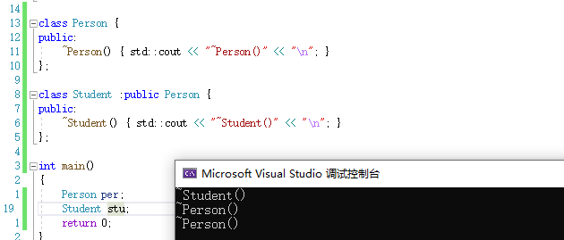
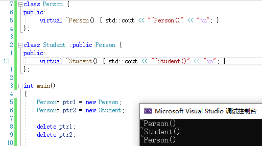

# 多态

[TOC]


## 虚函数

在函数前加上virtual就是虚函数

```
class A{
public:
	virtual void func(){}; //这是一个虚函数
};
```


## 重写/覆盖

### 概念:

是指虚函数且函数名字类型等完全一样的情况下,对函数体代码重新编写

- 体现接口继承

- 重写只有虚函数才有,非虚函数的叫做隐藏

- 虚函数是重写/覆盖,非虚函数是隐藏/重定义.注意区别

### 条件:

三同:函数名,参数(平常说的参数都是说参数的类型,与缺省参数无关),返回值都要相同


## 多态的条件(有多态的效果)

 * a.虚函数的重写  -- 多态的基础
 * b.父类的指针或引用去调用  -- 很重要,必须是父类类型的指针或引用(接收父类对象或子类对象)的对象去调用虚函数 -- 直接定义的对象不可以
 * $一个不满足都实现不了多态 
 * $但是 只要是父类的指针或引用(指针引用的是父类对象也是)调用都进虚表中找(非多态,而是多态调用) -- 傻瓜式
 * 
 * 3.1 多态对象和普通对象的区别
 * $不满足多态时,只看类型
 * $满足多态时,看指向对象的类型
 * 
 * 4.必须使用多态的场景
 * a.继承中对析构函数的特殊处理场景
 * $引入:继承中析构的特殊处理引入 Destructor
 * &如果是父类指针接收子类类型,则析构函数调用父类的,没调子类,
 * $析构特殊处理后,构成隐藏的析构函数,类型是谁就调用谁的析构,目前不能解决
 * $多态,虚函数,父类指针或引用调用虚函数,->彻底解决继承的析构问题
 * 
 * 5.虚函数的例外
 * a.子类可以不写virtual(重点记忆) -- 虚函数可以继承(隐式) -- 体现接口继承
 * b.协变covariant -- 返回值可以不同,但必须是父子关系的指针或引用,可以是nullptr,不能是对象
 * 
 * 5.1 协变 - 目前用途比较少 后续遇到再学习
 * 
 * 6.多态的特殊继承
 * a.发生多态后,会继承父类的缺省参数,即子类缺省参数无效 -- 非多态下,子类继承下来的成员与父类无关
 * $ a的解释:多态的继承是一种接口实现,即函数体外所有东西都是父类的,只有函数体是对象的,多态继承的函数叫重写;重写:即重写函数体
 * 
 * 7 说明符final (说明符不是关键字)
 * 7.1 final的功能
 * a.final可以修饰类,表示|最终类|,即不允许被继承的类
 * b.final可以修饰虚函数,使虚函数不能被重写(可以继承) //但是很矛盾,虚函数的意义就是可以重写,重写的意义就是实现多态
 * 
 * 8 说明符override:重写说明符
 * 8.1 override的功能
 * a.辅助用户检查是否完成重写; 语法:加载函数参数列表的括号后(),函数体花括号{}前: (//...)override{//...};
 * 
    */

//单继承虚表原理
/**
 * 1.虚函数表指针(virtual function table pointer) /也叫虚表指针
 *   如果在类中定义了虚函数,则对象中会增加一个指针,叫虚函数表指针__vfptr,虚函数表指针在成员的前面,直接占了4/8字节
 * 虚表中存放着对象各自的虚函数
 * 
 * 1.1.虚函数表/虚表
 * 虚函数表本质是一个虚函数指针数组,由虚函数的数量决定大小,元素中虚函数指针顺序由声明顺序决定,
 * $ 虚表数组最后面放了一个nullptr(VS才有,g++没有)
 * $虚表在编译过程就生成了,每个类都有自己的虚表,虚表指针在构造函数中完成初始化
 * 
 * 1.2 虚函数的另一个名字|覆盖|的来由
 * $ 重写后就把重写后的函数的地址覆盖掉虚表里原来的未重写的地址:
 * $ 不重写则地址一样,直接从父类拷贝过来
 * $ 继承下来的,但不是虚函数的,不会进虚表
 * 
 * 2.多态的原理:
 * $ 父类对象和子类对象的虚表中存放了各自的虚函数
 * 如果不是多态,则在编译时就已经确定调用各自的函数
 * 如果是多态,则会在各自的虚表中去调用对应的虚函数,虚函数也不知道自己调用的是哪个对象的,因为切片,只要是多态,就会到虚表中去找,调用
 * 
 * 3.由原理引出
 * $ 为什么多态一定要父类的指针或引用:因为指针或引用能接收不同对象,再去找各自对象的虚表
 * $ 为什么多态必须要重写: 因为有虚表存在,使各个对象都有自己的重写/覆盖,多态能根据虚表去找到对应的函数
 * 
 * 4.虚函数表的特性
 * a.子类会继承父类的虚函数表(开辟一个新的数组,浅拷贝)
 * b.如果派生类重写了基类中某个虚函数，用派生类自己的虚函数覆盖虚表中基类的虚函数,如果子类没有重写,则虚函数表和父类的虚函数表的元素完全一样,
 * c.派生类自己新增加的虚函数,从继承的虚表的最后一个元素开始,按其在派生类中的声明次序增加到派生类虚表的最后。
 * $ 派生类自己的虚函数放在继承的虚表的后面,没有继承就顺序从头开始放,总而言之,自己的虚函数位置一定比继承的虚函数位置后
 * d.虚函数和普通函数一样的，都是存在代码段的，只是他的指针又存到了虚表中。另外对象中存的不是虚表，存的是虚表指针
 * e.虚表是在编译阶段就完成了,在初始化列表完成的是虚表指针的初始化
 * 
 * 5.针对直接定义的对象分析
 * a.同一类型直接定义的对象共享同一个虚表
 * b.子类对象直接赋值给父类对象后就变成了父类对象,只拷贝成员,不拷贝虚表,虚表还是父类的
 *  因为父类对象中有子类对象的虚表不合理,有的话会分不清是父类还是子类的虚表,父类对象一定是父类的虚表,子类对象一定是子类的虚表
 * */


## 继承遗留问题解决(析构函数)

先看继承关系中直接实例对象的代码

```
class Person {
public:
    ~Person() { std::cout << "~Person()" << "\n"; }
};

class Student :public Person {
public:
    ~Student() { std::cout << "~Student()" << "\n"; }
};

int main(){
    Person per; 
    Student stu;
    return 0;
}
```

结果没有问题,析构执行是正确的



再看指针切片样例

```
int main(){
    Person* ptr1 = new Person; 
    Person* ptr2 = new Student;

    delete ptr1;
    delete ptr2;
    return 0;
}
```

结果:


显然,没有正确的析构.

- 结果说明对切片后的对象进行析构时,只会执行对应切片类型的析构函数.

在继承篇有提起过的继承体系中析构函数会被重命名成Destructor.

本意:**根据指针(引用)指向的对象类型来选择对应的析构函数**
结果:**根据指针(引用)的类型的来选择对应的析构函数**

虽然结果符合正常语法,但是我们在这种情况下并不希望是这样,我们希望它是根据指针(引用)指向的对象类型来选择对应的函数执行.

而根据指针(引用)指向的对象类型来选择对应的函数，这正好就是**多态**的理念.

因此,为了解决切片中这样的析构函数问题,我们选择将其转化成多态来解决.

此时我们已经满足多态构造的2个条件的其中之一:基类的指针或引用， 剩下的我们需要满足**派生类的析构函数构成对基类析构函数的重写**。而重写的条件是：**返回值类型，函数名，参数列表都相同**。对于析构函数，目前还缺的就是函数名相同，因此,析构函数的名称统一处理为destructor.


具体解决方式:

析构函数都成为虚函数

```
class Person {
public:
     virtual ~Person() { std::cout << "~Person()" << "\n"; }
};

class Student :public Person {
public:
     virtual ~Student() { std::cout << "~Student()" << "\n"; }
};

int main(){
    Person* ptr1 = new Person; 
    Person* ptr2 = new Student;

    delete ptr1;
    delete ptr2;

    return 0;
}
```




彻底解决继承体系中析构函数问题


## 多继承虚表

 * 子类会继承所有父类的虚表,有多少个父类就有多少个虚表

 * 自己的虚函数在VS中放在第一个继承的虚表的后面. (没有重写的虚函数进第一个继承的虚表)

 * 当多继承的父类中有相同的虚函数时(两个父类都有fun1虚函数),子类重写会把相应的继承下来的父类的虚表都覆盖(合逻辑)

 * 

 * 的总结:

   1.调用后面继承的父类虚函数时需要重定向this 

   2.后继承的父类的虚表可能会有虚函数指针不一样(被VS封装过)$$

   3.在调用重写过的后继承的父类的虚函数时,如果是父类间相同的虚函数.会发生重定向(重新调整this)

 * 相同虚函数的后继承的父类的虚表中该虚函数的指针是不一样的,原因是VS做了一些改动.

 * 最先被继承的父类是正常的

 * 其他后面继承的都需要重新定向this才能调用

 * 

/** 与虚函数结合的其他语法情况

 * 

 * 1.内联函数inline 和 虚函数 virtual

 * 虽然: inline如果被编译器识别成内联函数,则该函数是没有地址的. 与 发生多态的虚函数要放入虚表冲突

 * 事实: inline 和 virtual 可以一起使用 :

 * 这取决于使用该函数的场景:如果发生多态,则编译器会忽略掉内联.如果没有发生多态,才有可能成为内联函数

 * 即:多态和内联可以一起使用,但同时只能有一个发生

 * 

 * 2.静态成员函数不能是虚函数,因为静态成员函数没有this指针,与多态发生条件矛盾(父类引用/指针去调用),且使用类::函数时无法访问虚函数表

 * 报错:virtual和static不能一起使用

 * 

 * 3.构造,拷贝构造不能是虚函数,赋值运算符重载建议不写成虚函数(编译器不报错),析构函数建议是虚函数

 * 构造函数他们要帮助父类完成初始化,是一起的,不能像多态那样非父即子(父对象调父的,子对象调子的)

   虚表指针初始化在构造函数的初始化列表中完成的,肯定是得先有构造函数才有虚表,才能有虚函数

   并且构造函数多态没有意义

## 抽象类

 1.纯虚函数:在虚函数后面写上=0,则这个函数为纯虚函数  例:virtual void fun() = 0;
   纯虚函数只需要声明,不能写函数体.
   纯虚函数被继承后的派生类如果不重写,则还是抽象类 -- 直到重写为止

 2.抽象类的定义:包含纯虚函数的类叫做抽象类,也叫接口类.
 $ 抽象类不能实例化出对象.派生类继承后也不能直接实例化出对象,必须重写纯虚函数后才能实例化对象.
 $ 纯虚函数规范了派生类必须重写(强制必须重写),  典型接口继承!!!


  功能:纯虚函数是用来规范接口的


## 动态绑定和静态绑定

 1.静态绑定又称为前期绑定(早绑定),在程序编译期间就确定了程序的行为,也称为静态多态. 如:函数重载(cout<<类型自动识别等等)\code

 2.动态绑定也称为后期绑定(晚绑定),是在程序运行期间(运行时),根据具体拿到的类型确定程序的具体行为(调用具体的函数),也称为动态多态.

 


多态调用

 * 父类对象的父类类型的指针或引用 去调用自己的虚函数会被判定成多态调用,
 * 就是进虚表嘛,自己的指针或引用调自己的虚函数,自己的虚函数丢进虚表里,方便多了
 * $ 只要是父类的指针调用都进虚表中找
 * $ 对象调用和普通函数一样
 */


#include<string>
#include<iostream>
using std::cout;
using std::endl;
using std::cin;
using std::string;

//test 入门演示
namespace test1
{

	class Person
	{
	public:
		//虚函数:在函数前面加virtual
		virtual void BuyTicket() { cout << "买票-全价" << endl; }
	
		virtual ~Person() { cout << "~Person()" << endl; }
	};
	
	class Student : public Person
	{
	public:
		//重写/覆盖:虚函数且函数名字类型等完全一样
		virtual void BuyTicket() { cout << "买票-半价" << endl; }
	
		virtual ~Student() { cout << "~Student()" << endl; }
	};
	
	//测试用例
	
	//多态的用法
	void fun(Person& p)
	{
		p.BuyTicket();
	}
	void test_polymorphism1()
	{
		Person p;
		Student s;
		fun(p);
		fun(s);
	}
	
	void test_polymorphism2()
	{
		//Person p;
		//Student s;
		cout << " ================ " << endl;
	
		//多态中析构函数有virtual和无virtual区别 -- 
		Person* p1 = new Person();
		Person* p2 = new Student();
		delete p1;
		delete p2;
	}


}

//单继承打印虚表
namespace test2
{
	class Base
	{
	public:
		virtual void Func1()
		{
			cout << "Base::Func1()" << endl;
		}
		virtual void Func2()
		{
			cout << "Base::Func2()" << endl;
		}
		//void Func3()
		//{
		//	cout << "Base::Func3()" << endl;
		//}
	private:
		int _b = 1;
	};

	class Derive : public Base
	{
	public:
		virtual void Func1()
		{	
			cout << "Derive::Func1()" << endl;
		}
		virtual void Func4()
		{
			cout << "Derive::Func4()" << endl;
		}
	private:
		int _d = 2;
	};
	
	////程序打印虚表
	/// 
	typedef void(*VF_PTR)();//重命名一个函数指针,要用函数指针,需要重命名//定义一个虚函数指针
	void PrintVFTable(VF_PTR* p) //形参:虚函数指针数组
	{
		for (int i = 0; p[i] != nullptr; ++i)
		{
			cout<< p[i]<<endl; //打印地址方法1
			//cout<< (void*)p[i]<<endl; //打印地址方法2 //cout自动识别类型,p是void*类型
	
			//调用虚函数方法1:函数指针,因为p是void,所以定义一个void的函数指针f,再调用
			//void (*f)() = p[i];
			//f();
			
			//调用虚函数方法2 直接通过函数指针调用 ,需要编译器推导类型
			//p[i]();
	
			//调用虚函数方法3 :实际上和2一样,是2的正确版,显式给出了正确类型的指针
			VF_PTR f = p[i];
			f();
		}
	}
	
	/** 注意
	 * 1.打印过程注意bug
	 * 建议在打印前重新生成项目,
	 * 程序在运行过程中虚表指针位的nullptr位置可能会变动,导致打印过程中有可能会打印出多个指针,或者调试过程中00 00 00 00在很后面
	 * 
	 * 2.内存窗口
	 * a.内存窗口太小的话可能会隐藏搜索功能
	 * b.内存窗口最右上角有个小小按钮可以选择显示字节,建议选择1字节,就能显示成 00 00 00 00 ,因为每一对数都是1字节
	 * 
	 */
	
	void test_VFTable1()
	{
		//&d 就是拿到了d对象的首元素的地址
		Base b;
		Derive d;
		//传参方法1
		//1.32位DEBUG中指针是4字节,int符合,所以用int
		//2.在对指针操作时,首先要确定指针的位数,所以,先取地址,然后强转为int*(指针4字节).再解引用,得到4字节的首地址.不然得到的还是对象,一大块
		//3.得到b对象的首地址后,由于虚表指针就位于b对象的首地址,故将其强转成VF_PTR类型的指针后,就是虚表的首地址了
		PrintVFTable((VF_PTR*)(*(int*)&b)); 
		//
		cout <<"============="<< endl;
	
		//传参方法2 -- 一步到位,二级指针厉害,自动分析,任何场景都能用,32位或64位都可以
		//1.由于PrintVFTable的参数是指针,所以实参必须是指针,因此需要&d得到指针
		//2.对象b原本指向就是虚表(首地址),即b的首地址的类型是VF_PTR*,所以&b后就变成VF_PTR**,再解引用就是VF_PTR*,**解引用过程自动转化成指针而不是对象(一大快)
		PrintVFTable(*(VF_PTR**)&d);
	}
	
	//技巧:通过指针位置推导变量的空间逻辑位置划分
	void test_VFTable2()
	{
		typedef void(*VF_PTR)();
		Base b;
		Derive d;
	
		int x = 0;//局部变量 -- 栈
		int* y = new int;//指向堆中的整型指针  --- 堆 
		static int z = 0; //静态变量 --静态区,
		const char* str = "xxxxxxxxxxxxxxxxxxx";//字符串常量 -- 常量区
	
		cout << &x << endl;					  //局部变量:0113FC8C	栈  区
		cout << y << endl;					  //动态申请:0118E7E8	堆  区
		cout << &z << endl;					  //静态变量:006CE45C	静态区(数据段)
		cout << (void*)str << endl;			  //常    量:006CBDD0	常量区(代码段)
		cout << *(VF_PTR**)&b << endl;		  //父类虚表:006CBBC0	容易推出,虚表在常量区
		cout << *(VF_PTR**)&d << endl;		  //子类虚表:006CBBF0	
	//分析:虚表在编译后基本不会改变了,因为继承都是我们在编译阶段(写代码阶段)完成,在程序运行过程中基本不会再发生变化,所以放在常量区合适
		//-->> 有的编译器可能会放在静态区(符合共享性质).
	}
}


namespace test3
{


	class Base1 {
	public:
		virtual void func1() { cout << "Base1 ::func1" << endl; }
		virtual void func2() { cout << "Base1 ::func2" << endl; }
	private:
		int b1;
	};
	class Base2 {
	public:
		virtual void func1() { cout << "Base2 ::func1" << endl; }
		virtual void func2() { cout << "Base2 ::func2" << endl; }
	private:
		int b2;
	};
	class Derive : public Base1, public Base2 {
	public:
		virtual void func1() { cout << "Derive::func1" << endl; }
		virtual void func3() { cout << "Derive::func3" << endl; }
	private:
		int d1;
	};
	
	typedef void(*VF_PTR)();
	void PrintVFtable(VF_PTR table[])
	{
		for (int i = 0; table[i]!=nullptr; i++)
		{
			cout << (void*)table[i]<<"  ";
			VF_PTR f = table[i];
			f();
		}
	}
	
	void test_VFTable1()
	{
		//观察/打印多继承各虚表位置情况
		Derive d;
		//方法1
		//PrintVFtable(*(VF_PTR**)&d);//Base1的虚表
		//cout << "  ==================== " << endl;
		//PrintVFtable((*(VF_PTR**)((char*)&d + sizeof(Base1))));//偏移到Base2.
	
		//方法2 -- 切片自动定位到对应父类对象的首元素的地址,直接就是指针了,不需要像d一样先取地址
		Base1* ptr1 = &d;
		Base2* ptr2 = &d;
		PrintVFtable(*(VF_PTR**)ptr1);
		cout << "  ==================== " << endl;
		PrintVFtable((VF_PTR*)*(int*)ptr2);
	
		//结果
		/**
		 * 1.子类自己的虚函数在第一个先继承的父类的虚表中,并且在末尾位置
		 * 
		 * 2.发现两个父类的虚表中被子类重写的func1的地址不一样:理论上说,子类对象的父类虚表中的func1是子类对象的才对,但为什么不一样?,
		 * ,决定进行验证
		 * 
		 */
	
	}
	
	void test_VFTable2()
	{
		Derive d;
		Base1* ptr1 = &d;
		Base2* ptr2 = &d;
		ptr1->func1();
		ptr2->func1();
		/**验证结果
		 * 
		 * 通过反汇编验证发现,最终调用的func1的地址都是一样的,只是base2中需要一些特殊处理
		 * 
		 * ($ 类的this一般就是首地址)
		 * 对于ptr1,ptr1的this刚好和d的this重叠,所以可以直接调用func1
		 * 而对于ptr2,ptr2的this在下方,偏移sizeof(base1)位置.而VS对此做了一些封装调整(汇编层次),,导致虚表地址看起来不一样
		 * 我们要想通过ptr2调用func1,则需要调整this回到d或ptr1.重定向,所以在通过ptr2调用func1时,汇编会多一个sub和call或jump调整this
		 * 
		 * 
		 * 重定向
		 */
	
		 //eax寄存器:一般存函数地址
		 //ecx寄存器:一般存this地址
	}

}
