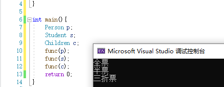
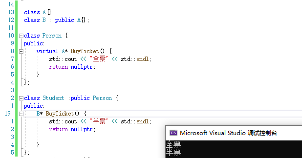
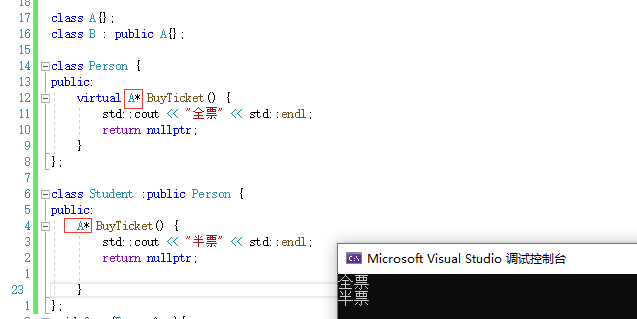
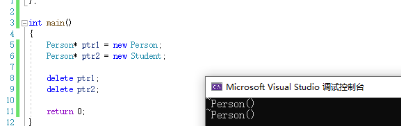
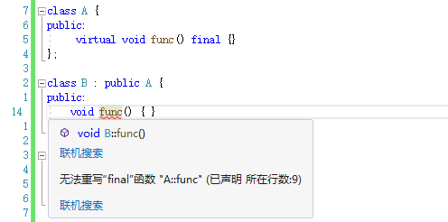
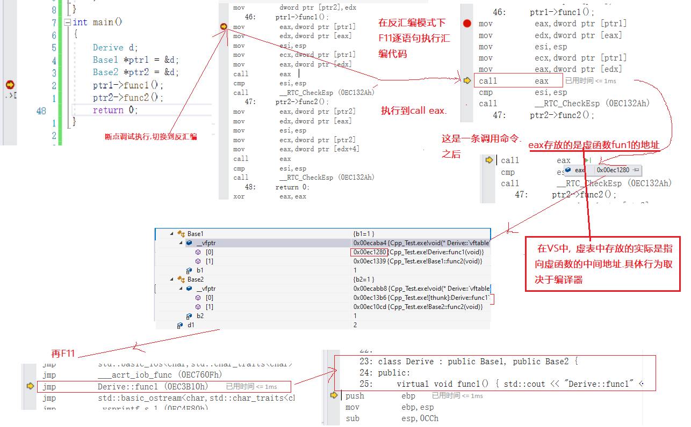

# 多态

[TOC]


## 虚函数

在函数前加上virtual就是虚函数

```
class A{
public:
	virtual void func(){}; //这是一个虚函数
};
```

### 虚函数的继承

虚函数的继承体现了接口继承

继承了接口等于继承了函数的壳,这个壳有返回值类型,函数名,参数列表,还包括了缺省参数

只需要重写/覆盖接口的实现(函数体)


## 虚类/虚基类

含有虚函数的类是虚类.

是虚类,且是基类,则是虚基类


## 重写/覆盖

### 条件:

三同:函数名,参数(平常说的参数都是说参数的类型,与缺省参数无关),返回值都要相同

### 概念:

重写/覆盖是指该函数是虚函数且函数的名字、类型、返回值完全一样的情况下,子类的函数体会替换掉继承下来的父类虚函数的函数体

- 体现接口继承

- 重写/覆盖只有虚函数才有,非虚函数的是隐藏/重定义.注意区别
- 重写/覆盖只对函数体有效,返回值类型,函数名,参数列表,和缺省参数都不能修改
- 只要子类写上满足三同的虚函数都会触发重写.无论是否修改函数体


## 多态的条件

多态有两个条件,任何一个不满足都不能执行多态 ,分别是

1. 虚函数的重写 

> 多态的基础

```
   class Person {
   public:
       virtual void BuyTicket() {            //是虚函数
           std::cout<<"全票"<<std::endl;
       }
   };
   
   class Student :public Person {
   public:
       virtual void BuyTicket() {           //虚函数的重写
           std::cout<<"半票"<<std::endl;
       }
   };
```

2. 父类类型的指针或引用(接收父类对象或子类对象)的对象去调用虚函数
   ```
   void func(Person& p){                 //父类的指针或引用去调用
      p.BuyTicket();
   }
   
   int main(){
       Person p;
       Student s;
       func(p);
       func(s);
       return 0;
   }
   ```
    


### 其他的多态行为

#### 多态中子类可以不写virtual

多态中子类可以不写virtual,而且只要父类是虚函数,之后继承的子孙类都是虚函数(待验证,是否位于虚表)

```
class Person {
public:
    virtual void BuyTicket() {
        std::cout << "全票" << std::endl;
    }
};

class Student :public Person {
public:
    void BuyTicket() {
        std::cout << "半票" << std::endl;
    }
};

class Children : public Person {
public:
    void BuyTicket(){
        std::cout << "三折票" << std::endl;
    }
};

void func(Person& p){
    p.BuyTicket();
}

int main()
{
    Person p;    
    Student s;    
    Children c;
    func(p);     
    func(s);      
    func(c);
    return 0;
}
```



- 说法1:体现接口继承:继承了接口==继承了函数的壳,只需要重写接口的实现(函数体),这样就是体现了接口继承

- 说法2: 可能存在父类子类不是同一个人实现的情况.  

  > ​    假设子类必须是虚函数才能实现多态,如果父类是虚函数,而另外一个人写子类时忘记加上virtual,这是就有可能发生内存泄露问题,如切片后再析构的情况(只析构父类,不析构子类).
  >
  > ​    因此,父类是虚函数的情况下,子类不强制需要virtual才能发生多态这种行为,能有一定的安全作用.

缺点:没有统一规范. 最好还是全都加上virtual

#### 协变

>  概念引入:协变与逆变
>
> 协变与逆变规定了编程语言中的类型父子关系的方向
>
> 引入这个概念是为了类型安全
>
> ---------------------------------------------
>
> ​	协变(父←子)    
>
> 动物 - 哺乳类 - 熊科 - 黑熊 
>
> ​	逆变(子→父)
>
> ----
>

协变场景下三同中返回值可以不同,且返回值必须是父类或派生类关系的指针或引用

其他方面读者可以阅读更具体的资料

[C++协变(covariant)-CSDN博客](https://blog.csdn.net/qq_45780653/article/details/131595707)

##### 代码举例

1. 举例1:父类返回类型为父类,子类返回类型为子类

   ```
   class Person {
   public:
       virtual Person& BuyTicket() {
           std::cout << "全票" << std::endl;
           Person p;
           return p;
       }
   };
   
   class Student :public Person {
   public:
       Student& BuyTicket() {
           std::cout << "半票" << std::endl;
           Student s;
           return s;
   
       }
   };
   ```

   

2. 举例2:父类子类返回类型全部是父类

   ```
   class Person {
   public:
       virtual Person& BuyTicket() {
           std::cout << "全票" << std::endl;
           Person p;
           return p;
       }
   };
   
   class Student :public Person {
   public:
       Person& BuyTicket() {
           std::cout << "半票" << std::endl;
           Person s;
           return s;
   
       }
   };
   ```

   

3. 举例3:返回值类型为非所在类类型

   ```
   class A{};
   class B : public A{};
   
   class Person {
   public:
       virtual A* BuyTicket() {
           std::cout << "全票" << std::endl;
           return nullptr;
       }
   };
   
   class Student :public Person {
   public:
       B* BuyTicket() {
           std::cout << "半票" << std::endl;
           return nullptr;
       }
   };
   ```

   

4. 返回值为非虚函数所在类类型,且都是返回父类

   

注意:

- 反过来,父类中返回值是子类,子类中返回值是父类是不支持的.


- 全部返回子类也不支持

  
  
- 返回值类型为非所在类类型的情况也是如此

总之,当虚函数返回值为基类类型的指针或引用时,编译器才会检查是否是协变类型.此时如果派生类虚函数返回值是基类或派生类的指针或引用,则判定为协变;否则不是协变

## 继承遗留问题解决

### 析构函数

先看继承关系中直接实例对象的代码

```
class Person {
public:
    ~Person() { std::cout << "~Person()" << "\n"; }
};

class Student :public Person {
public:
    ~Student() { std::cout << "~Student()" << "\n"; }
};

int main(){
    Person per; 
    Student stu;
    return 0;
}
```

结果没有问题,析构执行是正确的


再看指针切片样例

```
int main(){
    Person* ptr1 = new Person; 
    Person* ptr2 = new Student;

    delete ptr1;
    delete ptr2;
    return 0;
}
```

结果:



显然,没有正确的析构.

- 结果说明对切片后的对象进行析构时,只会执行对应切片类型的析构函数.

在继承篇有提起过的继承体系中析构函数会被重命名成Destructor.

本意:**根据指针(引用)指向的对象类型来选择对应的析构函数**
结果:**根据指针(引用)的类型的来选择对应的析构函数**

虽然结果符合正常语法,但是我们在这种情况下并不希望是这样,我们希望它是根据指针(引用)指向的对象类型来选择对应的函数执行.

而根据指针(引用)指向的对象类型来选择对应的函数，这正好就是**多态**的理念.

因此,为了解决切片中这样的析构函数问题,我们选择将其转化成多态来解决.

此时我们已经满足多态构造的2个条件的其中之一:基类的指针或引用， 剩下的我们需要满足**派生类的析构函数构成对基类析构函数的重写**。而重写的条件是：**返回值类型，函数名，参数列表都相同**。对于析构函数，目前还缺的就是函数名相同，因此,析构函数的名称统一处理为destructor.


#### 具体解决方式:

析构函数都成为虚函数

```
class Person {
public:
     virtual ~Person() { std::cout << "~Person()" << "\n"; }
};

class Student :public Person {
public:
     virtual ~Student() { std::cout << "~Student()" << "\n"; }
};

int main(){
    Person* ptr1 = new Person; 
    Person* ptr2 = new Student;

    delete ptr1;
    delete ptr2;

    return 0;
}
```


至此,彻底解决继承体系中析构函数问题.


## 题目1

1.以下程序输出结果是什么（）

```
   class A 
   { 
   public:
       virtual void func(int val = 1){ std::cout<<"A->"<< val <<std::endl;}
              virtual void test(){ func();} 
   };
   
   class B : public A
   { 
   public:
       void func(int val=0){ std::cout<<"B->"<< val <<std::endl; } 
   };
   
   int main(int argc ,char* argv[])
   {
       B*p = new B;
       p->test(); 
       return 0;
   }
```

 A: A->0    B: B->1   C: A->1   D: B->0   E: 编译出错    F: 以上都不正确

### 答案:


### 解析:

`B*p = new B;`这里p是普通的指针,不满足多态.

`p->test();`这里调用了继承下来的`test();`

`test()`的实际原型是`test(A*this)`,因此函数体内即为`(A*)->func();`

因为`test()`在B中,B会将自己的this传参给test(),即父类类型指针接收子类类型指针.同时func也是虚函数.

因此满足多态,即test()中调用的是子类的func().

又因为虚函数的继承是接口继承,只有函数体是子类的,其他都是父类的,缺省参数也是父类的,因此答案是`B->1`

## 题目2

以下程序输出结果是什么（）

```
class A
{
public:
    virtual void func(int val = 1) { std::cout << "A->" << val << std::endl; }
};

class B : public A
{
public:
    void func(int val = 0) { std::cout << "B->" << val << std::endl; }
    virtual void test() { func(); }
};

int main(int argc ,char* argv[])
{
    B*p = new B;
    p->test(); 
    return 0;
}
```

 A: A->0    B: B->1   C: A->1   D: B->0   E: 编译出错    F: 以上都不正确

### 答案:

D: B->0 


<br><br>

<br>


## C++11 override和final


### final

#### 功能1:禁用继承

C++11中允许将类标记为final，继承该类会导致编译错误.

用法:直接在类名后面使用关键字final

```
class A final
{};

class B : public A //编译错误
{};
```

##### 使用场景:

明确该类未来不会被继承时,可以使用final明确告知.

#### 功能2:禁用重写

C++中还允许将函数标记为final，禁用子类中重写该方法

用法:在函数体前使用关键字final

```
class A {
public:
     virtual void func() final {}
};

class B : public A {
public:
    void func() {}    //编译错误
};
```



##### 使用场景

一般情况下,只有**最终实现**的情况下会使用final： 当你在一个派生类中实现了某个虚函数，并且认为这是该函数的“最终”或“最完善”的实现，不希望后续的派生类再次改变其行为。使用`final`关键字可以确保这一点，防止函数被进一步重写。

对虚函数使用final后,编译器可以做出一些优化，比如内联调用，因为它知道不会有其他版本的函数存在。

### override

#### 场景:

C++对函数重写的要求是比较严格的.如果某些情况因为疏忽而导致函数没有进行重写,这种情况在编译期间是不会报错的,只有程序运行时没有得到预期结果才可能意识到出现了问题,等到这时再debug已经得不偿失了.

因此,C++11提供了override关键字,可以帮助用户检测是否完成重写

#### 描述:

override(覆盖)关键字用于检查派生类虚函数是否重写了基类的某个虚函数，如果没有则无法通过编译。

#### 用法:

在需要进行重写的虚函数的函数体前或参数列表花括号后加上override

```
class A {
public:
     virtual void func()  {}
};

class B : public A {
public:
    void func(int i) override{ }
};
```


## 重载、覆盖(重写)、隐藏(重定义)的对比 


## 

## 纯虚函数

### 概念:

在虚函数后面写上=0,这个函数就为纯虚函数.

```
virtual void fun() = 0;
```

纯虚函数只能写声明,不能写函数体.


## 抽象类/纯虚类

### 概念

含有纯虚函数的类是纯虚类,更多的是叫抽象类(也叫做接口类)

```
class A{
	virtual void func() = 0;
};
```

### 特点

- 抽象类不能实例化对象

- 抽象类的派生类如果不重写纯虚函数,则还是抽象类
- 纯虚函数规范了派生类必须重写,更体现接口继承
- 纯虚类可以有成员变量


## 接口继承和实现继承 

从类中继承的函数包含两部分：一是"接口"(interface)，二是 "实现" (implementation).

- 接口就是函数的"壳",是函数除了函数体外的所有组成.

- 实现就是函数的函数体.

------

纯虚函数     => 继承的是:接口 (interface) 

普通虚函数   => 继承的是:接口 + 缺省实现 (default implementation) 

非虚成员函数 => 继承的是:接口 + 强制实现 (mandatory implementation)　

- 普通函数的继承是一种实现继承，派生类继承了基类函数，继承的是函数的实现,目的是为了复用函数实现.

- 普通虚函数的继承是一种接口继承，派生类继承的是基类虚函数的接口+缺省实现，目的是为了重写，达成多态.

- 纯虚函数只继承了接口,要求用户必须要重写函数的实现.

如果不实现多态，不要把函数定义成虚函数。


<br>

<br>

<br>

<br>


-----


# 多态原理

## 引入(多态的原理)

计算下面虚类的大小

```
class Base{
public:
    virtual void func() {}
private:
    int _a;
    char _b;
};

int main(int argc, char* argv[])
{
    std::cout<<sizeof(Base)<<"\n";
    return 0;
}
```

结果:


如果是一般的类,那我们会认为是计算结构体对齐之后的大小,结果应当是8.

但计算结果发现,虚类的结果是12,说明虚类比普通类多了一些东西.

实例化对象`Base b;`查看监视窗口


可以发现对象的头部多了一个指针`_vfptr`;这个指针叫做**虚函数表指针**,它指向了**虚函数表**

## 虚函数表指针

指向虚表的指针,叫虚函数表指针,位于对象的头部.

定义:

​    如果在类中定义了虚函数,则对象中会增加一个隐藏的指针,叫虚函数表指针__vfptr,虚函数表指针在成员的前面,直接占了4/8字节.

## 虚函数表/虚表

### 描述:

虚函数表指针所指向的表,叫做虚函数表(virtual function table),也叫做虚表

虚函数表本质是一个虚函数指针数组.元素顺序取决于虚函数的声明顺序.大小由虚函数的数量决定.

### 虚表的特性(单继承)

- 虚表在编译期间生成.

  > 虚表是由虚函数的地址组成,而编译期间虚函数的地址已经存在,因此能够在编译期间完成.

- 虚函数继承体系中,虚基类先生成一份虚表,之后派生类自己的虚表都是基于从父类继承下来的虚表.

- 特例,为了方便使用,VS在虚表数组最后面放了一个nullptr.(其他编译器不一定有)

 * 子类会继承父类的虚函数表(开辟一个新的数组,浅拷贝)
 * 如果派生类重写了基类中某个虚函数，用派生类自己的虚函数覆盖虚表中基类的虚函数,如果子类没有重写,则虚函数表和父类的虚函数表的元素完全一样
 * 派生类自己新增加的虚函数,从继承的虚表的最后一个元素开始,按其在派生类中的声明次序增加到派生类虚表的最后。
 * 派生类自己新增的虚函数放在继承的虚表的后面,如果是基类则是按顺序从头开始放,总而言之,自己新增的虚函数位置一定比继承的虚函数位置后
 * 虚函数和普通函数一样的，都是存在代码段的，只是他的指针又存到了虚表中.另外对象中存的不是虚表,存的是虚表指针
 * 虚表是在编译阶段就完成了,在初始化列表完成的是虚表指针的初始化
 * 同一类型直接定义的对象共享同一个虚表
 * 子类对象直接赋值给父类对象后就变成了父类对象,只拷贝成员,不拷贝虚表,虚表还是父类的

### 虚表的一般示例:

```
class Person {
public:
    virtual void BuyTicket(int val = 1) {
        std::cout << "全票" << ":" << val << "\n";
    }
    virtual void func(int val = 1) {
        std::cout << "全票" << ":" << val << "\n";
    }
};

class Student :public Person {
public:
    void BuyTicket(int val = 0) {                 //覆盖
        std::cout << "半票" << "=" << val << "\n";
    }
};

int main() {
    Person p;
    Student s;
    return 0;
}
```


### 对象中的虚表指针在构造函数中初始化

  

  注:虚表指针和成员谁先初始化由编译器决定

### 虚表的位置

虚表没有明确说必须在哪里,不过我们可以尝试对比各个区的地址,看虚表的大致位置

```
class Base{
public:
    virtual void func(){
    }
private:
    int _a;
};

class Derive :public Base {
};

int main()
{
    Base b;
    Derive d;
    int x = 0;
    int *y = new int;
    static int z = 1;
    const char * str = "hello world";

    printf("栈对象地址:        %p\n",&x);
    printf("堆对象地址:        %p\n",y);
    printf("静态区对象地址:    %p\n",&z);
    printf("常量区对象地址:    %p\n",str);
    printf("Base对象虚表指针:  %p\n",*(int**)(&b)); //32位环境
    printf("Derive对象虚表指针:%p\n",*(int**)(&d)); 
    
    return 0;
}
```


根据地址分析,虚表指针与常量区对象地址距离最近,因此可以推测虚表位于常量区.

另外,在监视窗口中观察虚表指针与虚函数地址也可以发现,虚表指针与虚函数地址也是比较接近,也可以大致推测在代码段中.(代码段常量区很贴近,比较ambiguous,模棱两可的)

从应用角度来说,虚表也应当位于常量区中,因为虚表在编译期间确定好后,不会再发生改变,在常量区也是比较合适的.


## 谈谈对象切片

> 我们可以使用子类对象给父类类型赋值,但要注意C++中不支持通过对象切片实现多态.
>
> 首先赋值过程会涉及大量拷贝.成本开销比较大.
>
> 其次,拷贝只拷贝成员,不会拷贝虚表.
>
> 因为子类中继承的自父类的虚表可能被子类覆盖过,如果切片给父类对象,那么父类对象的虚表中就会有子类重写的虚函数,显然不合理.

## 谈谈多态的原理

> 多态是怎么实现的,其实程序也不知道自己调用的是子类还是父类的,在它眼里都是一样的父类指针或引用.
>
> 如果是虚函数,则在调用时,会进入到"父类"中去,找到虚函数表中的函数去调用,是父类的就调用父类的,是子类就调用子类的.如果不是虚函数,则直接调用.
>
> 多态的实际原理也是传什么调什么,**编译期间虚函数表已经确定好了**
>
> 再看多态的两个条件
>
> - 为什么需要虚函数重写,虚表中存的就是子类的虚函数,重写后就和父类不同了,也就能实现多态的效果.
>
> - 为什么需要父类的指针或引用,就是因为指针或引用既能指向父类也能指向子类,能够实现切片,区分父类和子类
>
> 虚函数**覆盖**这个词的由来就是,子类重写的虚函数会覆盖父类的.
>
> 覆盖是原理层的叫法.重写是语法的叫法

## 虚表打印

### 例程1.VS查看虚表

```
class Person {
public:
    virtual void BuyTicket(int val = 1) {
        std::cout << "全票" << ":" << val << "\n";
    }
    virtual void func(int val = 1) {
        std::cout << "全票" << ":" << val << "\n";
    }
};

class Student :public Person {
public:
    void BuyTicket(int val = 0) {
        std::cout << "半票" << "=" << val << "\n";
    }
    virtual void Add()
    {
        std::cout<<"Studetn"<<"\n";
    }
};

class C : public Student {
public:
    virtual void Add()
    {
        std::cout<<"C"<<"\n";
    }
    int _c = 3;
};

void fun(Student &s){
    s.Add();
}

int main() {
    Person p;
    Student s;
    C c;
    fun(c);
    return 0;
}
```

对上例函数查看VS监视时,发现虚表不显示完全


需要在监视窗口中手动输入`(void**)0x虚函数表指针,10`,表示以`(void*)[10]`方式展开


此后就能全部显示虚表了

### 例程2.程序打印虚表

#### 源码:

(仅适用VS,因为VS会将虚表末尾置空,如果是g++,则需要明确虚表有几个虚函数)

```
class A {
public:
    virtual void fun1(){
        std::cout<<"func1()"<<"\n";
    }
    virtual void fun2(){
        std::cout<<"func2()"<<"\n";
    }
};

class B :public A {
public:
    virtual void fun3(){
        std::cout<<"func3()"<<"\n";
    }
};

using VFPTR = void(*)(void);
void PrintVFTable(VFPTR table[])
{
    for (int i = 0; table[i]; i++)
    {
        //1.打印虚类对象的虚表
        printf("%p",table[i]);
        //2.指针不够直观的情况下.可以执行函数指针得到更具象的结果
        VFPTR f = table[i];
        f(); 
        //小细节:f()能够正常执行,说明这样的调用方式能够自动将虚表所在对象的this传参到虚函数中.
        
    }
}

int main()
{
    A a;
    B b;
    PrintVFTable((VFPTR*)(*((VFPTR*)&a))); //方式1 (修改,VFPTR*比int*更通用)
    puts("");
    PrintVFTable(*(VFPTR**)&b); //方式2 ,在明确指向逻辑的情况下,二级指针更为简洁
    
    /* 代码理解:
    1.typedef和using语法层面功能都是将类型重命名,这个重命名会被认定成一个新类型,需要时再进行解释.
    2.int*在32位和64位下解引用都是4字节.而指针大小在32位下是4字节,64位下是8字节.在64位机器下使用int*解引用的话,就会得到错误的结果.因此int*不够普遍.
    3.VFPTR被当作一个新类型来看待.直接使用VFPTR时,编译器认为是非指针变量;使用VFPTR*时,编译器认为是一级指针变量.(VFPTR*)&a即为将a的地址转成类型为VFPTR的一级指针.之后,解引用则以VFPTR的大小为步长,取出相应的数据(虚表指针,也是虚表首地址).VFPTR实际类型为函数指针,32位下为4字节,64位下为8字节,因此解引用后能够取得正确的结果. 
    */
    
    return 0;
}
```


模型图


## 多继承虚表

先看虚函数多继承体系下内存布局

```
class Base1 {
public:
    virtual void func1() { std::cout << "Base1::func1" <<std::endl; }
    virtual void func2() { std::cout << "Base1::func2" <<  std::endl; }
private:
    int b1 = 1;
};

class Base2 {
public:
    virtual void func1() { std::cout << "Base2::func1" << std::endl; }
    virtual void func2() { std::cout << "Base2::func2" << std::endl; }
private:
    int b2 = 1;
};

class Derive : public Base1, public Base2 {
public:
//子类重写func1
    virtual void func1() { std::cout << "Derive::func1" << std::endl; }
//子类新增func3
    virtual void func3() { std::cout << "Derive::func3" << std::endl; }
private:
    int d1 =2;
};

int main()
{
    Derive d;
    return 0;
}
```


简单分析可知,虚函数多继承体系下派生类会根据声明顺序依次继承父类.继承方式类似于虚继承.

### 多继承下子类自己新增的虚函数在哪?

我们知道,单继承中,子类自己新增的虚函数会尾插到虚表的末尾.

那么多继承呢?是每个父类都添加?还是只添加到其中一个?添加到一个的话添加到哪里?

要知道结果,必须要看一眼虚表的真实情况.因此我们**打印所有虚表**看看情况.

#### 多继承虚表打印代码

```
int main()
{
    Derive d;
    /*打印d中Base1的虚表*/
    std::cout<<"Base1的虚表"<<"\n";
    PrintVFTable(*(VFPTR**)(&d));
   
    puts("");
    /*打印d中Base2的虚表*/
    std::cout<<"Base2的虚表"<<"\n";
     //方法1,手动计算指针偏移
    //PrintVFTable((VFPTR*)*(VFPTR*)((char*)&d+sizeof(Base1)));
    //PrintVFTable(*(VFPTR**)((char*)&d+sizeof(Base1)));
    
    //方法2,切片,自动计算指针偏移 -- 推荐,不容易出错
    Base2 *b2 = &d;
    PrintVFTable(*(VFPTR**)b2);
    return 0;
}
```


##### 结论与发现:

- 通过结果能证明,**子类自己新增的虚函数只会添加进第一个继承的父类的虚表中**,也就是尾插.
- 子类会继承所有父类的虚表,有多少个父类就有多少个虚表


- 结果也证明,**子类重写会对所有父类的同名函数进行覆盖**

- 观察结果还发现,两个func1的地址居然不一样.这其实涉及到C++this指针的原理问题->**this指针修正**.

要搞明白是什么情况,我们需要观察汇编代码,去看更深层次的逻辑.

##### this指针修正分析

例程代码

```
int main(){
    Derive d;
    Base1 *ptr1 = &d;
    Base2 *ptr2 = &d;
    ptr1->func1();
    ptr2->func1();
    return 0;
}
```

先观察ptr1



再看ptr2


对比可以发现,ptr2要比ptr1走多了好几步才能正确调用fun1.

解释:

看ptr2的的中间过程有句汇编`sub  ecx,8`,功能是ecx-8再放到ecx中.而**ecx在类中通常表示类的this指针**,即`sub  ecx,8`得功能是将this指针-8,这里8刚好是sizeof(Base1)的值,因此`sub  ecx,8`就可以解释成this向下偏移8个字节,因为对象的this指针位于低字节,这就同时刚好满足了this指向Base2.再结合问题场景,就可以同步证明ptr2多走的这几步目的就是为了让指针正确偏移回对象d的this.

再结合切片原理,切片后会自动计算将ptr2指向了d中Base2的首地址,可以推测切片后ecx也指向了Base2的首地址.为了能够发生多态,需要将ecx重新偏移至正确位置.

这就是多继承下多态的原理

##### 虚表中地址(概念修正)

1. **虚函数地址**：这是虚函数在程序内存中的实际地址，即函数体开始的位置。
2. **虚表中的地址**：虚表中存储的地址通常直接指向虚函数的实际地址。然而，在某些情况下，如为了实现一些优化，编译器可能不会直接在虚表中存储虚函数的地址，而是存储一个“跳跃”函数的地址，这个跳跃函数再跳转到虚函数的真实地址。这种跳跃函数可以用来做额外的检查或者优化，例如性能计数、调试信息插入等。

> 所以，虚表中存放的地址大多数情况下就是虚函数的真实地址，但在某些特定的优化场景下，它可能指向一个中间函数，这个中间函数再负责跳转到真实的函数地址。这种间接调用的机制有时被称为“thunk”，它允许编译器在运行时进行更复杂的控制流分析和优化。
>
> 对于现代的C++编译器，如GCC或Clang，它们默认的行为是在虚表中直接存储虚函数的真实地址，除非有特殊的优化需求。如果想了解具体的实现，可以通过反汇编工具（如objdump, IDA Pro等）查看编译后的二进制文件，检查虚表的结构和内容。


## 菱形继承+多态 与 菱形虚拟继承+多态

C++中非常恐怖的东西.

简单演示一下,有兴趣的读者可以自行扩展研究.

### 菱形继承+多态

```
class A {
public:
	virtual void func1() {}
public:
	int _a;
};

class B : public A {
public:
	virtual void func1() {}
public:
	int _b;
};

class C : public A {
public:
	virtual void func1() {}
public:
	int _c;
};

class D : public B, public C {
public:
	virtual void func1() {}
public:
	int _d;
};

int main() {
	D d;
	d.B::_a = 1;
	d.C::_a = 2;
	d._b = 3;
	d._c = 4;
	d._d = 5;

	return 0;
}
```

内存布局:


### 菱形虚拟继承+多态(子类没有新增虚函数)

```
class A {
public:
	virtual void func1() {}
public:
	int _a;
};

class B : virtual public A {
public:
	virtual void func1() {}
	//virtual void func2() {}
public:
	int _b;
};

class C : virtual public A {
public:
	virtual void func1() {}
	//virtual void func3() {}
public:
	int _c;
};

class D : public B, public C {
public:
	virtual void func1() {}
public:
	int _d;
};

```

(其中要求最远类必须重写虚基类A的虚函数,因为要消除二义性,是B是C都不好,最好是D.)

内存布局:


和非多态菱形虚拟继承很类似.只重写虚基类虚函数时,只有虚基类有虚表

### 菱形虚拟继承+多态（子类自己新增了虚函数）

```
class A {
public:
	virtual void func1() {}
public:
	int _a;
};

class B : virtual public A {
public:
	virtual void func1() {}
	virtual void func2() {}
public:
	int _b;
};

class C : virtual public A {
public:
	virtual void func1() {}
	virtual void func3() {}
public:
	int _c;
};

class D : public B, public C {
public:
	virtual void func1() {}
public:
	int _d;
};
```

内存布局:


64位环境下内存布局


推测虚基表中低四字节是存放虚表偏移量,也可能是到B或C类型首部的偏移量.


## 一些概念

### 动态绑定和静态绑定

- 静态绑定又称为前期绑定(早绑定),在**程序编译期间**就确定了程序的行为,即**编译时**,也称为静态多态. 

  静态多态例子:函数重载,如`std::cout<<`的类型自动识别,原理就是**函数名修饰规则**将operator<<(不同的参数)在编译时生成多份(都是生成多份,C语言需要程序员手动,C++由编译器自动生成),使传的参数不同时能够对外表现出不同的行为.这种技术给开发者和用户都带来了使用上的便利.

- 动态绑定也称为后期绑定(晚绑定),是在**程序运行期间**,即**运行时**,根据具体拿到的类型确定程序的具体行为,调用具体的函数,也称为动态多态.虚函数多态就是动态多态.


### 内联函数inline 和 虚函数virtual

inline如果被编译器识别成内联函数,则该函数是没有地址的. 与虚表中存放虚函数的地址有冲突.

但事实上,inline 和 virtual 可以一起使用 :

 * 这取决于使用该函数的场景:内联是一个建议性关键字,如果发生多态,则编译器会忽略内联.如果没有发生多态,才有可能成为内联函数

 * 即:多态和内联可以一起使用,但同时只能有一个发生


   

### 静态函数static 与 虚函数

静态成员函数不能是虚函数,因为静态成员函数没有this指针,与多态发生条件矛盾

1. 父类引用/指针去调用
2. static函数没有隐藏this参数.不满足虚函数重写条件"三同"

3. 静态成员函数目的是给所有对象共享,不是为了实现多态


### 构造函数、拷贝构造函数、赋值运算符重载 与 虚函数 

- 构造,拷贝构造不能是虚函数
  1. 构造函数需要帮助父类完成初始化,必须一起完成,不能像多态那样非父即子(父对象调父的,子对象调子的);
  2. 虚表指针初始化是在构造函数的初始化列表中完成的,要先执行完构造函数,才能有虚函数
  3. 构造函数多态没有意义

- 赋值运算符重载也和拷贝构造一样,不建议写成虚函数,虽然编译器不报错.

  


### 虚函数和普通函数谁快?

一般来说,普通函数会比构成多态调用的虚函数快.但要注意,是虚函数在**构成多态调用**的情况下.

看例子1:

```
class AA {
public:
	virtual void func1() {}
};

class BB : public AA {
	void func2(){};
};

int main() {
	AA a;
	BB b;
	a.func1();
	b.func1();
	return 0;
}
```


 在VS2019-32位环境下,两种函数在对象的调用下汇编代码是一样的.因此这种情况下它们一样快.


看例子2:

成员函数为非虚函数时,指针调用是普通调用

```
class AA {
public:
    void func1() {}
};

class BB : public AA {
};

int main()
{
	BB b;
	BB*ba = &b;
	pb->func1();
	return 0;
}
```


看例子3:

```
class AA {
public:
    virtual void func1() {}
};

class BB : public AA {
};

int main()
{
	AA*pa = &a;
	pa->func1();
	BB*pb = &b;
	pa->func1();

	return 0;
}
```


在虚函数情况下(包括继承和非继承),使用指针调用都会触发**多态的调用方式**,显然这时调用虚函数效率会比普通函数慢.

小结:

通过上面几个例子分析,发现有虚函数,且是指针的情况下,无论有没有发生多态,调用方式都会发生改变.上面举的名词"多态的调用方式"是为了描述这种调用方式.

这种调用方式简化了编译器的调用逻辑:只要是虚函数,且是指针/引用,都会去虚表中找.如果满足多态的条件就能发生**多态的现象**,否则就是正常调用.

因此,需要注意区分**多态的调用方式**与**多态的现象**.常说的多态的两个条件是指满足这两个条件才能触发多态的现象.与是否是多态的调用方式无关.

