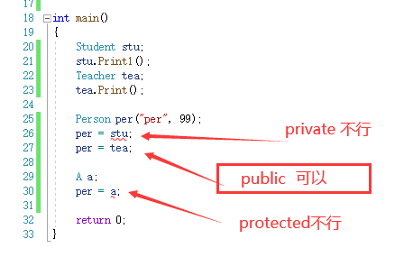

# 封装、继承、多态


## 继承和组合

 组合即为在类成员是其他自定义类型:如适配器中栈,队列,反向迭代器.

 继承的耦合度高 , 组合的耦合度低

 耦合度:联系强度,软件工程领域:高内聚,低耦合; 类与类之间高耦合->解耦 ; 继承解耦->组合

 继承被称为白盒复用(white_box reuse)
 组合被称为黑箱复用(black_box reuse)

 继承是is-a关系:我就是你
 组合是has-a关系:我里面有一个你

 一般来说组合更好
 不过继承也有用武之地:面向对象三大特性,继承,封装,多态. 有继承才有多态


## 抽象类

 1.纯虚函数:在虚函数后面写上=0,则这个函数为纯虚函数  例:virtual void fun() = 0;
   纯虚函数只需要声明,不能写函数体.
   纯虚函数被继承后的派生类如果不重写,则还是抽象类 -- 直到重写为止

 2.抽象类的定义:包含纯虚函数的类叫做抽象类,也叫接口类.
 $ 抽象类不能实例化出对象.派生类继承后也不能直接实例化出对象,必须重写纯虚函数后才能实例化对象.
 $ 纯虚函数规范了派生类必须重写(强制必须重写),  典型接口继承!!!


  功能:纯虚函数是用来规范接口的


## 动态绑定和静态绑定

 1.静态绑定又称为前期绑定(早绑定),在程序编译期间就确定了程序的行为,也称为静态多态. 如:函数重载(cout<<类型自动识别等等)\code

 2.动态绑定也称为后期绑定(晚绑定),是在程序运行期间(运行时),根据具体拿到的类型确定程序的具体行为(调用具体的函数),也称为动态多态.

 

场景
 一般库里带base的,可能就是继承关系


## 继承

- 继承受权限影响
   有public protected private 三种继承

- 基本语法: 

  class 子类 : 权限 父类
   `class student : public Person`

- 使用父类成员的方法
    使用域作用限定符显式指出,语法:
     基类::基类成员
     `Person::Print();`

- 继承方式也可以不写 -- 默认是public,建议显式写出继承方式
    a.对于class,默认继承方式是私有
    b.对于struct默认继承方式是公有

### 继承的访问权限

继承的访问权限的作用是将继承下来的父类成员的原有的权限进行缩小.

> 类权限  
> - public: 外部,子类都可见
> - protected: 外部不可见,子类可见
> - private: 外部,子类都不可见
> 

- 继承的访问权限表
|类成员\继承方式     |public继承            |protected继承          |private继承		  |  
|:-------------------|:---------------------|:----------------------|:--------------------|  
|基类的public成员    |派生类的public成员    |派生类的protected成员  |派生类的private成员  |  
|基类的protected成员 |派生类的protected成员 |派生类的protected成员  |派生类的private成员  |  
|基类的private成员   |在派生类中不可见      |在派生类中不可见       |在派生类中不可见	  |  


- 继承的权限可以被缩小，但是不能放大，和const一样

- 私有继承私有成员也是继承下来了,只是对子类和外界都不可见(直接不可见). 虽然子类不可见,但是可以通过父类的方法间接去调用(间接可见)


### 子类赋值给父类
#### 赋值兼容规则
在公有继承中,子类可以赋值给父类 并且是天然支持(编译器直接行为),没有临时变量,(不是隐式类型转换,不存在类型转换发生)

1. 派生类的对象可以赋值给基类对象。
2. 派生类的对象可以初始化基类的引用。
3. 派生类对象的地址可以赋给指向基类的指针。

#### “天然”的行为

“赋值”过程是通过切片方式,通过调用父类拷贝构造/赋值运算符重载完成赋值,将从父类继承下的部分依次赋值给父类,

引用和指针也是类似，通过切片方式，直接引用/指向子类中父类的一部分,也是"天然"的,不存在类型转换的发生

> 切片不是丢弃,是划分

#### 验证:

##### 1. 其他权限继承能否支持赋值兼容规则

```
class Person{
public:
    Person(std::string name, int age) :_name(name), _age(age)
    {};
    void Print(){
        std::cout << "name:" << _name << " ";
        std::cout << "age:" << _age << " ";
        std::cout << std::endl;
    }
private:
    std::string _name;
    int _age;
};

class Student : private Person
{
public:
    Student() :Person("stu", 18) {};
    void Print1(){
        Print();
    }
private:
    int _stuid;
};

class Teacher : public Person
{
public:
    Teacher() :Person("tea", 28) {};
private:
    int _teaid;
};

class A :protected Person
{
public:
    A():Person("A",65){};
};

int main(){
    Student stu;
    stu.Print1();
    Teacher tea;
    tea.Print();

    Person per("per", 99);
    per = stu;
    per = tea;

    A a;
    per = a;

    return 0;
}
```



结论:只有公有继承才支持赋值兼容规则


##### 2.是否"天然",有没有产生临时变量

产生临时变量就说明是赋值行为,没有则是"天然"

```
student s;
person& rp = s;//可以不加const -- 说明不是右值,没有隐式类型转换
```


#### 


对于父类对象引用子类对象,父类只引用子类中继承父类的那一部分 -- 指针也差不多

- 父类不能赋值给子类

- 继承中的作用域
不同作用域可以定义同一个名字的变量
不同作用域的同名函数不能构成重载,同一个作用域内同名函数才有可能构成重载


- 隐藏/重定义:不同作用域的同名函数(非虚函数)构成隐藏
 子类和父类有同名成员时,子类成员将屏蔽父类对同名成员的直接访问,这种情况叫做隐藏或重定义,继承关系才有隐藏
  $隐藏一般只在子类中体现

- 默认成员
 a.子类自动生成的构造函数会自动调用父类构造函数,子类自动生成的析构函数会自动调用父类析构函数
  $规定:父类的成员必须通过调用父类的构造函数完成初始化
  b.如果子类中没写父类构造函数,则父类会自动调用无参的构造函数,但是父类写了其他构造函数,但没写无参则报错,除非全缺省
  c.父类构造会经过子类初始化列表,无论显式还是隐式
  d.需要显式指定参数完成父类初始化时,可以在初始化列表中显式写出父类构造函数Person(<参数>),
  $理解:继承下来的父类可以理解成隐藏的子类成员,和其他子类成员一样,需要初始化,只是在调用时需要显式指定出来
  e.拷贝构造初始化列表写法:Person(s) -- 切片:父类拷贝构造需要父类对象,通过子类切片得到父类对象

 4.6 析构的特殊处理
 析构在继承及以后的多态中会被处理成Destructor,即父类和子类的析构函数构成隐藏.因为名字相同
 所以在调用父类构造的时候需要显式指定出父类类域
 $坑引入:析构的特殊处理引入
	&如果是父类指针接收子类类型,则析构函数调用父类的,没调子类,
	$析构特殊处理后,构成隐藏的析构函数,类型是谁就调用谁的析构,目前不能解决
	$多态,虚函数,父类指针或引用调用虚函数,->彻底解决继承的析构问题

 4.7 析构顺序
     析构保持和普通类一样,按照进栈的顺序,后进的先析构,先析构子类,再析构父类
 父类析构会在子类析构结束后自动调用

 4.8 不允许显式调用父类析构
     因为要保证析构顺序,所以父类析构是自动调用的 -- 如果是用户自己写,可能不能保证析构顺序,容易出问题

 4.9.父类不能用子类的成员
 (注:析构子类只析构属于子类的那部分)
 a.保证了析构时析构子类后父类不会析构到野指针

 5.友元关系不能继承 

 5.1 -- 哪个类需要友元则哪个类声明

 5.2 友元后类的私有和保护都能访问


  6.静态成员不能被继承,但是父类子类都能调用 -- 共享
  a.静态成员属于父类也属于子类,属于整个类,公共区

  7.不能被继承的类 --
  a.私有构造函数
  b.私有析构函数
被私有后需要进行特殊处理
public :
	static A CreateObj(){ return A()};
private:
	A(){};
main(){A::CreateObj()};


  8.多继承:>多继承是指被多个子孙继承
  多继承可以用,但尽量少用,容易变成菱形继承
  菱形继承,难处理,菱形继承不仅是菱形,包括成环都是菱形继承

  8.1多继承的语法:继承方式 类 ,继承方式 类,...
  以逗号分隔开

  8.2 菱形继承的二义性和数据冗余
  $菱形继承意味着两个父类都继承了爷爷类,所以两个父类都有相同的爷爷成员,导致孙子会有两个相同的成员
  a.二义性是指从父类继承的变量不知道是哪个父类的,通过指定父类类域可以解决二义性
  b.数据冗余:两份相同继承
  c.解决:虚继承:>

 演示
 非虚继承的菱形继承
  [ A成员  ] B -|
  [ B成员  ]	|
  [ A成员  ] C -|-D
  [ C成员  ]	|
  [ D成员  ]   -|

 虚继承的菱形继承
  [ A的偏移地址  ] B -|
  [ B成员        ]    |
  [ A的偏移地址  ] C -|-D
  [ C成员        ]    |
  [ D成员        ]    |
  [ A成员        ] A -|

  $ 偏移量的作用:目的是让子类对象切片后的父类对象指针能找到A

 

  8.3虚继承/虚拟继承  
  语法:>在继承方式前加上virtual
  表现:>a对象为所有子孙共享,子孙指针域内原非虚继承的位置变成 存放a的偏移量的指针,A的成员则在D的最下方,D的成员后面(比D还后)
  注意:虚拟继承不能在其他地方使用

  8.4 虚继承的调试
  虚继承调试需要观察内存;监视窗口中虚继承和多继承基本一样,观察不出来

  9.继承的this
  $a.继承不会改变函数的类型
  $b. 由a ==> 继承下来的函数中,this参数的类型还是父类指针(重要) ************ ,


 补充
 虚继承和虚函数没有直接关系,容易混淆


 菱形继承没有虚基表,菱形虚拟继承才有虚基表
 虚基表存的是偏移量,两个值都是偏移量

 菱形继承+虚继承+虚函数->需要子类完成最终重写

  继承是在使用层面做了限制,仅仅在用户使用层面私有不可见
	但在内存中父类所有代码都是可见的,完整继承了父类的所有代码.


