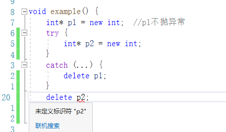
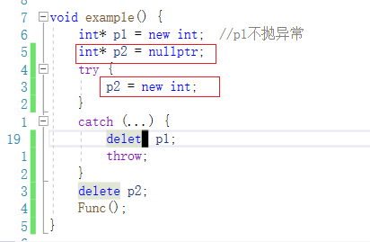
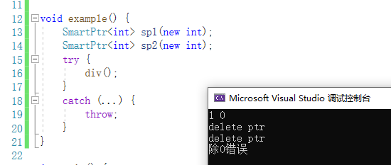

# 智能指针

## 场景引入 - 为什么需要智能指针？

C++有些场景下,处理异常安全问题时特别繁琐

```
void example{
	int *p1 = new int;  //可能会抛异常1
	int *p2 = new int;  //可能会抛异常2
	Func();             //可能会抛异常3
	
	delete p1;
	delete p2;
}

int main(){
	try{
		example();
	}
	catch(std::exception& e){
		std::cout<<e.what()<<std::endl;
	}
}
```

如果需要将上面例子使用异常处理,则可能会面临如下情况

1. 只有p1抛异常:

   p1抛异常程序没有安全问题,因为new没有申请成功,之后程序就跳转了

2. p1不抛异常,但p2抛异常:

   

   如果直接复制粘贴到try中,p2就出作用域了.因此需要改代码:

   

   这样就可以了,但是这么做会有点别扭和麻烦.

3. 如果p1和p2都不抛异常,Func抛异常

   ```
   void example() {
       int* p1 = new int;   
       int* p2 = nullptr;
       
       try {
           p2 = new int;
       }
       catch (...) {
           delete p1;
           throw;
       }
   
       try {
           Func();
       }
       catch(...){
           delete p1;
           delete p2;
           throw;
       }
       delete p1;
       delete p2;
   }
   ```

   使用try-catch处理后,代码越来越膨胀.如果再多几个可能会抛异常的函数.那代码是相当长了.

先说结论:如果使用C++的智能指针,处理这些问题会变得很简单.

## 内存泄漏 

### 什么是内存泄漏

> 内存泄漏指因为疏忽或错误造成程序未能释放已经不再使用的内存的情况.内存泄漏并不是指内存在物理上的消失,而是应用程序分配某段内存后,因为设计错误,失去了对该段内存的控制,因而造成了内存的浪费.

### 内存泄漏的危害

> 长期运行的程序出现内存泄漏,影响很大,如操作系统、后台服务等等,出现内存泄漏会导致响应越来越慢,最终卡死.(不怕一下子泄露完,就怕一点一点泄露,难以发现)

### 内存泄漏分类

> C/C++程序中一般我们关心两种方面的内存泄漏
>
> - 堆内存泄漏(Heap leak) 
>   堆内存指的是程序执行中依据须要分配通过malloc / calloc / realloc / new等从堆中分配的一块内存，用完后必须通过调用相应的free或者delete删掉。假设程序的设计错误导致这部分内存没有被释放，那么以后这部分空间将无法再被使用，就会产生Heap Leak。
> - 系统资源泄漏 
>   指程序使用系统分配的资源，比方套接字、文件描述符、管道等没有使用对应的函数释放掉，导致系统资源的浪费，严重可导致系统效能减少，系统执行不稳定。

### 如何避免内存泄漏 

> 1. 工程前期良好的设计规范，养成良好的编码规范，申请的内存空间记着匹配的去释放。ps:这个理想状态。但是如果碰上异常时，就算注意释放了，还是可能会出问题。需要智能指针来管理才有保证。
> 2. 采用RAII思想或者智能指针来管理资源。
>
> 3. 有些公司内部规范使用内部实现的私有内存管理库。这套库自带内存泄漏检测的功能选项。 
> 4. 出问题了使用内存泄漏工具检测。ps:不过很多工具都不够靠谱，或者收费昂贵。
>
> 总结一下: 
> 内存泄漏非常常见，解决方案分为两种：1、事前预防型。如智能指针等。2、事后查错型。如泄漏检测工具。

## 智能指针的使用及原理

### RAII 

> RAII（Resource Acquisition Is Initialization）是一种利用对象生命周期来控制程序资源（如内存、文件句柄、网络连接、互斥量等等）的简单技术。
> 在对象构造时获取资源，接着控制对资源的访问使之在对象的生命周期内始终保持有效，最后在对象析构的时候释放资源。借此，我们实际上把管理一份资源的责任托管给了一个对象。这种做法有两大好处: 
>
> - 不需要显式地释放资源。 
> - 采用这种方式，对象所需的资源在其生命期内始终保持有效。
> - 智能指针是RAII思想的一种产物,还有守护锁lock_gard等...


#### 简易例程

```
template<class T>
class SmartPtr {
public:
    SmartPtr(T*ptr):_ptr(ptr) 
    {}
    ~SmartPtr() {
        delete _ptr;
        std::cout<<"delete ptr"<<"\n";
    }
private:
    T*_ptr;
};

int div()
{
    int a, b;
    std::cin >> a >> b;
    if (b == 0)
        throw std::invalid_argument("除0错误");
    return a / b;
}

void example() {
    SmartPtr<int> sp1(new int);
    SmartPtr<int> sp2(new int);
    try {
        div();
    }
    catch (...) {
        throw;
    }
}
```

执行结果:



根据执行结果可以发现,在div()抛出异常后,SmartPtr的两个对象都delete.

原因就是sp1和sp2都是类型为SmartPtr的局部对象,出了作用域会调用它的析构函数.

之后不需要再写一堆try-catch,代码更加简洁


### 智能指针的原理 

> 上述的SmartPtr还不能将其称为智能指针，因为它还不具有指针的行为。指针可以解引用，也可 
> 以通过->去访问所指空间中的内容，因此：AutoPtr模板类中还得需要将* 、->重载下，才可让其 
> 像指针一样去使用。

```
template<class T>
class SmartPtr {
public:
    SmartPtr(T*ptr):_ptr(ptr) 
    {}
    ~SmartPtr() {
        delete _ptr;
        std::cout<<"delete ptr"<<"\n";
    }
    T& operator*() {
        return *_ptr;
    }
    T* operator->() {
        return _ptr;
    }
private:
    T*_ptr;
};
```

