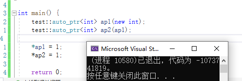

[toc]

# 智能指针

## 场景引入 - 为什么需要智能指针？

C++有些场景下,处理异常安全问题时特别繁琐

```
void example{
	int *p1 = new int;  //可能会抛异常1
	int *p2 = new int;  //可能会抛异常2
	Func();             //可能会抛异常3
	
	delete p1;
	delete p2;
}

int main(){
	try{
		example();
	}
	catch(std::exception& e){
		std::cout<<e.what()<<std::endl;
	}
}
```

如果需要将上面例子使用异常处理,则可能会面临如下情况

1. 只有p1抛异常:

   p1抛异常程序没有安全问题,因为new没有申请成功,之后程序就跳转了

2. p1不抛异常,但p2抛异常:

   

   如果直接复制粘贴到try中,p2就出作用域了.因此需要改代码:

   

   这样就可以了,但是这么做会有点别扭和麻烦.

3. 如果p1和p2都不抛异常,Func抛异常

   ```
   void example() {
       int* p1 = new int;   
       int* p2 = nullptr;
       
       try {
           p2 = new int;
       }
       catch (...) {
           delete p1;
           throw;
       }
   
       try {
           Func();
       }
       catch(...){
           delete p1;
           delete p2;
           throw;
       }
       delete p1;
       delete p2;
   }
   ```

   使用try-catch处理后,代码越来越膨胀.如果再多几个可能会抛异常的函数.那代码是相当长了.

先说结论:如果使用C++的智能指针,处理这些问题会变得很简单.

## 内存泄漏 

### 什么是内存泄漏

> 内存泄漏指因为疏忽或错误造成程序未能释放已经不再使用的内存的情况.内存泄漏并不是指内存在物理上的消失,而是应用程序分配某段内存后,因为设计错误,失去了对该段内存的控制,因而造成了内存的浪费.

### 内存泄漏的危害

> 长期运行的程序出现内存泄漏,影响很大,如操作系统、后台服务等等,出现内存泄漏会导致响应越来越慢,最终卡死.(不怕一下子泄露完,就怕一点一点泄露,难以发现)

### 内存泄漏分类

> C/C++程序中一般我们关心两种方面的内存泄漏
>
> - 堆内存泄漏(Heap leak) 
>   堆内存指的是程序执行中依据须要分配通过malloc / calloc / realloc / new等从堆中分配的一块内存，用完后必须通过调用相应的free或者delete删掉。假设程序的设计错误导致这部分内存没有被释放，那么以后这部分空间将无法再被使用，就会产生Heap Leak。
> - 系统资源泄漏 
>   指程序使用系统分配的资源，比方套接字、文件描述符、管道等没有使用对应的函数释放掉，导致系统资源的浪费，严重可导致系统效能减少，系统执行不稳定。

### 如何避免内存泄漏 

> 1. 工程前期良好的设计规范，养成良好的编码规范，申请的内存空间记着匹配的去释放。ps:这个理想状态。但是如果碰上异常时，就算注意释放了，还是可能会出问题。需要智能指针来管理才有保证。
> 2. 采用RAII思想或者智能指针来管理资源。
>
> 3. 有些公司内部规范使用内部实现的私有内存管理库。这套库自带内存泄漏检测的功能选项。 
> 4. 出问题了使用内存泄漏工具检测。ps:不过很多工具都不够靠谱，或者收费昂贵。
>
> 总结一下: 
> 内存泄漏非常常见，解决方案分为两种：1、事前预防型。如智能指针等。2、事后查错型。如泄漏检测工具。

## 智能指针的使用及原理

### RAII 

> RAII（Resource Acquisition Is Initialization）是一种利用对象生命周期来控制程序资源（如内存、文件句柄、网络连接、互斥量等等）的简单技术。
> 在对象构造时获取资源，接着控制对资源的访问使之在对象的生命周期内始终保持有效，最后在对象析构的时候释放资源。借此，我们实际上把管理一份资源的责任托管给了一个对象。这种做法有两大好处: 
>
> - 不需要显式地释放资源。 
> - 采用这种方式，对象所需的资源在其生命期内始终保持有效。
> - 智能指针是RAII思想的一种产物,还有守护锁lock_gard等...


#### 简易例程

```
template<class T>
class SmartPtr {
public:
    SmartPtr(T*ptr):_ptr(ptr) 
    {}
    ~SmartPtr() {
        delete _ptr;
        std::cout<<"delete ptr"<<"\n";
    }
private:
    T*_ptr;
};

int div()
{
    int a, b;
    std::cin >> a >> b;
    if (b == 0)
        throw std::invalid_argument("除0错误");
    return a / b;
}

void example() {
    SmartPtr<int> sp1(new int);
    SmartPtr<int> sp2(new int);
    try {
        div();
    }
    catch (...) {
        throw;
    }
}
```

执行结果:


根据执行结果可以发现,在div()抛出异常后,SmartPtr的两个对象都delete.

原因就是sp1和sp2都是类型为SmartPtr的局部对象,出了作用域会调用它的析构函数.

之后不需要再写一堆try-catch,代码更加简洁


### 智能指针的原理 

- RAII
- 像指针一样使用
- 拷贝问题

> 上述的SmartPtr还不能将其称为智能指针，因为它还不具有指针的行为。指针可以解引用，也可 
> 以通过->去访问所指空间中的内容，因此：AutoPtr模板类中还得需要将* 、->重载下，才可让其 
> 像指针一样去使用。

例程:

```
template<class T>
class SmartPtr {
public:
    SmartPtr(T*ptr):_ptr(ptr) 
    {}
    ~SmartPtr() {
        delete _ptr;
        std::cout<<"delete ptr"<<"\n";
    }
    T& operator*() {
        return *_ptr;
    }
    T* operator->() {
        return _ptr;
    }
private:
    T*_ptr;
};
```

<br>

#### 智能指针的拷贝问题

智能指针最难的在于拷贝问题.

下面例子中,尝试使用拷贝构造初始化sp2:


运行后出现了程序奔溃.

我们知道,默认生成的拷贝构造是浅拷贝.我们目前的SmartPtr并没有写拷贝构造,并且sp1是管理着一个动态申请的对象的.拷贝构造之后,sp1和sp2同时指向了同一个对象.最终会导致释放时释放两次.

那给SmartPtr加上深拷贝可以吗? 不可以,因为我们要的就是浅拷贝.因为智能指针是要模拟普通指针的行为.普通指针赋值也是浅拷贝,赋值后它们都指向同一个资源,由用户进行delete.因此不能是深拷贝.

> 迭代器也是模拟指针行为,也是浅拷贝,为什么迭代器不担心拷贝问题?
>
> 因为迭代器只是用于访问资源,修改资源,并不需要管理资源释放,资源释放由容器进行处理.
>
> 而智能指针需要管理资源释放,不能单纯的浅拷贝

如何解决.最终解决方案是使用引用计数.再此之前还有一段智能指针发展过程.


## 智能指针的发展历史

C++98时,C++有了第一款智能指针,它叫做`auto_ptr`,自动指针.

它的出现也遇到了如我们上文中存在的拷贝问题.auto_ptr使用了**管理权转移**的方案进行解决.

### `std::auto_ptr`

头文件 <memory>

#### 模拟实现auto_ptr例程:

```
namespace test {
    template<class T>
    class auto_ptr {
    public:
        auto_ptr(T* ptr) :_ptr(ptr)
        {}

        auto_ptr(auto_ptr& ap) {
            _ptr = ap._ptr;
            ap._ptr = nullptr;
        }

        ~auto_ptr() {
            delete _ptr;
            std::cout << "delete ptr" << "\n";
        }
        T& operator*() {
            return *_ptr;
        }
        T* operator->() {
            return _ptr;
        }
    private:
        T* _ptr;
    };
}
```

使用这种方案下,如果熟悉特性,使用效果还好.

##### 这种方案存在的问题:



管理权转移后,ap1就成了**垂悬指针**,导致后续代码不好维护,容易出错.很多公司明确规定不能使用auto_ptr.

> 垂悬指针:指向曾经存在的对象，但该对象已经不再存在了，此类指针称为悬垂指针。结果未定义，往往导致[程序错误](https://baike.baidu.com/item/程序错误/4605473?fromModule=lemma_inlink)，而且难以检测。


### Boost库中的智能指针

>Boost库
>
>为C++语言标准库提供扩展C++程序库的总称
>
>Boost库是为C++语言标准库提供扩展的一些C++程序库的总称，由Boost社区组织开发、维护。Boost库可以与C++标准库完美共同工作，并且为其提供扩展功能。
>
>Boost库是为C++语言标准库提供扩展的一些C++程序库的总称。
>
>Boost库由Boost社区组织开发、维护。其目的是为C++程序员提供免费、同行审查的、可移植的程序库。Boost库可以与C++标准库共同工作，并且为其提供扩展功能。Boost库使用Boost License来授权使用，根据该协议，商业或非商业的使用都是允许并鼓励的。
>
>Boost社区建立的初衷之一就是为C++的标准化工作提供可供参考的实现，Boost社区的发起人Dawes本人就是C++标准委员会的成员之一。在Boost库的开发中，Boost社区也在这个方向上取得了丰硕的成果。在送审的C++标准库TR1中，有十个Boost库成为标准库的候选方案。在更新的TR2中，有更多的Boost库被加入到其中。从某种意义上来讲，Boost库成为具有实践意义的准标准库。
>
>大部分boost库功能的使用只需包括相应头文件即可，少数（如正则表达式库，文件系统库等）需要链接库。里面有许多具有工业强度的库，如graph库。
>
>很多Boost中的库功能堪称对语言功能的扩展，其构造用尽精巧的手法，不要贸然的花费时间研读。Boost另外一面，比如Graph这样的库则是具有工业强度，结构良好，非常值得研读的精品代码，并且也可以放心的在产品代码中多多利用。

boost中有两套智能指针比较知名

- scoped_ptr
- shard_ptr/weak_ptr

它们分别是C++11标准库中的unique_ptr与shared_ptr/weak_ptr的前身.

## unique_ptr

**原理:**防拷贝

**使用场景:**在很多情况下,不允许对象拷贝,使用unique_ptr就能很好解决这类问题.比如i/ostring防拷贝,线程类缓冲区问题,mutex唯一性等,拷贝后冲突,拷贝代价大等这问题通过禁止拷贝能很好的解决.

### 模拟实现简易unique_ptr例程

原理:封掉拷贝构造和赋值重载

```
namespace test {
    template<class T>
    class unique_ptr {
    public:
        unique_ptr(T* ptr) :_ptr(ptr)
        {}
        ~unique_ptr() {
            delete _ptr;
            std::cout << "delete ptr" << "\n";
        }
        T& operator*() {
            return *_ptr;
        }
        T* operator->() {
            return _ptr;
        }

        //C++11封拷贝 
        unique_ptr(const unique_ptr<T>& up) = delete;
        unique_ptr<T>& operator = (const unique_ptr<T>&up) = delete;
    private:
        //C++98封拷贝
        //unique_ptr(const unique_ptr<T>& up); //C++98
        //unique_ptr<T>& operator=(const unique_ptr<T>&up);

        T* _ptr;
    };
}
```


## `shared_ptr`

头文件<memory> [shared_ptr](https://cplusplus.com/reference/memory/shared_ptr/)

### 构造函数

| default(1)            | `constexpr shared_ptr() noexcept; `                          |
| :-------------------- | :----------------------------------------------------------- |
| from null pointer (2) | `constexpr shared_ptr(nullptr_t) : shared_ptr() {} `         |
| from pointer (3)      | `template <class U> explicit shared_ptr (U* p); `            |
| with deleter (4)      | `template <class U, class D> shared_ptr (U* p, D del); template <class D> shared_ptr (nullptr_t p, D del); ` |
| with allocator (5)    | `template <class U, class D, class Alloc> shared_ptr (U* p, D del, Alloc alloc); template <class D, class Alloc> shared_ptr (nullptr_t p, D del, Alloc alloc);` |

> 注意: 根据构造函数得知,shared_ptr不能直接使用非空指针进行隐式类型转换.只允许nullptr直接构造.

### 用例:

```
#include<iostream>
#include<memory>
#include<thread>
#include<future>


class Bullet {
public:
    //伤害
    virtual int Attack() = 0;
    virtual ~Bullet() {};
};

//金子弹
class GoldBullet :public Bullet {
public:
    GoldBullet() {
        std::cout << "金子弹" << std::endl;
    }
    virtual int Attack() override {
        return 3;
    }
    virtual ~GoldBullet()override {
        std::cout << "销毁 金子弹" << std::endl;
    }
};

//银子弹
class SilverBullet : public Bullet {
public:
    SilverBullet() {
        std::cout << "银子弹" << std::endl;
    }
    virtual int Attack() override {
        return 2;
    }
    virtual ~SilverBullet()override {
        std::cout << "销毁 银子弹" << std::endl;
    }
};

//铜子弹
class CopperBullet : public Bullet {
public:
    CopperBullet() {
        std::cout << "铜子弹" << std::endl;
    }
    virtual int Attack() override {
        return 1;
    }
    virtual ~CopperBullet()override {
        std::cout << "销毁 铜子弹" << std::endl;
    }

};

enum class BulletType :int { gold, silver, copper };
class BulletFactory {
public:
    std::shared_ptr<Bullet> CreateBullet(BulletType type) {
        switch (type) {
        case BulletType::gold:
            //return new GoldBullet;                //错误,无法直接使用原始非空指针构造shared_ptr
            return std::make_shared<GoldBullet>();
        case BulletType::silver:
            return std::make_shared<SilverBullet>();
        case BulletType::copper:
            return std::make_shared<CopperBullet>();
        default:
            std::cout << "CreateBullet type error" << std::endl;
            //TODO
            return nullptr;
        }
    }
};

//射击
void Shoot(std::shared_ptr<Bullet> bullet){
     
    std::cout<<"造成伤害: "<<bullet->Attack()<<std::endl;
}

int main() {
    BulletFactory factory;

    for (int i = 0; i < 1; i++) {
        std::async(std::launch::async|std::launch::deferred,Shoot,factory.CreateBullet(BulletType::gold));
        std::async(Shoot,factory.CreateBullet(BulletType::silver));
        std::async(Shoot,factory.CreateBullet(BulletType::copper));
    }
    
    return 0;
}
```


自动内存管理,没有发生资源泄漏


unique_ptr不能解决所有问题,还有一些场景是需要共享的.因此有了shared_ptr

核心原理:引用计数

技术实现分析:

- 引用计数实现

  每个资源应该配对一个引用计数.

  实现方法:动态申请一个int

- 能否使用static作为引用计数类型? 

  不能.static虽然有共享性质,但是static是所有类共享一个,shared_ptr不仅仅只用于管理一个对象资源,还可能需要管理多个对象资源.如果使用static,管理多个资源的情况下,这些资源都会指向同一个计数了,因此不可以使用static.

- 线程安全

  1. 线程安全问题,智能指针只负责自身线程安全,并不负责资源的线程安全,资源的线程安全由资源自己负责.而引用计数是属于智能指针维护的,因此,智能指针的线程安全问题为引用计数的线程安全问题.即保护引用计数
  1. 锁的定义方式和`_pRefCount`一样.一份资源(此处资源为`_pRefCount`)对应一个.

- operator=实现较为复杂,具有任意性(可以多次赋值,拷贝只能一次)
  1. 如果使用赋值进行初始化,则和拷贝赋值一样.
  2. 如果是二次赋值,需要考虑有:
    - 新管理资源走拷贝构造一套.
    - 原先管理资源的引用计数减少.为0时需要析构(走一次析构)
    - 处理"自己"给"自己"赋值
         1. 智能指针对象相同,指向的资源相同
         2. 智能指针对象不同,指向的资源相同
         传统的方法(`*this!=对象`),只能处理第一种;而(`*this._ptr != sp._ptr`)能够兼容两种方法;
         注意:虽然处理逻辑和析构函数很像,但是C++中成员函数不能自己调用析构函数,因为肚子里的蛋不能杀的了鸡.
         如果需要提高复用性,可以将逻辑独立成一个函数,然后析构和赋值重载都分别进行调用

### 模拟实现简易shared_ptr例程:

```
namespace test {
    template<class T>
    class shared_ptr {
    public:
        shared_ptr() : _ptr(nullptr), _pRefCount(new int(0)),_pmtx(new std::mutex)
        {}

        shared_ptr(T* ptr) :_ptr(ptr), _pRefCount(new int(1)),_pmtx(new std::mutex)
        {}

        shared_ptr(const shared_ptr<T>& sp) :_ptr(sp._ptr), _pRefCount(sp._pRefCount) ,_pmtx(sp._pmtx){
            AddRef();
        }


        ~shared_ptr() {
            Release();
        }

        shared_ptr<T>& operator=(const shared_ptr<T>& sp) {
            if (_ptr != sp._ptr)
            {
                if (*_pRefCount == 0) //天生就为0的情况
                {}
                else {
                    Release();
                }

                _ptr = sp._ptr;
                _pRefCount = sp._pRefCount;
                _pmtx = sp._pmtx;
                AddRef();
            }
            return *this;
        }

        void Release() {
            _pmtx->lock();
            if (--(*_pRefCount) <= 0) {
                _pmtx->unlock();
                delete _ptr;
                delete _pRefCount;
                delete _pmtx;
                std::cout << "delete " << _ptr << "\n";
            }
            else {
                _pmtx->unlock();
            }
        }

        void AddRef() {
            _pmtx->lock();
            ++(*_pRefCount);
            _pmtx->unlock();
        }
        
        T& operator*() {
            return *_ptr;
        }
        T* operator->() {
            return _ptr;
        }

        T* get() {
            return _ptr;
        }

        int use_count() {
            return *_pRefCount;
        }


    private:
        T* _ptr;
        int* _pRefCount;
        std::mutex* _pmtx;
    };
}
```


#### 多线程测试例程

```
void SharePtrFunc(test::shared_ptr<Date>& sp, size_t n)
{
    for (size_t i = 0; i < n; ++i)
    {
        test::shared_ptr<Date> copy(sp);
        copy->_year++;
        copy->_month++;
        copy->_day++;
    }
}

int main() {
    test::shared_ptr<Date> sp (new Date);

    const size_t n = 1000000;
    std::thread t1(SharePtrFunc, std::ref(sp), n);
    std::thread t2(SharePtrFunc, std::ref(sp), n);
    std::thread t3(SharePtrFunc, std::ref(sp), n);

    t1.join();
    t2.join();
    t3.join();

    std::cout<<sp.use_count()<<"\n";
    std::cout<<sp->_year<<"\n";
    std::cout<<sp->_month<<"\n";
    std::cout<<sp->_day<<"\n";
    return 0;
}
//测试标准库: 包含头文件<memory>,将所有命名空间修改成std
```

测试结果:


shared_ptr线程安全.管理的资源不是线程安全.

### shared_ptr循环引用问题

通过shared_ptr构建的链表节点.

```
struct ListNode
{
    int _data;
    std::shared_ptr<ListNode> _prev;
    std::shared_ptr<ListNode> _next;

    ~ListNode() { std::cout << "~ListNode()" << std::endl; }
};

int main() {
    std::shared_ptr<ListNode> sp1 (new ListNode);
    std::shared_ptr<ListNode> sp2 (new ListNode);

    return 0;
}
```

当两个节点独立时,析构正常


单链表时,析构正常


当成环状时,不能正常析构.


#### 原因图解分析:


## weak_ptr

头文件<memory> [weak_ptr](https://cplusplus.com/reference/memory/weak_ptr/)

weak_ptr也叫弱指针.

weak_ptr的特点

- 它不是一个常规的智能指针,并不符合RAII
- 支持像指针一样使用
- 专门设计出来,辅助解决shared_ptr循环引用问题

weak_ptr的核心原理是不增加引用计数.

上述循环引用问题就是因为增加了内部引用增加了引用计数.我们需要一个不增加引用计数,又可以指向资源,像指针一样的东西,因此有了weak_ptr.

### 模拟实现简易weak_ptr

库中的shaerd_ptr和weak_ptr实现机制非常复杂.在这里仅模拟实现,复现出简单场景功能

```
template<class T> 
    class weak_ptr
    {
    public:
        weak_ptr()
            :_ptr(nullptr)
        {}

        weak_ptr(const shared_ptr<T>& sp)
            :_ptr(sp.get())
        {}

        weak_ptr<T>& operator=(const shared_ptr<T>& sp) 
        {
            _ptr = sp.get();
            return *this;
        }

        T& operator*()
        {
            return *_ptr;
        }

        T* operator->()
        {
            return _ptr;
        }

    private:
        T* _ptr;
    };
}
```

### 解决循环引用问题

```
struct ListNode{
    int _data;
    test::weak_ptr<ListNode> _prev;
    test::weak_ptr<ListNode> _next;

    ~ListNode() { std::cout << "~ListNode()" << std::endl; }
};

int main() {
    test::shared_ptr<ListNode> sp1(new ListNode);
    test::shared_ptr<ListNode> sp2(new ListNode);
    sp1->_next = sp2;
    sp2->_prev = sp1;
    return 0;
}
```


## 定制删除器

上述实现的析构方法,仅适用于析构delete.如果new了一个数组,则析构时程序会奔溃,因为析构数组需要delete[].因此需要定制删除器


定制删除器是一个可调用对象(函数指针,仿函数/函数对象,lambda表达式)


### 仿函数版本实现

```
template<class T>
struct DeleteArray {
    void operator()(T*ptr) {
        delete[] ptr;
    }
};
```


### lambda版本实现

```
int main() {
    std::shared_ptr<Date> sp2(new Date[10],[](Date*ptr){delete[] ptr;});
    std::shared_ptr<FILE> sp3(fopen("test.cpp", "r"), [](FILE* ptr) {
    	std::cout<<"fclose()"<<"\n"; fclose(ptr); });
    	
    return 0;
}
```

### 定制删除器版本shared_ptr模拟实现

```
namespace test {
    template<class T>
    class shared_ptr {
    public:
        shared_ptr() : _ptr(nullptr), _pRefCount(new int(0)), _pmtx(new std::mutex)
        {}

        shared_ptr(T* ptr) :_ptr(ptr), _pRefCount(new int(1)), _pmtx(new std::mutex)
        {}

        shared_ptr(const shared_ptr<T>& sp) :_ptr(sp._ptr), _pRefCount(sp._pRefCount), _pmtx(sp._pmtx) {
            AddRef();
        }

        template<class T, class D>  //第二步
        shared_ptr(T* ptr, D del) : shared_ptr(ptr) {
            _del = del;
        }


        ~shared_ptr() {
            Release();
        }

        shared_ptr<T>& operator=(const shared_ptr<T>& sp) {
            if (_ptr != sp._ptr)
            {
                if (*_pRefCount == 0) //天生就为0
                {
                }
                else {
                    Release();
                }

                _ptr = sp._ptr;
                _pRefCount = sp._pRefCount;
                _pmtx = sp._pmtx;
                AddRef();
            }
            return *this;
        }

        void Release() {
            _pmtx->lock();
            if (--(*_pRefCount) <= 0) {
                _pmtx->unlock();
                //delete _ptr;
                _del(_ptr); //第三步 
                delete _pRefCount;
                delete _pmtx;
                std::cout << "delete " << _ptr << "\n";
            }
            else {
                _pmtx->unlock();
            }
        }

        void AddRef() {
            _pmtx->lock();
            ++(*_pRefCount);
            _pmtx->unlock();
        }

        T& operator*() {
            return *_ptr;
        }
        T* operator->() {
            return _ptr;
        }

        T* get() const {
            return _ptr;
        }

        int use_count() const {
            return *_pRefCount;
        }

    private:
        T* _ptr;
        int* _pRefCount;
        std::mutex* _pmtx;
        std::function<void(T* ptr)> _del = [](T*ptr){delete ptr;}; //第一步:包装器+缺省
    };
}
```

#### 测试代码

```
int main() {
    test::shared_ptr<Date> sp0(new Date);
    test::shared_ptr<Date> sp1(new Date[10], DeleteArray<Date>());
    test::shared_ptr<Date> sp2(new Date[10], [](Date* ptr) {delete[] ptr; });
    test::shared_ptr<FILE> sp3(fopen("test.cpp", "r"), [](FILE* ptr) {std::cout << "fclose()" << "\n"; fclose(ptr); });
    return 0;
}
```

## `make_shared`
`shared_ptr`在创建过程中会申请空间两次,分别是管理的资源和强弱引用计数.这个过程中存在异常安全问题._如果new成功但强弱引用计数没有申请成功,则资源生命周期结束时可能不能正常析构,导致内存泄漏
C++11建议使用`make_shared`,不会出现异常,保证`shared_ptr`异常安全.
原理:`make_shared`将需要托管的资源和存储引用计数的资源合并成一块大内存进行申请. 要么都申请成功,要么都申请失败.
优点:
1. 内存分配效率更高.
2. 有效防止内存泄露.

缺点:
1. 无法自定义删除器.默认使用delete. 也就无法创建数组等非delete删除器支持的类型.
2. 导致托管的资源延迟释放.内存连续后,就算RefCnt为0,只要弱指针还不为零,即还有观察者时,资源就不会释放.  而直接new的shared_ptr只要RefCnt为0立即释放. (要么一起释放,要么都不释放)

代码演示:
```
int main(){
    std::shared_ptr<int> sp1(new int(10)); //需要两次申请内存,new int + new RefCnt
    auto bar = std::make_shared<int>(10);
    auto foo = std::make_shared<std::array<char,64>>();
    return 0;
}
```

C++14 则可以使用make_unique;


注意:在C++11中,make_shared不可以接收new对象作为参数

```
std::shared_ptr<int> sp = std::make_shared<int>(new int);
```

