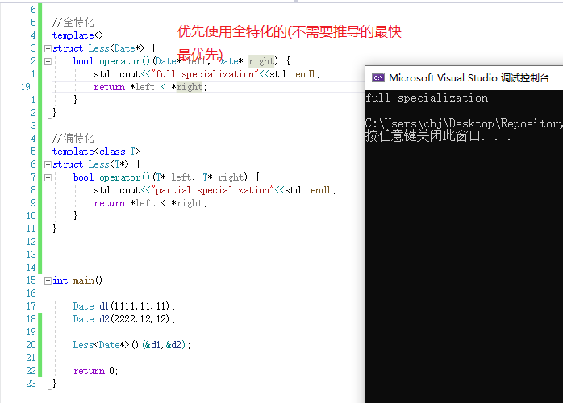
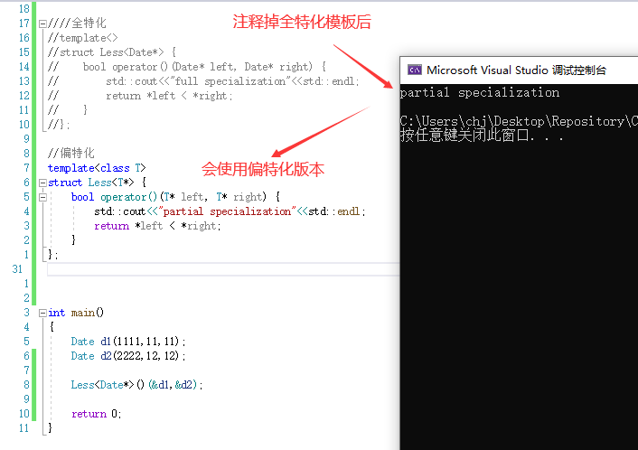

# 模板

## 缺省模板类型
```
template<class T = int>//之后就可以使用缺省模板类型了
class test{};
int main(){
   test<> t; //自动使用缺省
}
``` 
- 类需要显式写<>
- 函数不需要


## 函数模板 

  关键字tamplate 
  语法:
  1.一个模板类型
  template<class T>  -- T可以是别的字母,任意字母,一般用大写
  void Swap(T& x, T& y)
  {
 	 T tmp = x;
 	 x = y;
 	 y = tmp;
  }

  或者template<typename T>
  void Swap(T& x, T& y)
  {
  //...};

  2.多个模板类型
  template<class T , class Z> --- 用逗号分割
   fun(){}

  3.参数类型不同 
  显式实例化 --- 模板类型只有1个时,如果传了多个不同类型,则编译器无法判断,会报错,需要唯一指定
  template<class T , class T> 
  fun(T a , T b){//...};

  fun<int>( 1 , 1.1 ); //错误
  fun<double>( 2 , 3.4 );

  或者强换一个 fun( 2 , (int)3.4);

  

  特点:
  1.如果定义的模板函数已有可以构成重载的函数(编译后构成重载),则编译器优先调用非模板的, --- 效率原则
  2.在1的前提下,如果非要使用模板生成的,则使用显式实例化?即可

  

  

## 类模板

  注意:
  1.类模板一般声明与定义不分离,分离后也要在同一个文件,不然会链接错误.

  

>   T x = T(); //模板调用匿名(对象)构造函数完成初始化 -- 任意类型都支持
>   模板出现后,基本类型也需有构造函数,因此可以实现基本类型构造,
>   int x = int();//基本类型构造

  //类型模板参数
  类型:class_name<T>
  类名:class_name

  特点:
  1.类模板在参数列表中可以只写类名不写模板参数,如:list<int> 可以写成list
  2.模板参数可以传类型T,T*(Ptr),T&(Ref)
  3.模板参数可以给缺省值<class Containers = vector<int>> //vector<int>也是类型


## 非类型模板参数

  模板参数分为类型形参和非类型形参
  $类型模板参数用于解决typedef type reType_name; -- 根据传入的模板类型自动生成相应类型的代码,不需要再写多份不同类型的代码,有效代码复用,减小开发成本

  非类型模板参数的意思是,它不是类型,他是常量,是整型常量
  $非类型模板参数用于解决宏常量,#define N 10 ;

  举例:
 template<class T = int,size_t N = 10> 
  class Array
  {
	T _a[N];
  }

 Array<> a1;  //大小为10
 Array<int,20> a2;  //大小为20

  特点:
  1.只能是整型常量,有符号无符号long,char,bool(true为1,false为0)等都可以,double,float等不行
  2.非类型模板参数也可以有缺省值


## 模板特化 Template Specialization 

功能目的:当传给模板的类型为匹配特化版本时,则使用特化版本

```
template<class T1,class T2>
struct A
{};

template<class T1>
struct A<T1,char>   //当第二个模板参数为char时,使用这个模板
{};
```


术语:

- 偏特化:Partial Template Spcialization

- 全特化:Full specialization


模板特化:类模板特化,函数模板特化

    - 当使用模板时,如果有对应的特化模板,则调用特化模板,否则调用原模板
        - 模板特化必须要有一个原始模板,然后在原始模板之上特化


### 函数模板特化

全特化 : 是原始模板的特定版本,全特化,即类型全部明确指定. 

>  函数模板特殊只支持全特化,不支持偏特化

举例,函数模板全特化:

```
template<class T>
      bool Less(T left , T right){
            return left<right;   //直接使用正常"对象"进行比较时,类内重载了比较方法,因此可以得到想要的结果
}

//注意,必须要带上template<>,以表示模板特化,不带的话就是普通函数了
template<>
bool Less<Date*>(Date* left,Date* right){
     return *left < * right;  
     //类型不单是对象,还可能有如指针,一些需要我们特殊处理的情况.
     //如果是需要特殊处理的类型,就需要模板特化来对该类型进行特殊处理,以调整到合适的结果
}
```

 **函数模板和相同的函数能同时存在**

```
template<typename T>
void func(T t)
{
    std::cout<<"template"<<std::endl;
}

void func(int t)
{
    std::cout<<"function"<<std::endl;
}

int main()
{
    func<int>(1); //明显区别,使用方式都不一样.
    func(1);
    return 0;
}
```

//虽然生成的函数功能相同,但编译对模板生成的函数的函数名和普通函数的函数名的命名规则不一样,使它们能共存
实际预编译后生成的特化代码:

```
template<>
void func<int>(int t)
{
  std::operator<<(std::cout, "template").operator<<(std::endl);
}

void func(int t)
{
  std::operator<<(std::cout, "function").operator<<(std::endl);
}
```


### 类模板特化

使用更频繁

1. 全特化
2. 部分特化/偏特化-- 1.部分限制(给具体类型)  2.进一步限制(限制是指针,引用等)

```
//非特化原始模板
template<class T>
struct Less {
    bool operator()(const T& left, const T& right) {
        return left < right;
    }
};

int main()
{
    Date d1(1111,11,11); 
    Date d2(2222,22,22);

    //具名对象
    Less<Date> less;
    less(d1,d2);

    //匿名对象
    Less<Date> ()(d1,d2);

    return 0;
}


```


```
//...非特化原始模板

//全特化
template<>
struct Less<Date*> {
    bool operator()(Date* left, Date* right) {
        std::cout<<"full specialization"<<std::endl;
        return *left < *right;
    }
};

//偏特化
template<class T>
struct Less<T*> {
    bool operator()(T* left, T* right) {
        std::cout<<"partial specialization"<<std::endl;
        return *left < *right;
    }
};

int main()
{
    Date d1(1111,11,11); 
    Date d2(2222,12,12);
        
    Less<Date*>()(&d1,&d2);
    return 0;
}
```





  

注意:还可以特化引用,引用的话注意要初始化(缺省参数),使用引用的情况很少 -- const迭代器有使用引用

 


### 模板的分离编译

  模板不支持不同文件定义和声明,只支持在同一个文件声明和定义分离
  定位C++NO.21 2023_3_20

>  原因:
>
> 声明和定义需要在程序编译过程的最后一步'链接'中通过符号表去寻找地址建立联系.但是模板比较特殊,需要实例化才能编译成二进制代码,而C++要求要有定义才能实例化,声明和定义分离到不同文件后就找不到定义了,因此模板声明和定义分离到不同文件后,不会生成二进制代码

  如果非要分离,需要显式实例化(指定类型) -> 丧失模板优势,直接回到C语言

  所以:
  如果比较短小的的函数直接在类里面定义(无声明) -- 类内函数都是内联函数

  体积大的函数在类内声明,在类外定义 ,不使用内联,减小可执行程序体积

  有些库会把.h文件写成.hpp文件, 一般用于模板类的头文件,两者没有差异


### 模板的优缺点

  优点:实现复用代码,开发效率提高,C++标准模板库STL因此诞生,增强了代码的灵活性

  缺点:错误定位不精确,凌乱


模板的使用注意


  $ 使用模板后,变量多使用auto自动推导类型,这样可以容易得知是模板的类型(模板习惯用auto)

  $ typedef 类模板的内嵌类型需要加上typename -- 编译器无法区分是类型还是静态变量(静态变量也是通过类域使用)
  typedef typename rep::const_iterator iterator;

  $ 类模板前置声明:
  1.模板间互相调用时,在其中一个模板前加上另一个模板的声明,以区分调用先后....
  2.(复习)缺省参数要写在声明中...


  $ 同一个类模板,只要模板参数不同就是不同类型了--多一个const也不行,类模板类型只看<>一不一样 -- 场景:红黑树和哈希的迭代器

  

