# 继承


[TOC]

## 继承

- 继承受权限影响
   有public protected private 三种继承

- 基本语法:   
  class 子类 : 权限 父类
   `class student : public Person`

- 使用父类成员的方法
    使用域作用限定符显式指出,语法:
     基类::基类成员
     `Person::Print();`

- 继承方式也可以不写 -- 默认是public,建议显式写出继承方式
    a.对于class,默认继承方式是私有
    b.对于struct默认继承方式是公有

- 继承可以认为是将父类当作子类的一个看不见成员  
  证明:  
  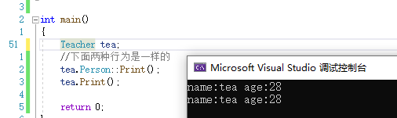

- 友元关系不能被继承  
  父类的友元不是子类的友元.友元只对所在的类域有效


### 继承的访问权限

继承的访问权限的作用是将继承下来的父类成员的原有的权限进行缩小.

> 类权限  
> - public: 外部,子类都可见
> - protected: 外部不可见,子类可见
> - private: 外部,子类都不可见
> 

- 继承的访问权限表
|类成员\继承方式     |public继承            |protected继承          |private继承		  |  
|:-------------------|:---------------------|:----------------------|:--------------------|  
|基类的public成员    |派生类的public成员    |派生类的protected成员  |派生类的private成员  |  
|基类的protected成员 |派生类的protected成员 |派生类的protected成员  |派生类的private成员  |  
|基类的private成员   |在派生类中不可见      |在派生类中不可见       |在派生类中不可见	  |  

> 基类的private成员最特殊,继承后子类不可见. 其他权限成员无论被什么方式继承至少子类自己内部可见

- 继承的权限可以被缩小，但是不能放大，和const一样

- 私有继承私有成员也是继承下来了,只是对子类和外界都不可见(直接不可见). 虽然子类不可见,但是可以通过父类的方法间接去调用(间接可见)


### 子类赋值给父类
#### 赋值兼容规则
在公有继承中,子类可以赋值给父类 并且是天然支持(编译器直接行为),没有临时变量,(不是隐式类型转换,不存在类型转换发生)

1. 派生类的对象可以赋值给基类对象。
2. 派生类的对象可以初始化基类的引用。
3. 派生类对象的地址可以赋给指向基类的指针。

#### “天然”的行为

“赋值”过程是通过切片方式,通过调用父类拷贝构造/赋值运算符重载完成赋值,将从父类继承下的部分依次赋值给父类,

引用和指针也是类似，通过切片方式，直接引用/指向子类中父类的一部分,也是"天然"的,不存在类型转换的发生

> 切片不是丢弃,是划分

> (切片目的:多态需要,具体见多态篇)

#### 验证:

##### 1. 其他权限继承能否支持赋值兼容规则

```
class Person{
public:
    Person(std::string name, int age) :_name(name), _age(age)
    {};
    void Print(){
        std::cout << "name:" << _name << " ";
        std::cout << "age:" << _age << " ";
        std::cout << std::endl;
    }
private:
    std::string _name;
    int _age;
};

class Student : private Person
{
public:
    Student() :Person("stu", 18) {};
    void Print1(){
        Print();
    }
private:
    int _stuid;
};

class Teacher : public Person
{
public:
    Teacher() :Person("tea", 28) {};
private:
    int _teaid;
};

class A :protected Person
{
public:
    A():Person("A",65){};
};

int main(){
    Student stu;
    stu.Print1();
    Teacher tea;
    tea.Print();

    Person per("per", 99);
    per = stu;
    per = tea;

    A a;
    per = a;

    return 0;
}
```

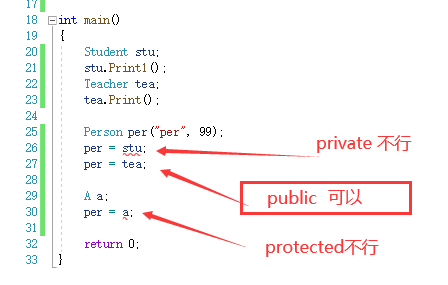

结论:只有公有继承才支持赋值兼容规则


##### 2.是否"天然",有没有产生临时变量

产生临时变量就说明是赋值行为,没有则是"天然"

```
student s;
person& rp = s;//可以不加const -- 说明不是右值,没有隐式类型转换
```

- 父类不能赋值给子类


### 继承中的作用域
在继承体系中,基类和派生类都有独立的作用域.

> 不同作用域可以定义同一个名字的变量
> 不同作用域的同名函数不能构成重载,同一个作用域内同名函数才有可能构成重载

#### 隐藏/重定义

概念:不同作用域的同名成员(非虚函数)构成重定义/隐藏

- 定义:子类和父类有同名成员时,子类成员将屏蔽父类对同名成员的直接访问,这种情况叫做隐藏或重定义,继承关系才有隐藏
- 说明: 触发隐藏后,默认调用的是子类作用域内的成员,如果需要调用父类的,只需要显式指出父类作用域  
  语法:   "基类::基类成员"  
  `Base::_member;`

- 函数构成隐藏的条件:只需要函数名相同就构成隐藏,不考虑返回值和参数列表(一不一样都不影响)  

- 注意:隐藏会影响可读性,最好还是少用,可能会给自己埋坑.


### 继承的构造函数

继承中规定:父类的成员必须通过调用父类的构造函数完成初始化.因此,继承中子类需要帮助父类初始化.
子类自动生成的构造函数也会自动调用父类构造函数进行初始化

- 如果子类中没写父类构造函数,则父类会自动调用无参的构造函数,但是父类写了其他构造函数,但没写无参则报错,除非全缺省
- 父类构造都是通过子类初始化列表完成初始化,无论显式还是隐式
- 需要显式指定参数完成父类初始化时,可以在初始化列表中显式写出父类构造函数`Derive:Base(参数列表){}`  
- 继承下来的父类算是一个子类成员,和其他子类成员一样,需要初始化,只是看不见

### 继承的拷贝构造

```<Cpp>
Derive(const Derive& d):Base(d){};  //将d切片成Base的形状给父类
```
### 继承的operator=
```<Cpp>
Derive& operator(const Derive& d)
{
    if(this!=d)
    {
        Base::operator=(d);
        _member = d._member;
    }
    return *this;
}

```


### 继承的析构函数


#### 析构顺序
> 正常来说,父类是子类的"成员",先调子类析构,析构到自定义类型时,就调用自定义类型的析构函数.等析构到父类时,就调用父类的析构函数,这样符合逻辑.   
> 
> 因此,继承中析构像进栈的顺序那样,后进去的先析构,先析构子类,再析构父类


- 不需要显式调用父类析构  
  > 为了要保证析构顺序,父类的析构是自动调用的 -- 如果是用户自己写,不能保证析构顺序,容易出问题
  
  如果显式调用了,则会析构两次.

##### 析构的特殊处理
析构在继承及以后的多态中会被处理成Destructor,(多态篇描述)

> ###### 坑:为什么析构函数需要特殊处理
>
> 如果是父类指针接收子类类型,析构父类指针时只会调用父类的析构函数,不会调用子类的,这样可能会造成资源泄露问题.
>
> 本意:**根据指针(引用)指向的对象类型来选择对应的析构函数**
> 结果:**根据指针(引用)的类型的来选择对应的析构函数**
>
> 虽然结果符合正常语法,但是我们在这种情况下并不希望是这样,我们希望它是根据指针(引用)指向的对象类型来选择对应的函数执行.
>
> 而根据指针(引用)指向的对象类型来选择对应的函数，这正好就是**多态**的理念.
>
> 因此,为了解决切片中这样的析构函数问题,我们选择将其转化成多态来解决.
>
> 此时我们已经满足多态构造的2个条件的其中之一:基类的指针或引用， 剩下的我们需要满足**派生类的析构函数构成对基类析构函数的重写**。而重写的条件是：**返回值类型，函数名，参数列表都相同**。对于析构函数，目前还缺的就是函数名相同，因此,析构函数的名称统一处理为destructor.


### 继承中的static成员
基类定义了static静态成员,则整个继承体系里面只有一个这样的成员,都共享这个成员.无论派生出多少个子类,都只有一个static成员实例 

### 设计一个不能被继承的类 
- 方法1:私有构造函数或私有析构函数(继承需要帮助父类初始化和析构,ban就完事了)
- 方法2:C++11关键字 final修饰类

```<language>
public :
	static A CreateObj(){ return A()}; //允许从类域内访问
private:
	A(){};
main(){A::CreateObj()};
```

  

### 多继承

多继承是指被多个子孙继承

多继承的语法:继承方式 类 ,继承方式 类,...
  以逗号分隔开


#### 菱形继承

##### 定义

多个子类继承同一个父类而又有子类同时继承这几个子类或其子孙类

##### 标准的菱形继承图:

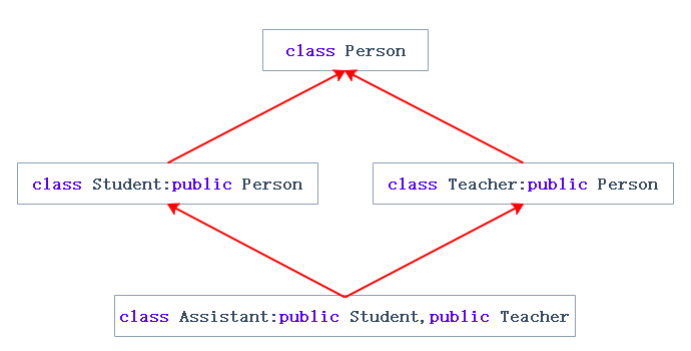

```
class Person
{
public:
    std::string _name; // 姓名
};

class Student : public Person {
protected:
    int _num; //学号
};

class Teacher : public Person{
protected:
    int _id; // 职工编号
};
class Assistant : public Student, public Teacher{
protected:
    std::string _majorCourse; // 主修课程
};

int main(){
    Assistant a;
    return 0;
}
```


其他的菱形继承

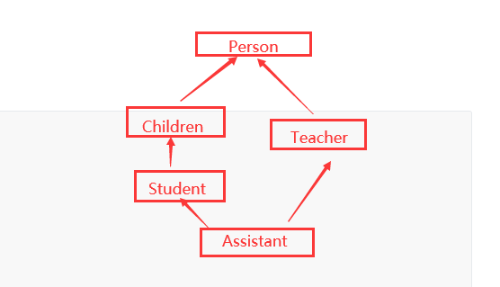

```
class Person{
public:
    std::string _name; // 姓名
};

class Children:public Person{
protected:
    int _num; //学号
};

class Student : public Children {
protected:
    int _num; //学号
};

class Teacher : public Person{
protected:
    int _id; // 职工编号
};

class Assistant : public Student, public Teacher{
protected:
    std::string _majorCourse; // 主修课程
};

int main(){
    Assistant a;
    return 0;
}

```

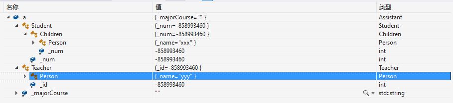


#### 菱形继承的二义性和数据冗余

菱形继承意味着两个父类都继承了爷爷类,所以两个父类都有相同的爷爷成员,导致孙子会有两个相同的成员

- 二义性是指继承了多个有相同爷爷类的父类,也就继承了多份相同的爷爷类成员,直接指定这些爷爷类成员时会发生冲突,不能唯一确认.

- 数据冗余:两份相同继承

- 菱形继承不仅是菱形,包括成环都是菱形继承

##### 代码举例:

```
class Person
{
public:
    std::string _name; // 姓名
};
class Student : public Person
{
protected:
    int _num; //学号
};
class Teacher : public Person
{
protected:
    int _id; // 职工编号
};
class Assistant : public Student, public Teacher
{
protected:
    std::string _majorCourse; // 主修课程
};
int main()
{
    // 这样会有二义性无法明确知道访问的是哪一个 
    Assistant a;
    a._name = "peter";

    return 0;
}

```

问题举例:

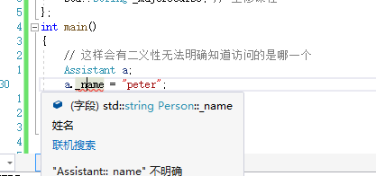

显式指定父类成员可以解决二义性问题:

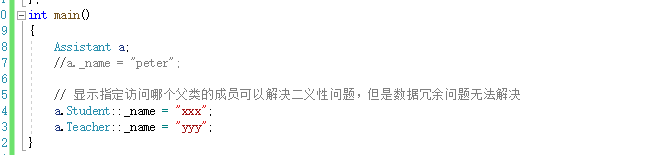


##### 菱形继承的现实问题:

菱形继承在现实情况下不存在,爷爷类的属性在子孙类中都应该是唯一属性,才能符合继承的意义.

> 比方说我们都是人,我们都继承了人的属性,我们都有一套相同的人的属性,不可能有多套.爷爷类就相当于人的属性,大家都只有一份才合理.

#### 菱形继承的内存布局

```
class A{
public:
    int _a = 1;
};

class B : public A{
public:
    int _b = 2;
};

class C : public A{
    public:
    int _c = 3;
};

class D :public B, public C {
    public:
    int _d = 4;
};

int main(){
    D d;
    return 0;
}
```


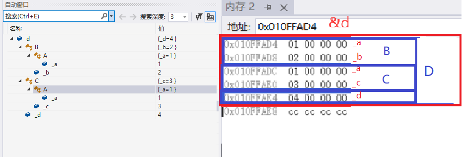

#### 解决数据冗余 -- 虚继承

##### 定义:

虚拟继承,也叫**虚继承** 是面向对象编程中的一种技术，是指一个指定的基类，在继承体系结构中，将其成员数据实例共享给也从这个基类型直接或间接派生的其它类。

##### 用法:

- 只有直接继承基类的子类需要进行虚继承,间接继承的派生类不需要.

- 语法,在继承权限前加上virtual关键字.

  实例代码`class Derive:virtual public Base{//...};`

##### 示例代码:

```
class A{
public:
    int _a = 1;
};

class B :virtual public A{
public:
    int _b = 2;
};

class C :virtual public A{
    public:
    int _c = 3;
};

class D :public B, public C {
    public:
    int _d = 4;
};

int main(){
    D d;
    return 0;
}
```

##### VS监视窗口现象

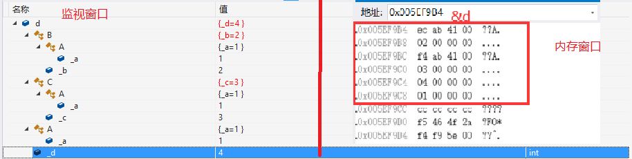

  目前我们认为虚继承解决是解决了数据冗余问题,但监视窗口中依旧显示出菱形继承中数据冗余的样子.可能会引起误解.

这其实也是合理的,因为虚拟继承是让直接或间接派生的类共享基类,每个派生类都共同享有这个基类,因此每个派生类都有一份也是能够理解的.只要注意在使用时提醒自己这是个共享类.

  监视窗口终究还是抽象的产物,看内存得到的信息则一定是准确的.可以发现图片右边的内存窗口中数值为1的只有一个字节,这就能够说明,基类只有1个,就是是数据冗余问题被解决.

  另外,还可以发现对象d的内存中还有除了缺省值1,2,3,4以外的其他值,这是虚继承做的特殊处理,见下文分析

##### 虚继承的原理

直接看内存(因调试中断,重新运行&d会改变,因此上下文地址不一定相同)

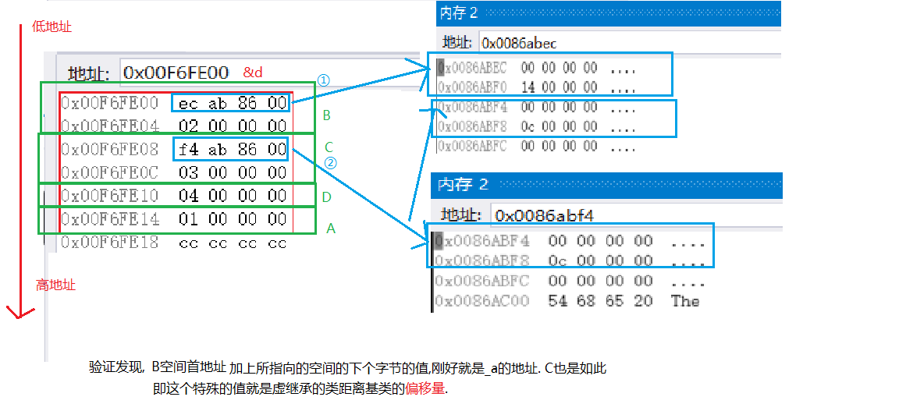

验证发现,B空间首地址,加上所指向的空间的下一个字节的值,刚好就是A中成员_a的地址.同样计算的C也是如此.

因此可以证明,这个特殊的值就是虚继承类距离基类的偏移量.这就是虚继承实现数据实例共享,解决数据冗余的原理

###### 留下问题:

- 为什么所指向的空间中还有一个字节的数据是全0?

  这个全0的字节空间是为了给后面的多态的虚表指针等而设计.见后文多态原理分析.

- 为什么不直接存偏移量,而是使用地址间接寻找偏移量? 

  可能原因有:

  1. 有多种不同的数据需要保存,且需要满足切片后还能保证找到正确的地址

     ```
     B d = d;
     B* ptrb = &d;
     C* ptrc = &d;
     要满足A,B,C切片都能找到_a
     ```

  2. 让类保持简洁不膨胀,更易维护

  3. 历史,技术选型


###### 成本优势

同一个子类实例的所有对象全部共享一张表(同一个地址)

```
D d1,d2,d3; //这三个对象都共用同一个地址
```

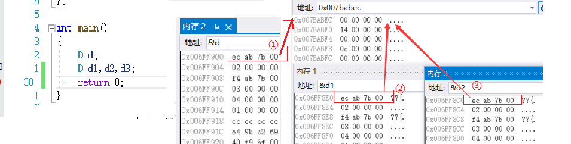

 

##### 虚继承的特性

- 虚继承体系中的声明顺序: 谁先继承谁就先声明

  ```
  class D:public C,public B{
  };// 先继承的是C,即C先声明
  
  class D:public B,public C{
  };// 先继承的是B,即B先声明
  ```

  

- 虚继承的基类只会调用一次构造,由实例化的子类进行构造,这个子类需要对所有祖先进行构造;非基类且非实例化的子类的派生类中的对基类的构造函数会自动失效

  ```
  class B : public A{
  public:
  	B():A() //A()不生效
  	{}
  };
  
  class D:public B,public C{
  public:
  	D():B(),C(),A() //初始化列表中执行顺序与列表顺序无关,只与声明顺序有关
  	{}
  };
  ```

- 虚拟继承不能在其他地方使用,只能用于解决菱形继承

###### 练习题

下面程序输出结果是什么? （）

```
#include<iostream>
using namespace std; 
class A{
public:
    A(char *s) { cout<<s<<endl; } 
    ~A(){}
};

class B:virtual public A{
public:
    B(char *s1,char*s2):A(s1) { cout<<s2<<endl; }
};

class C:virtual public A{
public:
    C(char *s1,char*s2):A(s1) { cout<<s2<<endl; }
};

class D:public B,public C{
public:
    D(char *s1,char *s2,char *s3,char *s4):B(s1,s2),C(s1,s3),A(s1)
    { cout<<s4<<endl;} 
};

int main() {
    D *p=new D("class A","class B","class C","class D");
    delete p;
    return 0;
}
```

A：class A class B class C class D      B：class D class B class C class A 
C：class D class C class B class A      D：class A class C class B class D

答案:A


#### 模型图

- 非虚继承的菱形继承

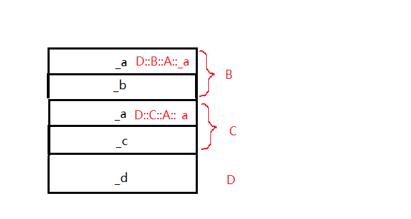

- 虚继承的菱形继承
  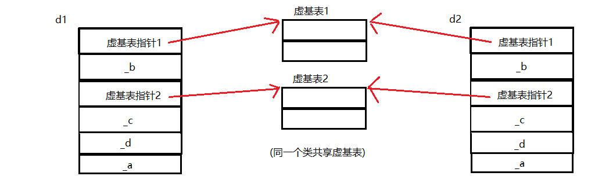

 


(多态篇描述)
继承的this  
继承不会改变函数的类型  
 由a ==> 继承下来的函数中,this参数的类型还是父类指针(重要) 


####  补充注意

- 虚继承和虚函数没有直接关系,注意不要混淆

- 菱形继承没有虚基表,菱形虚拟继承才有虚基表
   虚基表存的是偏移量,两个值都是偏移量

- 菱形继承+虚继承+虚函数->需要子类完成最终重写

- 继承是在使用层面做了限制,仅仅在用户使用层面私有不可见
  	但在内存中父类所有代码都是可见的,完整继承了父类的所有代码.
  
- 一般库里看见有带base的,可能就是继承关系


## 继承和组合

 组合即为在类成员是其他自定义类型:如适配器中栈,队列,反向迭代器.

 继承的耦合度高 , 组合的耦合度低

 耦合度:联系强度,软件工程领域:高内聚,低耦合; 类与类之间高耦合->解耦 ; 继承解耦->组合

 继承被称为白盒复用(white_box reuse)
 组合被称为黑箱复用(black_box reuse)

 继承是is-a关系:我就是你
 组合是has-a关系:我里面有一个你

 一般来说组合更好
 不过继承也有用武之地:面向对象三大特性,继承,封装,多态. 有继承才有多态


## 继承与多态

- 多态只有在父类指针或引用的情况下发生,而隐藏\重定义只在子类对象、指针、或引用下可能发生
